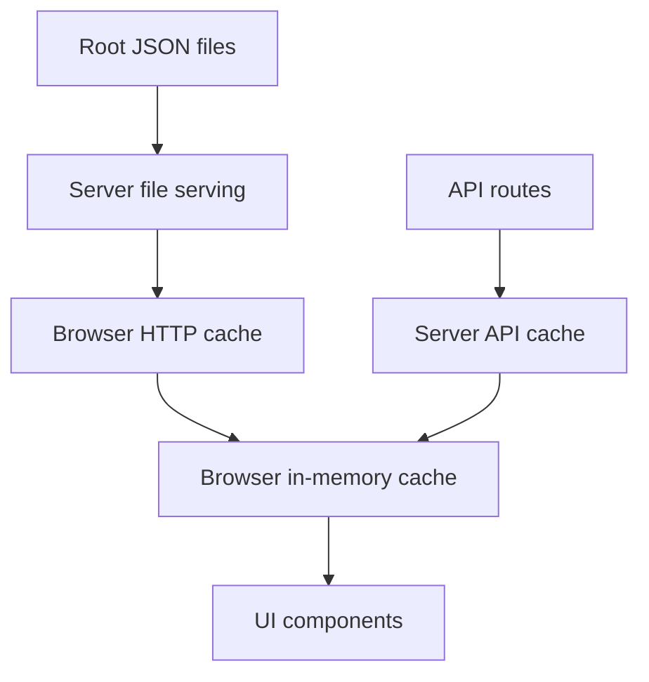

# Cache Architecture

This document describes the current caching model in this app after the cache refactor.

The goal is to keep caching:
- consistent
- easy to reason about
- short-lived for changing JSON data
- shared between development and production

## Principles

### 1. One source of truth per data type
- Raw generated datasets stay as root JSON files such as `data_*.json`, `bonds_v2.json`, `top_holding_addresses.json`, and `buy_dips.json`.
- Computed app snapshots stay behind API routes such as `/api/prana-stats` and `/api/bond-metrics`.
- Refresh/update side effects stay behind explicit API routes such as `/api/bonds-v2/refresh-bonds` and `/api/refresh-holdings`.

### 2. Short-lived data should have short-lived caches
- Root JSON files can be reused briefly by the browser before revalidation.
- API responses are browser-revalidated on each use.
- In-browser memory caches are short-lived and shared.

### 3. Dev and prod should behave the same
- The Vite dev server proxies API requests and root JSON requests to the Node server.
- The Node server is the single place that applies root JSON cache headers.

## Cache Layers

There are four main cache layers in the app.

### Browser HTTP cache
- Controlled by `Cache-Control` headers from the Node server.
- Applies to root JSON files and built assets.

### Browser in-memory cache
- Used by small client helpers created with `createBrowserJsonCache(...)`.
- Prevents duplicate fetches and avoids repeated requests during a short window.
- Supports forced refresh when needed.

### Server API cache
- Used for computed API endpoints.
- Keeps expensive loader work from running on every request.

### Server file serving
- Serves root JSON files and static files.
- Adds HTTP cache headers, `ETag`, and `Last-Modified`.

## Central TTL Registry

All shared TTL values live in `constants/cachePolicy.js`.

### Millisecond TTLs
- `apiResponse`: `30_000`
- `bondsJson`: `30_000`
- `bondsRefresh`: `30_000`
- `buyDipsJson`: `30_000`
- `lpTokenId`: `30_000`
- `topHoldingAddressesJson`: `30_000`
- `topHoldingsRefresh`: `30_000`

### HTTP cache TTLs in seconds
- `apiResponseBrowserHttp`: `30`
- `rootDataJsonHttp`: `30`
- `rootBondsJsonHttp`: `30`
- `rootBuyDipsJsonHttp`: `30`
- `rootTopHoldingAddressesJsonHttp`: `30`
- `staticAssetsHttp`: `31536000`

Rule of thumb:
- changing protocol/app data: 30 seconds
- long-lived hashed assets: 1 year immutable

## Browser Cache Helper

The shared browser helper is `utils/browserJsonCache.ts`.

It provides:
- a short-lived in-memory cache
- in-flight request sharing
- forced refresh support
- optional safe fallback behavior

Main API:
- `getCachedValue()`
- `fetchCached({ force?: boolean })`
- `fetchSafe(fallback, { force?: boolean })`
- `clear()`

Behavior:
- If cached data is still within TTL, return it immediately.
- If a non-forced request is already in flight, reuse that Promise.
- If `force: true` is passed, bypass the local cache and fetch again.
- Forced refresh also disables the lower-level `fetchJson()` dedupe for that request by setting `dedupeKey: null`.

## Low-Level Fetch Dedupe

`utils/fetchJson.ts` still handles request deduplication for concurrent GET requests.

This is different from the browser cache helper:
- `fetchJson.ts` dedupes only simultaneous requests
- `browserJsonCache.ts` caches successful results for a TTL window

Both are useful:
- dedupe avoids duplicate network traffic during one render burst
- TTL cache avoids repeated fetching across a short period

## Current Browser Data Paths

### Computed API snapshot: PRANA stats
- `hooks/usePranaStats.ts`
- `hooks/usePranaPrices.ts`
- `utils/pranaStatsApi.ts`

These now share the same current snapshot source:
- `/api/prana-stats`

This means the stats card and converter read the same pricing inputs:
- `latestSatPrice`
- `btcPriceUsd`
- `usdToVndRate`

### Computed API snapshot: bond metrics
- `utils/bondMetricsApi.ts`
- `hooks/useBuyBondStats.ts`
- `hooks/useSellBondStats.ts`

These use:
- `/api/bond-metrics`

### Raw JSON helpers

These use the shared browser JSON cache helper:
- `utils/bondsV2Json.ts`
- `utils/topHoldingAddressesJson.ts`
- `utils/buyDipsJson.ts`

Their data sources are:
- `/bonds_v2.json`
- `/top_holding_addresses.json`
- `/buy_dips.json`

### Chart JSON

Charts fetch the JSON directly with `fetchJson(...)`, but they now rely on the shared HTTP cache policy instead of forcing `cache: 'no-store'`.

Files:
- `components/SatsPriceChart.tsx`
- `components/PranaVndPriceChart.tsx`

Main data sources:
- `/data_sats.json`
- `/data_30_days.json`
- `/data_90_days.json`
- `/data_180_days.json`
- `/data_365_days.json`
- `/data_max.json`

## Server Cache Behavior

### Server cache factory

`server/cacheHelpers.ts` exports `createServerCache(ttlMs)`, a single factory used for both API response caching and refresh throttling.

Each instance holds its own TTL-checked value and in-flight promise. Callers pass a loader function; the cache returns the cached value when fresh, shares an in-flight promise when one is already running, or invokes the loader otherwise.

API response caches (TTL = `CACHE_TTL_MS.apiResponse`):
- `/api/prana-stats`
- `/api/capital`
- `/api/lp-capital`
- `/api/bond-metrics`

Refresh caches (TTL = `CACHE_TTL_MS.bondsRefresh` / `topHoldingsRefresh`):
- `ensureBondsRefreshed()` — throttles `updateBondsV2` script
- `ensureHoldingsRefreshed()` — throttles `updateTopHoldingAddresses` script

### Price loader cache

`server/loaders/pranaPrices.ts` now uses the same short API TTL model rather than a special longer TTL.

That keeps the server-side price snapshot aligned with the rest of the API freshness model.

## HTTP Cache Headers

### Root JSON headers

Defined in `server/cacheControl.ts`.

These files use short-lived browser caching:
- `data_*.json`
- `bonds_v2.json`
- `top_holding_addresses.json`
- `buy_dips.json`

Header shape:
- `public, max-age=30`

This means:
- the browser may reuse the response locally for up to 30 seconds without a roundtrip
- after that, normal revalidation can happen with the server
- because filenames are not content-hashed, these are not `immutable`

### API headers

Defined via `sendJson(...)` in `server/requestHelpers.ts`.

Primary JSON API routes send:
- `Cache-Control: private, max-age=30`

These currently include:
- `/api/prana-stats`
- `/api/capital`
- `/api/lp-capital`
- `/api/bond-metrics`
- `/api/refresh-bonds`
- `/api/refresh-holdings`
- `/api/bonds-v2/refresh-bonds`

This means:
- browsers can reuse the API response locally for up to 30 seconds without a roundtrip
- shared caches should not store it because the response is marked `private`
- after 30 seconds, the browser will fetch again and the server API cache still applies

Error responses still send:
- `Cache-Control: no-cache`

### Built assets

Hashed built assets use:
- `public, max-age=31536000, immutable`

This is safe because their filenames change when content changes.

## Dev vs Prod Behavior

`vite.config.js` proxies both API routes and root JSON files to the Node server:
- `/api`
- `/data_*.json`
- `/top_holding_addresses.json`
- `/bonds_v2.json`
- `/buy_dips.json`

Why this matters:
- dev and prod now use the same Node server cache headers
- root JSON handling is no longer duplicated between Vite middleware and the Node server
- freshness bugs are easier to reproduce consistently

Important development note:
- when running the frontend in dev, the Node server must also be running for these proxied routes

## Force Refresh Rules

Use `force: true` only when you specifically need to bypass the short-lived browser cache.

Current examples:
- after `/api/bonds-v2/refresh-bonds` reports new data, `useBondsV2Volume` forces a fresh `bonds_v2.json` fetch
- after `/api/refresh-holdings` reports new data, `useTopHoldingAddresses` forces a fresh `top_holding_addresses.json` fetch

Do not use forced refresh for normal page load unless there is a clear reason.

## What Was Removed

The old extra client-side price bundle path was removed:
- deleted `utils/pranaPrices.ts`

Why:
- it created a second current-price data path
- it could drift from `/api/prana-stats`
- it made the converter and stats card disagree

Now:
- current price snapshot for app UI comes from `/api/prana-stats`

## Guidelines For Future Changes

When adding a new cached data source:

1. Decide whether it is:
- raw JSON
- computed API
- refresh side effect

2. Put its TTL in `constants/cachePolicy.js`.

3. If it is browser-consumed JSON with short-lived caching, prefer `createBrowserJsonCache(...)`.

4. If it is a computed API endpoint, use the server cache helpers instead of inventing a one-off cache.

5. If it is served as a root JSON file, add HTTP cache policy in `server/cacheControl.ts`.

6. If the frontend needs it in dev, make sure `vite.config.js` proxies it to the Node server.

## Anti-Patterns To Avoid

- adding another module-level `cached` value that never expires
- adding a separate custom cache helper for one file when `createBrowserJsonCache(...)` already fits
- using different current-price sources for UI that users compare side by side
- using `cache: 'no-store'` by default when short browser-fresh HTTP headers are enough
- making dev JSON routing different from prod routing

## Quick Reference

If you are not sure where to put a new cache:

- Raw generated JSON file:
  - serve from Node root route
  - give it short browser-fresh HTTP headers
  - use `createBrowserJsonCache(...)` if the browser reads it often

- Computed API response:
  - cache on the server with `createServerCache(...)`
  - expose browser access through a small helper like `pranaStatsApi.ts`

- Manual or side-effect refresh:
  - keep it as an explicit API route
  - use `force: true` only after the refresh says new data is available
