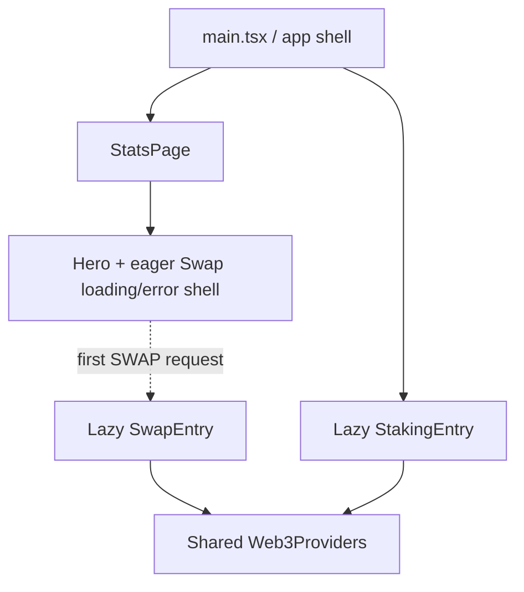

# Shared Code and Feature Boundaries

This document explains how the main Stats page, the lazy Swap modal, and the
Staking UI reuse utilities, helpers, constants, UI primitives, and Web3
infrastructure.

It describes the current source tree. It is an ownership and dependency guide,
not a requirement that every shared module must be used by all three surfaces.

Related documents:

- [`CACHE_ARCHITECTURE.md`](./CACHE_ARCHITECTURE.md) — browser and server data caches
- [`swap-modal-technical-overview.md`](./swap-modal-technical-overview.md) — Swap client/server flow
- [`add-staking-ui.md`](./add-staking-ui.md) — Staking UI and transaction flow

---

## 1. Runtime composition

The application has one root shell and two lazy page-level entries:

- `main.tsx` owns routing, the site-language provider, the legal pages, and the
  lazy boundary for `StatsPage` and `StakingEntry`.
- `StatsPage` owns the public protocol dashboard and hero.
- The hero imports `SwapLazyShell` eagerly so loading and chunk errors can still
  be shown as an accessible modal. The full `SwapEntry` is imported only after
  the user requests Swap.
- `SwapEntry` and `StakingEntry` each mount the shared `Web3Providers` boundary.
  The root shell and normal Stats page do not eagerly mount Wagmi or React Query
  Web3 providers.

This distinction matters when describing sharing:

- **Feature ownership** asks which feature owns or directly imports a module.
- **Route dependency** includes nested features. For example, the Stats route
  contains the Swap launcher and therefore includes the eager Swap shell and its
  focus-trap dependency.

---

## 2. Directory responsibilities

| Location | Responsibility |
| --- | --- |
| `utils/` | Pure or broadly reusable helpers, browser data adapters, and some established Stats helpers |
| `constants/` | Canonical routes, network values, deployed addresses, token metadata, cache policy, and feature configuration |
| `components/` | App-level UI and Stats page components |
| `components/ui/` | Generic presentation primitives; currently used mainly by Staking |
| `hooks/` | App/Stats hooks and the site-language context |
| `features/web3/` | Shared wallet/provider capability used only by Swap and Staking |
| `features/swap/` | Swap UI, quote state, transaction state, and Swap-specific formatting/logging |
| `features/staking/` | Staking UI, API adapters, math, validation, and transaction flows |
| `server/helpers/` | Server-only HTTP, cache, logging, address, and static-file helpers |
| `server/utils/` | Server-only providers plus Stats, Swap, and Staking loader support |

A file does not need three consumers to belong in a shared location. It belongs
there when its behavior is neutral, stable, and useful outside one feature.
Feature-specific behavior should stay with the feature even when it resembles a
generic helper.

---

## 3. Shared utilities and helpers

### Current cross-surface helpers

| Module | Main Stats page | Swap modal | Staking UI | Notes |
| --- | --- | --- | --- | --- |
| `utils/focusTrap.ts` | Route dependency through `SwapLazyShell` | `SwapModal`, `SwapLazyShell` | `EarlyUnstakeDialog` | Accessible focus containment, Escape handling, and optional focus restoration |
| `utils/fetchJson.ts` | Stats hooks/components and API adapters | No semantic use | `stakingApi.ts` | Concurrent GET dedupe; Swap uses specialized POST requests with abort and structured errors |
| `utils/formatters.ts` | Broad direct use | No | No direct client use | Also used by Stats/Staking-related server loaders and scripts |
| `utils/tokenAmounts.ts` | Indirectly through `formatters.ts` | No | No direct client use | Dependency-free raw-unit conversion used to avoid adding Web3 libraries to basic formatting |
| `utils/polygonscanUrls.ts` | Buy Dips and top-holder links | No current consumer | No current consumer | Neutral token explorer URL builder backed by `constants/network.ts` |
| `utils/swapTokens.ts` | No Stats-owned consumer | Swap client and server | No | Lookup over the Swap allowlist |

The root `utils/` directory also contains Stats-oriented data and calculation
modules. Important groups include:

- JSON/API adapters: `pranaStatsApi.ts`, `stakingStatsApi.ts`,
  `bondMetricsApi.ts`, `prana730Data.ts`, `pranaSatsData.ts`, and
  `buyDipsJson.ts`
- shared fetch/cache primitives: `fetchJson.ts` and `browserJsonCache.ts`
- Stats calculations: `protocolCapital.ts`, `supplyMetrics.ts`,
  `liquidityMetrics.ts`, `pranaStatsPerformance.ts`, and bonding helpers
- content and presentation helpers: FAQ/legal parsers, build-info helpers,
  model-viewer helpers, formatters, and explorer URL builders

These modules remain separate instead of being merged into one large
`sharedUtils` object. Named modules preserve clear ownership and allow bundlers
to include only the required code.

### Feature-local helpers

Swap keeps behavior with Swap when it depends on Swap semantics:

- `features/swap/utils/swapTokenFormatting.ts` uses token-specific decimals and
  Swap display thresholds.
- `sanitizeSwapWalletError.ts` exposes safe wallet errors to the modal.
- `swapTransactionLogs.ts` sends Swap lifecycle telemetry.
- `useUniswapQuote.ts` uses a specialized abortable POST request rather than
  the shared GET-oriented `fetchJson`.

Staking keeps its own domain behavior:

- `stakingMath.ts` implements Solidity-compatible interest math, PRANA parsing,
  duration handling, progress, grace-window rules, and early-unstake results.
- `stakingErrors.ts`, `permitUtils.ts`, `accountRefetch.ts`,
  `stakeCtaPhase.ts`, and `stakeTransactionFlow.ts` model Staking-specific
  validation and transaction state.
- `stakingApi.ts` is the browser adapter for the Staking config and account
  endpoints and reuses `fetchJson`.

---

## 4. Shared constants and canonical data

### App-wide and cross-feature constants

| Module | Purpose | Main consumers |
| --- | --- | --- |
| `constants/appRoutes.ts` | Terms, privacy, and canonical Staking paths plus route matchers | Root shell, hero, footer, Swap terms link, server static routing and summary |
| `constants/network.ts` | Polygon chain ID, frontend RPC, Polygonscan bases, and time units | Explorer helpers, Swap, Staking, Web3, server security/loaders |
| `constants/sharedContracts.ts` | PRANA/WBTC addresses and decimals, shared pool, Multicall, and shared token decimals | Stats UI/loaders, Swap token registry/quote server, Staking amount math/loaders |
| `constants/protocolAddresses.ts` | Canonical operational wallets and reserves | Capital UI/loader, top-holder registry, Buy Dips, Arbitrum LP owner |
| `constants/cachePolicy.ts` | Browser/server TTL policy | Browser caches, server API caches, static responses |

`sharedContracts.ts` is shared at the file level, but each export has its own
scope:

- `PRANA_ADDRESS` and `PRANA_DECIMALS` cross Stats, Swap, and Staking.
- WBTC metadata and the WBTC/PRANA pool are primarily shared by Stats and Swap.
- Multicall address/ABI are used by Stats and server infrastructure.
- `USDT_DECIMALS` is shared by the Swap registry and capital loader.

`protocolAddresses.ts` gives each operational address one canonical name:

- `PRANA_PROTOCOL_ADDRESS`
- `PROTOCOL_RESERVE_ADDRESS`
- `BUY_DIPS_WALLET_ADDRESS`
- `DEX_POOL_BONDS_RESERVE_ADDRESS`

UI links, capital reads, LP ownership, and the top-holder registry should import
these values rather than repeat address literals.

### Feature constants

| Module | Ownership and consumers |
| --- | --- |
| `constants/swapContracts.ts` | Swap timing, slippage, router/quoter deployments, token allowlist, and Swap ABIs; the capital loader currently also reuses the Polygon USDT address |
| `constants/stakingContracts.ts` | Staking/interest deployments, PRANA account-read ABI, permit constants, and Staking ABI; also supplies addresses used by homepage top-holder/staking statistics |
| `constants/topHoldingAddresses.ts` | Stats presentation registry assembled from canonical protocol, pool, bond, and Staking addresses |
| `constants/arbitrumWbtcUsdtLp.ts` | Stats/server configuration and ABIs for the Arbitrum WBTC/USDT LP position |
| `constants/bonds.ts` and related files | Bond deployments, ABIs, and Stats/bond calculation inputs |
| `constants/pranaStats.ts`, `bondStats.ts`, `stakingStats.ts` | Initial UI state for independent homepage API cards |

Swap imports network constants directly from `network.ts`; `swapContracts.ts`
does not re-export network values. This keeps chain configuration and feature
configuration as separate sources of truth.

---

## 5. ABI ownership

There is no ABI consumed by all three client surfaces.

| ABI | Location | Consumers |
| --- | --- | --- |
| `MULTICALL3_ABI` | `constants/sharedContracts.ts` | Capital, LP capital, and top-holder server/update paths |
| `PRANA_TOKEN_ABI` | `constants/stakingContracts.ts` | Staking account server loader (`balanceOf`, `nonces`) |
| `STAKING_CONTRACT_ABI` | `constants/stakingContracts.ts` | Staking client writes, Staking API reads, and homepage staking-stat loaders |
| `SWAP_ROUTER_02_ABI` | `constants/swapContracts.ts` | Swap server calldata validation |
| `QUOTER_V2_ABI` | `constants/swapContracts.ts` | Swap server fallback quoting |
| Bond and LP ABIs | Feature-oriented constant files | Their corresponding Stats/server loaders |

ABIs stay near the deployment/configuration they describe. A shared ABI should
not be created merely to make the three features look symmetrical.

---

## 6. Shared UI and application hooks

| Shared UI/hook | Main Stats page | Swap modal | Staking UI |
| --- | --- | --- | --- |
| `SiteLanguageProvider` / `useSiteLanguage` | Yes | Yes | Yes |
| `AppFooter` | Yes | No | Yes |
| `LanguageToggle` | Root/main shell | Uses current locale only | Yes |
| `InfoTooltip` | Multiple Stats cards | Quote/minimum-received help | No |
| `FlutterShaderBackground` | Yes | Inherited from the page behind the modal | Yes, with lower brightness |
| `GlassPanel` | No current Stats use | No | Page/form/active-stake panels |
| `StatusBanner` | No current Stats use | No | Form, wallet, stake, and dialog status |
| `Web3Providers` | Not eagerly mounted | Yes | Yes |
| `useInjectedWallet` | No Stats-owned use | Yes | Yes |
| `formatCompactAddress` | No | Yes | Yes |

Generic placement does not imply broad current usage. `GlassPanel` and
`StatusBanner`, for example, are reusable UI primitives but are currently
Staking-only.

---

## 7. What each surface uses

### Main Stats page

The Stats page primarily uses:

- Stats hooks and API/JSON adapters from `hooks/` and `utils/`
- shared number/date/token formatters
- protocol, supply, liquidity, bond, and performance calculators
- `sharedContracts`, `protocolAddresses`, Stats constants, and route constants
- explorer URL construction for PRANA token links
- shared language, footer, tooltip, shader, and build-identity UI
- the eager Swap loading/error shell and `focusTrap`

It does not eagerly mount the Web3 provider tree. The full Swap/Web3 path starts
at the lazy `SwapEntry`.

### Swap modal

The Swap modal primarily uses:

- `SwapLazyShell`, `SwapEntry`, and `SwapModal`
- `focusTrap` for loading, error, and full modal states
- `Web3Providers`, `useInjectedWallet`, and wallet address formatting
- `network.ts` for Polygon chain/explorer configuration
- `swapContracts.ts` for the token allowlist, router, slippage, quote timing,
  defaults, and Swap ABIs
- `sharedContracts.ts` indirectly through the Swap token registry and directly
  in server quote logic
- feature-local amount formatting, wallet error sanitization, quote state,
  transaction state, and telemetry
- the app language context, `InfoTooltip`, and the shared terms route

Swap does not use `fetchJson` for quotes. Its quote request is a debounced,
abortable POST with content-type checks and structured server errors.

### Staking UI

The Staking UI primarily uses:

- `StakingEntry` and the shared `Web3Providers`
- `useInjectedWallet`, `wagmiConfig`, and wallet address formatting
- React Query hooks backed by `stakingApi.ts` and shared `fetchJson`
- `network.ts` for Polygon, explorer links, and time units
- `sharedContracts.ts` for PRANA decimals/address consumers
- `stakingContracts.ts` for deployed contracts, permit typed data, and ABIs
- Staking-local math, config/account adapters, error mapping, and transaction
  state machines
- shared language/footer/shader UI plus `GlassPanel` and `StatusBanner`
- `focusTrap` in the early-unstake confirmation dialog

The homepage `StakingStats` card is not the Staking transaction UI. It is a
Stats component backed by the aggregate `/api/staking-stats` data path.

---

## 8. Maintenance rules

1. Keep one canonical source for deployed addresses, token decimals, chain IDs,
   explorer bases, routes, and TTL policy.
2. Prefer named exports from small modules over one global `sharedData` object.
3. Keep feature semantics local. Similar formatting or request code should only
   be shared when error behavior, precision, caching, and lifecycle requirements
   are also the same.
4. Keep server-only helpers under `server/`; client code must not import them.
5. Keep Web3 providers below the lazy Swap and Staking entries.
6. Remove address literals from consumers when a canonical named constant
   exists.
7. Treat a generic directory as permission to reuse a module, not a requirement
   that every feature must consume it.

