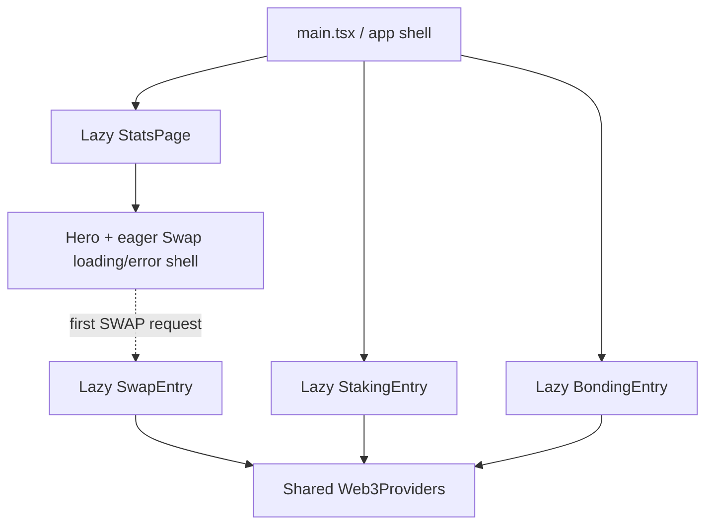

# Shared Code and Feature Boundaries

This document explains how the main Stats page, the lazy Swap modal, the
Staking UI, and the Bonding UI reuse utilities, helpers, constants, UI
primitives, and Web3 infrastructure.

It describes the current source tree. It is an ownership and dependency guide,
not a requirement that every shared module must be used by all four surfaces.

Related documents:

- [`CACHE_ARCHITECTURE.md`](./CACHE_ARCHITECTURE.md) — browser and server data caches
- [`swap-modal-technical-overview.md`](./swap-modal-technical-overview.md) — Swap client/server flow
- [`add-staking-ui.md`](./add-staking-ui.md) — Staking UI and transaction flow
- [`staking-technical-overview.md`](./staking-technical-overview.md) — Staking client/server flow
- [`add-bonding-ui.md`](./add-bonding-ui.md) — Bonding UI and transaction flow
- [`bonding-technical-overview.md`](./bonding-technical-overview.md) — Bonding client/server flow
- Vietnamese version: [`vi/SHARED_CODE_ARCHITECTURE.md`](./vi/SHARED_CODE_ARCHITECTURE.md)

---

## 1. Runtime composition

The application has one root shell, three lazy-loaded route entries
(`StatsPage`, `StakingEntry`, `BondingEntry`), and a nested lazy `SwapEntry`
inside the Stats page hero:

```mermaid
flowchart TD
  root["main.tsx / app shell"]
  stats["Lazy StatsPage"]
  hero["Hero + eager Swap loading/error shell"]
  swap["Lazy SwapEntry"]
  staking["Lazy StakingEntry"]
  bonding["Lazy BondingEntry"]
  web3["Shared Web3Providers"]

  root --> stats
  root --> staking
  root --> bonding
  stats --> hero
  hero -. "first SWAP request" .-> swap
  swap --> web3
  staking --> web3
  bonding --> web3
```

- `main.tsx` owns routing, the site-language provider, the legal/guide pages, and
  the lazy boundary for `StatsPage`, `StakingEntry`, and `BondingEntry`.
- `StatsPage` owns the public protocol dashboard and hero.
- The hero imports `SwapLazyShell` eagerly so loading and chunk errors can still
  be shown as an accessible modal. The full `SwapEntry` is imported only after
  the user requests Swap.
- `SwapEntry`, `StakingEntry`, and `BondingEntry` each mount the shared
  `Web3Providers` boundary. The root shell and normal Stats page do not eagerly
  mount Wagmi or React Query Web3 providers.

This distinction matters when describing sharing:

- **Feature ownership** asks which feature owns or directly imports a module.
- **Route dependency** includes nested features. For example, the Stats route
  contains the Swap launcher and therefore includes the eager Swap shell and its
  `focusTrap` dependency.

---

## 2. Directory responsibilities

| Location | Responsibility |
| --- | --- |
| `utils/` | Pure or broadly reusable helpers, browser data adapters, and some established Stats helpers |
| `constants/` | Canonical routes, network values, deployed addresses, token metadata, cache policy, and feature configuration |
| `components/` | App-level UI and Stats page components |
| `components/ui/` | Generic presentation primitives; used by Staking and Bonding |
| `hooks/` | App/Stats hooks and the site-language context |
| `pages/` | Route UI for Stats, Staking, and Bonding; orchestration between hooks and feature components |
| `types/` | Shared app/feature types such as blockchain, locale, Swap, and UI primitive props; Staking/Bonding domain types stay in the feature |
| `features/web3/` | Shared wallet/provider capability used by Swap, Staking, and Bonding |
| `features/swap/` | Swap UI, quote state, transaction state, and Swap-specific formatting/logging |
| `features/staking/` | Staking UI, API adapters, math, validation, and transaction flows |
| `features/bonding/` | Bonding UI, API adapters, math, validation, and transaction flows |
| `server/helpers/` | Server-only HTTP, cache, logging, address, and static-file helpers |
| `server/loaders/` | Provider/API reads and response building for Stats, Swap, Staking, Bonding; `cached/` wraps cacheable GET loaders |
| `server/utils/` | Server-only providers plus Stats, Swap, Staking, and Bonding loader support |

A file does not need three consumers to belong in a shared location. It belongs
there when its behavior is neutral, stable, and useful outside one feature.
Feature-specific behavior should stay with the feature even when it resembles a
generic helper.

---

## 3. Shared utilities and helpers

### Current cross-surface helpers

| Module | Main Stats page | Swap modal | Staking UI | Bonding UI | Notes |
| --- | --- | --- | --- | --- | --- |
| `utils/focusTrap.ts` | Route dependency through `SwapLazyShell` | `SwapModal`, `SwapLazyShell` | `EarlyUnstakeDialog` | No | Accessible focus containment, Escape handling, and optional focus restoration |
| `utils/fetchJson.ts` | Stats hooks/components and API adapters | No semantic use | `stakingApi.ts` | `features/bonding/utils/bondingApi.ts` | Concurrent GET dedupe; Staking/Bonding disable dedupe for POST quote/confirmation; Swap keeps specialized POST requests |
| `utils/formatters.ts` | Broad direct use | No | No direct client use | No direct client use | Also used by server loaders and scripts |
| `utils/tokenAmounts.ts` | Indirectly through `formatters.ts` | No | No direct client use | No direct client use | Dependency-free raw-unit conversion used to avoid adding Web3 libraries to basic formatting |
| `utils/polygonscanUrls.ts` | Buy Dips and top-holder links | No current consumer | No current consumer | No current consumer | Neutral token explorer URL builder backed by `constants/network.ts` |
| `utils/swapTokens.ts` | No Stats-owned consumer | Swap client and server | No | No | Lookup over the Swap allowlist |
| `features/web3/getPolygonWalletClient.ts` and `waitForPolygonWalletReceipt.ts` | No | No | Transaction hooks | Transaction hooks | Fetch the latest Polygon wallet client and wait for receipt via the same provider that broadcast |
| `features/web3/accountRefetch.ts` | No | No | Transaction flows/hooks | Transaction flows/hooks | Generic successful-refetch gate; rejects stale cache and address mismatch before writes |
| `features/web3/transactionConfirmation.ts` | No | No | Thin stake adapter | Thin bond adapter | Browser-receipt → server-fallback confirmation; Swap keeps its own helper for now |
| `features/web3/pendingTransactionStorage.ts` + `hooks/usePendingTransaction.ts` | No | No | Thin stake wrappers | Thin bond wrappers | Shared envelope factory + hook; feature parsers/prefixes stay local |
| `features/web3/confirmReceiptWithAccountSync.ts` | No | No | Thin `confirmStakeReceipt` | Thin `confirmBondReceipt` | Confirm broadcast then account sync; `syncFailed` stays non-fatal |
| `utils/fetchActiveStakesUtils.ts` | Stats/server scripts | No | Server loaders | Server loaders | RPC transform, sleep, and rate-limit detection primitives; legacy filename, but consumers now span Staking/Bonding |
| `server/utils/parseUnsignedDecimalRaw.ts` | No | No | Quote/confirmation server | Quote/confirmation server | Canonical `uint256` decimal parse and oversized-input rejection |
| `server/utils/transactionConfirmationLookup.ts` | No | No | Thin stake loader | Thin bond loader | Shared sender/target/calldata RPC confirmation; feature `buildExpectedCall` + mismatch errors stay local; Swap keeps its own verify path |

### Explicit non-sharing decisions

Staking and Bonding **keep separate API adapters and React Query hooks** on
purpose. Do not introduce shared factories such as `useWalletAccountQuery` or
`useFeatureConfigQuery` just because the wrappers look similar.

Keep feature-local:

- `features/staking/stakingApi.ts` and `features/bonding/utils/bondingApi.ts`
- `useStakingConfig` / `useBondingConfig`
- `useStakingAccount` / `useBondingAccount`

Shared layer stops at `utils/fetchJson.ts` (GET dedupe; POST quote/confirmation
sets `dedupeKey: null`). Named fetch helpers, query keys, and query options stay
in each feature so endpoints and cache/refetch behavior remain easy to find.

This was the decision-gate outcome for Điểm 5 in
[`STAKING_BONDING_SHARED_INFRASTRUCTURE_REFACTOR_PLAN.md`](./STAKING_BONDING_SHARED_INFRASTRUCTURE_REFACTOR_PLAN.md):
the wrappers are already short and typed, only two consumers exist per pattern,
and a generic helper would add layers without a clear complexity win.

The root `utils/` directory also contains Stats-oriented data and calculation
modules. Important groups include:

- JSON/API adapters: `pranaStatsApi.ts`, `stakingStatsApi.ts`,
  `bondMetricsApi.ts`, `prana730Data.ts`, `pranaSatsData.ts`, and
  `buyDipsJson.ts`
- shared fetch/cache primitives: `fetchJson.ts` and `browserJsonCache.ts`
- Stats calculations: `protocolCapital.ts`, `supplyMetrics.ts`,
  `liquidityMetrics.ts`, `pranaStatsPerformance.ts`, and bonding helpers
- content and presentation helpers: FAQ/legal parsers, build-info helpers,
  model-viewer helpers, formatters, and explorer URL builders

These modules remain separate instead of being merged into one large
`sharedUtils` object. Named modules preserve clear ownership and allow bundlers
to include only the required code.

### Feature-local helpers

Swap keeps behavior with Swap when it depends on Swap semantics:

- `features/swap/utils/swapTokenFormatting.ts` uses token-specific decimals and
  Swap display thresholds.
- `sanitizeSwapWalletError.ts` exposes safe wallet errors to the modal.
- `swapTransactionLogs.ts` sends Swap lifecycle telemetry.
- `swapTransactionConfirmation.ts` distinguishes receipt reverts from RPC read
  errors and falls back to server-side verify; `useUniswapSwap.ts` orchestrates
  Swap write and confirmation state.
- `useUniswapQuote.ts` uses a specialized abortable POST request rather than
  the shared GET-oriented `fetchJson`.

Staking keeps its own domain behavior:

- `stakingMath.ts` implements Solidity-compatible interest math, PRANA parsing,
  duration handling, truncation, grace-window rules, and early-unstake results.
- `formatGraceRemaining.ts` keeps Staking-specific grace-window countdown
  formatting.
- `stakingFundCheck.ts` builds pure quote results from Interest fund rules;
  the server loader reuses this feature helper instead of duplicating math.
- `stakingErrors.ts`, `permitUtils.ts`, `stakeCtaPhase.ts`, and
  `stakeTransactionFlow.ts` model Staking-specific validation, submit/CTA
  orchestration, and thin `confirmStakeReceipt` over shared
  `confirmReceiptWithAccountSync`. Account refetch gating uses
  `features/web3/accountRefetch.ts`. `stakeTransactionConfirmation.ts` is a
  thin adapter over `features/web3/transactionConfirmation.ts`.
- `stakePendingTransactionStorage.ts` and `usePendingStakeTransaction.ts` are
  thin wrappers over shared pending storage/hook; they keep the staking prefix
  and permit/stakeId action parser so reload only resumes confirmation, never
  re-sends the write.
- `stakingApi.ts` is the browser adapter for Staking config and account
  endpoints plus quote/confirmation POSTs, and reuses `fetchJson`.

Bonding keeps its own Buy/Sell, deployment-version, and quote semantics:

- `features/bonding/utils/bondingMath.ts`, `bondAllowance.ts`,
  `bondClaimTarget.ts`, `bondQuoteEcho.ts`, and `bondingErrors.ts` handle
  Bonding amounts, allowance, V1/V2 targets, quote snapshots, and error mapping.
- `bondTransactionFlow.ts` manages approve/create/claim orchestration and thin
  `confirmBondReceipt` over shared `confirmReceiptWithAccountSync`.
  `bondPendingTransactionStorage.ts` and `usePendingBondTransaction.ts` are
  thin wrappers over shared pending storage/hook (bonding prefix + action
  parser). `bondTransactionConfirmation.ts` is a thin adapter over shared
  `features/web3/transactionConfirmation.ts`.
- `bondingApi.ts` is the browser adapter for config/account/quote/confirmation
  and reuses `fetchJson`.
- Bonding-specific contract/pool quote math lives under
  `server/utils/bondingQuoteMath.ts` and is re-exported by `bondingReadUtils.ts`
  for loaders; it is not shared math with Staking.

---

## 4. Shared constants and canonical data

### App-wide and cross-feature constants

| Module | Purpose | Main consumers |
| --- | --- | --- |
| `constants/appRoutes.ts` | Canonical paths and matchers for Terms, Privacy, Swap/Staking/Bonding guides, Staking, and Bonding | Root shell, feature pages, hero, footer, Swap terms, server static routing and summary |
| `constants/network.ts` | Polygon chain ID, frontend RPC, Polygonscan bases, and time units | Explorer helpers, Swap, Staking, Bonding, Web3, server security/loaders |
| `constants/sharedContracts.ts` | PRANA/WBTC addresses/decimals, shared pool and pool ABI, Multicall, and shared token decimals | Stats UI/loaders, Swap token registry/quote server, Staking amount math/loaders, Bonding client/server |
| `constants/protocolAddresses.ts` | Canonical operational wallets and reserves | Capital UI/loader, top-holder registry, Buy Dips, Arbitrum LP owner |
| `constants/cachePolicy.ts` | Browser/server TTL policy | Browser caches, server API caches, static responses |

`sharedContracts.ts` is shared at the file level, but each export has its own
scope:

- `PRANA_ADDRESS` and `PRANA_DECIMALS` cross Stats, Swap, Staking, and Bonding.
- WBTC metadata and the WBTC/PRANA pool are used by Stats, Swap, and Bonding.
- Multicall address/ABI are used by Stats and server infrastructure.
- `USDT_DECIMALS` is shared by the Swap registry and capital loader.
- `UNISWAP_V3_POOL_ABI` serves pool reads for Bonding server-side quote math.

`protocolAddresses.ts` gives each operational address one canonical name:

- `PRANA_PROTOCOL_ADDRESS`
- `PROTOCOL_RESERVE_ADDRESS`
- `BUY_DIPS_WALLET_ADDRESS`
- `DEX_POOL_BONDS_RESERVE_ADDRESS`

UI links, capital reads, LP ownership, and the top-holder registry should import
these values rather than repeat address literals.

### Feature constants

| Module | Ownership and consumers |
| --- | --- |
| `constants/swapContracts.ts` | Swap timing, slippage, router/quoter deployments, token allowlist, and Swap ABIs; the capital loader currently also reuses the Polygon USDT address |
| `constants/stakingContracts.ts` | Staking/interest deployments, PRANA account-read ABI, permit constants, and Staking ABI; also supplies addresses used by homepage top-holder/staking statistics |
| `constants/topHoldingAddresses.ts` | Stats presentation registry assembled from canonical protocol, pool, bond, and Staking addresses |
| `constants/arbitrumWbtcUsdtLp.ts` | Stats/server configuration and ABIs for the Arbitrum WBTC/USDT LP position |
| `constants/bonds.ts` and related files | Bond deployments, ABIs, and Stats/bond calculation inputs |
| `constants/pranaStats.ts`, `bondStats.ts`, `stakingStats.ts` | Initial UI state for independent homepage API cards |

Swap imports network constants directly from `network.ts`; `swapContracts.ts`
does not re-export network values. This keeps chain configuration and feature
configuration as separate sources of truth.

---

## 5. ABI ownership

There is no ABI consumed by all three client surfaces.

| ABI | Location | Consumers |
| --- | --- | --- |
| `MULTICALL3_ABI` | `constants/sharedContracts.ts` | Capital, LP capital, and top-holder server/update paths |
| `PRANA_TOKEN_ABI` | `constants/stakingContracts.ts` | Staking account and quote server loaders (`balanceOf`, `nonces`) |
| `STAKING_CONTRACT_ABI` | `constants/stakingContracts.ts` | Staking client writes, Staking API reads, and homepage staking-stat loaders |
| `SWAP_ROUTER_02_ABI` | `constants/swapContracts.ts` | Swap server calldata validation |
| `QUOTER_V2_ABI` | `constants/swapContracts.ts` | Swap server fallback quoting |
| `UNISWAP_V3_POOL_ABI` | `constants/sharedContracts.ts` | Bonding quote reads on the shared WBTC/PRANA pool |
| Bond and LP ABIs | Feature-oriented constant files | Their corresponding Stats/server loaders |

ABIs stay near the deployment/configuration they describe. A shared ABI should
not be created merely to make the three features look symmetrical.

---

## 6. Shared UI and application hooks

| Shared UI/hook | Main Stats page | Swap modal | Staking UI | Bonding UI |
| --- | --- | --- | --- | --- |
| `SiteLanguageProvider` / `useSiteLanguage` | Yes | Yes | Yes | Yes |
| `AppFooter` | Yes | No | Yes | Yes |
| `LanguageToggle` | Root/main shell | No; modal uses current locale only | Yes | Yes |
| `InfoTooltip` | Multiple Stats cards | Quote/minimum-received help | No | No |
| `FlutterShaderBackground` | Yes | Inherited from the page behind the modal | Yes, with lower brightness | Yes, with lower brightness |
| `GlassPanel` | No current Stats use | No | Page/form/active-stake panels | Page/form/active-bond panels |
| `StatusBanner` | No current Stats use | No | Form, wallet, stake, and dialog | Form, wallet, and bond |
| `Web3Providers` | Not eagerly mounted | Yes | Yes | Yes |
| `useInjectedWallet` | No Stats-owned use | Yes | Yes | Yes |
| `formatCompactAddress` | No | Yes | Yes, via shared wallet control | Yes, via shared wallet control |
| `features/web3/WalletControl` | No | No, Swap has its own UI | Yes, via copy/error wrapper | Yes |
| `waitForPolygonWalletReceipt` | No | No | Yes | Yes |
| `TxLink` | No | No | Yes | Yes |
| `usePageMetadata` | Yes | Inherited from the Stats page | Yes | Yes |

Generic placement does not mean every surface must use it. For example
`GlassPanel`, `StatusBanner`, and `TxLink` are currently shared by
Staking/Bonding, while Swap still keeps modal-specific presentation and
transaction links.

---

## 7. What each surface uses

### Main Stats page

The Stats page primarily uses:

- Stats hooks and API/JSON adapters from `hooks/` and `utils/`
- shared number/date/token formatters
- protocol, supply, liquidity, bond, and performance calculators
- `sharedContracts`, `protocolAddresses`, Stats constants, and route constants
- explorer URL construction for PRANA token links
- shared language, footer, tooltip, shader, and build-identity UI
- the eager Swap loading/error shell and `focusTrap`

It does not eagerly mount the Web3 provider tree. The full Swap/Web3 path starts
at the lazy `SwapEntry`.

### Swap modal

The Swap modal primarily uses:

- `SwapLazyShell`, `SwapEntry`, and `SwapModal`
- `focusTrap` for loading, error, and full modal states
- `Web3Providers`, `useInjectedWallet`, and wallet address formatting
- `network.ts` for Polygon chain/explorer configuration
- `swapContracts.ts` for the token allowlist, router, slippage, quote timing,
  defaults, and Swap ABIs
- `sharedContracts.ts` indirectly through the Swap token registry and directly
  in server quote logic
- feature-local amount formatting, wallet error sanitization, quote state,
  transaction state, and telemetry
- browser receipt confirmation with `/api/swap/verify-transaction` fallback;
  Swap has no pending-storage/resume flow like Staking and Bonding
- the app language context, `InfoTooltip`, and the shared terms route

Swap does not use `fetchJson` for quotes. Its quote request is a debounced,
abortable POST with content-type checks and structured server errors.

### Staking UI

The Staking UI primarily uses:

- `StakingEntry` and the shared `Web3Providers`
- `useInjectedWallet`, `wagmiConfig`, and wallet address formatting
- React Query hooks backed by feature-local `stakingApi.ts` and shared
  `fetchJson` (config/account hooks stay in the staking feature by design)
- `network.ts` for Polygon, explorer links, and time units
- `sharedContracts.ts` for PRANA decimals/address consumers
- `stakingContracts.ts` for deployed contracts, permit typed data, and ABIs
- Staking-local math, config/account adapters, error mapping, and transaction
  state machines
- shared `WalletControl`, `waitForPolygonWalletReceipt`, and `TxLink`
- pending transaction storage by account/chain; post-reload resume must verify
  sender/target/calldata via the server before reporting success
- shared language/footer/shader UI plus `GlassPanel` and `StatusBanner`
- `focusTrap` in the early-unstake confirmation dialog

The homepage `StakingStats` card is not the Staking transaction UI. It is a
Stats component backed by the aggregate `/api/staking-stats` data path.

### Bonding UI

The Bonding UI primarily uses:

- `BondingEntry` and the shared `Web3Providers`
- `useInjectedWallet`, `WalletControl`, `wagmiConfig`, and wallet address formatting
- React Query hooks via feature-local `features/bonding/utils/bondingApi.ts` and
  shared `fetchJson` (config/account hooks stay in the bonding feature by design)
- `network.ts` for Polygon, explorer links, and time units
- `sharedContracts.ts` for PRANA/WBTC decimals and addresses
- `bonds.ts` for Buy/Sell V1/V2 contracts and ABIs
- Bonding-local math, config/account/quote adapters, error mapping, and
  approve/create/claim state machines
- shared `WalletControl`, `waitForPolygonWalletReceipt`, and `TxLink`
- pending transaction storage by account/chain; post-reload resume must verify
  sender/target/calldata via the server before reporting success
- shared language/footer/shader UI plus `GlassPanel` and `StatusBanner`

The homepage Bonding Stats cards are not the Bonding transaction UI. They use
`/api/bond-metrics` and related Stats data paths.

---

## 8. Maintenance rules

1. Keep one canonical source for deployed addresses, token decimals, chain IDs,
   explorer bases, routes, and TTL policy.
2. Prefer named exports from small modules over one global `sharedData` object.
3. Keep feature semantics local. Similar formatting or request code should only
   be shared when error behavior, precision, caching, and lifecycle requirements
   are also the same.
4. Keep server-only helpers under `server/`; client code must not import them.
5. Keep Web3 providers below the lazy Swap, Staking, and Bonding entries.
6. Remove address literals from consumers when a canonical named constant
   exists.
7. Treat a generic directory as permission to reuse a module, not a requirement
   that every feature must consume it.
