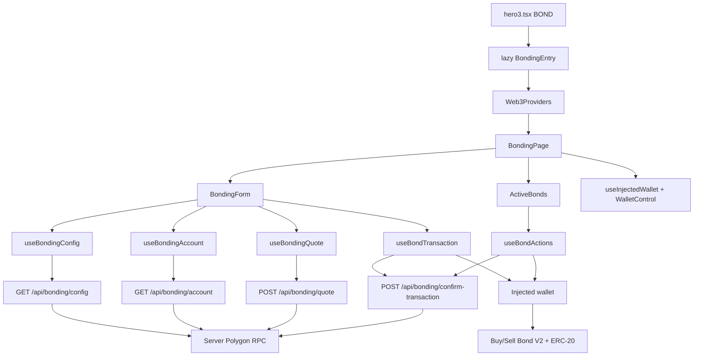
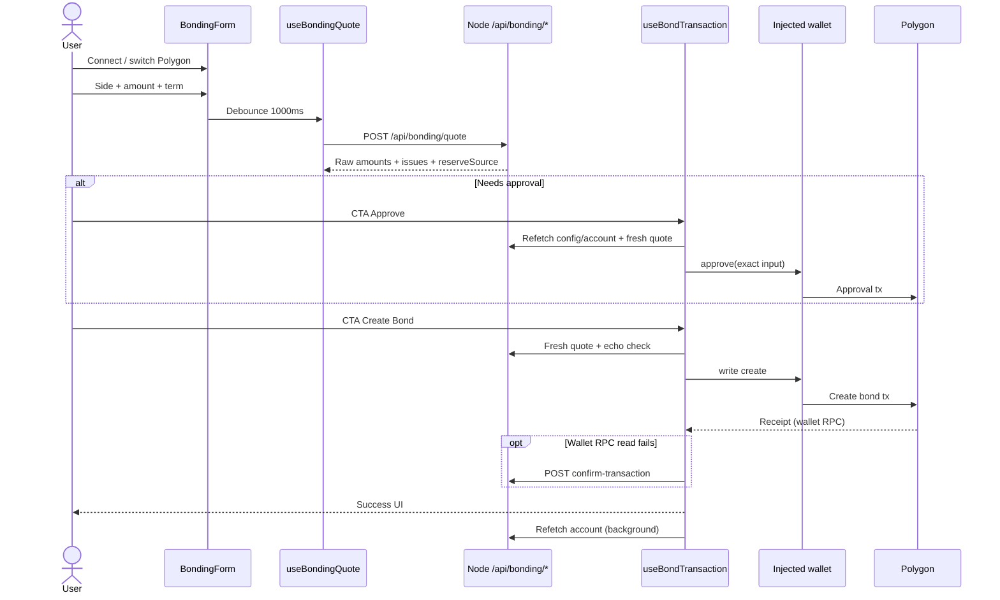

# Bonding UI — Technical Overview

This document describes the Bonding UI end to end: the `/bond/` route, Buy/Sell/claim flows, backend APIs, trust boundaries with the wallet, and locked design decisions. It is written for contributors who want to understand the feature before reading the code.

Related docs:

- `[add-bonding-ui.md](./add-bonding-ui.md)` — step-by-step implementation plan + test checklist
- `[SHARED_CODE_ARCHITECTURE.md](./SHARED_CODE_ARCHITECTURE.md)` — Web3/UI shared with Swap and Staking
- `[CACHE_ARCHITECTURE.md](./CACHE_ARCHITECTURE.md)` — config cache vs account/quote `no-store`
- `[SECURITY_OVERVIEW.md](./SECURITY_OVERVIEW.md)` — app-wide security inventory
- User guide: `/guide/bonding/` · Contracts guide: `/guide/bonding-contracts/`
- Vietnamese: `[vi/bonding-technical-overview.md](./vi/bonding-technical-overview.md)`

Parallel templates: Staking (`/stake/` — `[staking-technical-overview.md](./staking-technical-overview.md)`) and the Swap modal — shared lazy entry, API, CTA phases, and confirmation fallback structure.

---


## What it is

The `/bond/` page lets users create and claim PRANA bonds on **Polygon mainnet**:

- **Buy Bond (V2):** send exact WBTC → receive vesting PRANA for a chosen term.
- **Sell Bond (V2):** send exact PRANA → receive vesting WBTC for a chosen term.
- **Active Bonds:** view + claim vesting bonds from **Buy/Sell × V1/V2**. New bonds are created on V2 only; V1 is history/claim only.

There is no donut/status that duplicates Bonding Stats on the homepage. The `buyBondForPranaAmount` (target PRANA) path is not exposed in the UI/API.

Token amounts, allowance, and bond IDs travel through JSON as **decimal strings** (never coerced to `number`) for `uint256` safety.

---


## Design goals / locked assumptions

1. **Dedicated lazy route** — `/bond/` does not pull in `StatsPage`, GLB, or homepage data.
2. **Reads via backend** — config, account, quote, and confirmation fallback use server RPC; the wallet only does `approve` / create / `claim` directly.
3. **Hardcoded write targets** — create/claim do not take contract addresses from the API or UI; internal mapping is `side` × `version`.
4. **Exact input only** — Buy locks WBTC; Sell locks PRANA. Contracts have no `minOut` / deadline; residual quote↔execution risk is accepted at current scale.
5. **One CTA by phase** — Approve → Create Bond → Confirming; at most two wallet prompts (approve + create), never auto-chained.
6. **Confirmation without inference** — an RPC read error ≠ an on-chain revert; once a hash exists, never broadcast a second time.

---


## High-level architecture




`main.tsx` lazy-loads `BondingEntry` on the `isBondPath` branch (outside the homepage shader shell), same pattern as `isStakePath`. `BondingEntry` wraps `BondingPage` with shared `Web3Providers`.

Guides `/guide/bonding/` and `/guide/bonding-contracts/` live in the homepage/legal shell — they do **not** pull the Bonding/Web3 chunk.

### Trust split


| Layer            | Responsibility                                                                                                                                                      |
| ---------------- | ------------------------------------------------------------------------------------------------------------------------------------------------------------------- |
| **Browser**      | UI, wallet connect, amount parse, CTA phases, `writeContract`, wait for receipt on wallet RPC                                                                       |
| **Node backend** | Config/account/quote reads (same `blockTag`), quote math mirrored from Solidity, rate limit, origin/body validation, confirmation fallback (sender/target/calldata) |
| **User wallet**  | Final authority: only the wallet moves funds                                                                                                                        |
| **Polygon**      | Execution on Buy/Sell Bond V1/V2 + ERC-20 `approve`                                                                                                                 |


The browser does **not** build create/claim calldata from addresses returned by the API. Create inputs come from the form snapshot; targets come from `constants/bonds.ts` + `bondClaimTarget.ts`.

### Two RPC layers for writes

Bonding writes go through:

1. **Wallet RPC** (EIP-1193) — broadcast `approve` / create / claim; after broadcast, wait for the receipt on the **same** provider that sent the tx (`waitForPolygonWalletReceipt`). No explicit browser `simulateContract`; wallet gas estimation and contract revert are the pre-execution safeguards.
2. **Server RPC** (`ALCHEMY` / `POLYGON_RPC_URL`) — config/account/quote and `confirm-transaction` fallback.

Wagmi still configures a browser HTTP transport (`FRONTEND_POLYGON_RPC_URL` / dRPC) for shared Web3 providers, but Bonding write hooks do not call `simulateContract` on it.

A failed receipt read on the wallet provider does **not** mean the transaction failed. Correct flow: catch → server fallback → only treat as failed when the receipt is explicitly `reverted`.

---


## Public surfaces


### Routes


| Path                        | Role                                                   |
| --------------------------- | ------------------------------------------------------ |
| `/bond` → `/bond/`          | Canonical SPA; bare path `308` (preserve query)        |
| `/guide/bonding/`           | User guide (approve, Buy/Sell, vesting, claim)         |
| `/guide/bonding-contracts/` | Contracts guide (educational; cross-check Polygonscan) |


Constants: `BOND_*`, `GUIDE_BONDING_*`, `GUIDE_BONDING_CONTRACTS_*`, `isBondPath`, `isGuideBondingPath`, `isGuideBondingContractsPath` in `constants/appRoutes.ts`.

### APIs


| Endpoint                                | Cache               | Notes                                         |
| --------------------------------------- | ------------------- | --------------------------------------------- |
| `GET /api/bonding/config`               | `private`, 30s      | Paused × 4, min, V2 terms, addresses          |
| `GET /api/bonding/account?address=`     | `private, no-store` | Balances, V2 allowances, active bonds V1+V2   |
| `POST /api/bonding/quote`               | `private, no-store` | Union `buy_exact_wbtc` | `sell_exact_prana`   |
| `POST /api/bonding/confirm-transaction` | `private, no-store` | UX fallback; does not write trusted analytics |


POST admission: shared Web3 POST admission → Content-Type / origin → body ≤ 2 KB / shape parse → then rate-limit → RPC. Invalid requests do not consume the global quote/confirmation budget.

Raw amounts: canonical decimal (`0` or `[1-9]\d*`), `≤ MAX_UINT256`. Quote/create/claim require `> 0`; approve `0` (revoke) is supported.

---


## End-to-end user flows


### Create bond (Buy or Sell)




### Claim bond

Claim picks the target via `resolveBondClaimTarget(side, version)` — it does not trust addresses from the API. Same pattern as Staking actions: switch Polygon → write (no explicit simulate) → wallet receipt / server fallback → success UI → background account refetch. Pending hashes persist keyed by `{account, chainId}` (24h TTL); reload only resumes confirmation, never rebroadcasts. Resume requires server validation of sender/target/calldata.

Form approve/create and claim **lock each other** while a write is in flight (`formBusy` / `actionsBusy` on `BondingPage`). After approve confirms, the CTA stays locked until the allowance account sync finishes so Create does not run on a stale snapshot.

---


## CTA phase machine

Phases are **UI state**, not three separate wallet signatures:

```
approve → create → confirming → success
                             ↘ confirmation_unavailable
                error ↗ (retry the correct phase)
```


| Phase                      | Wallet?    | What happens                                      |
| -------------------------- | ---------- | ------------------------------------------------- |
| `approve`                  | Yes (1 tx) | `approve` exact input if allowance is short       |
| `create`                   | Yes (1 tx) | Fresh-quote → write create                        |
| `confirming`               | No         | Wait for receipt                                  |
| `confirmation_unavailable` | No         | Keep hash + snapshot; CTA “Continue confirmation” |
| `success` / `error`        | No         | Reset form or allow retry                         |


Helper: `features/bonding/utils/bondCtaPhase.ts` → `getBondCtaPhase(status, needsApproval, hasPendingHash)`.

Before approve and before create:

1. Successfully refetch account/config/quote (do not fall back to a failed cached account).
2. Correct wallet, Polygon, balance, minimum, term, paused, treasury.
3. Validate quote echo (`bondQuoteEcho.ts`): Buy matches `mode` + `termId` + `wbtcAmountRaw`; Sell matches `pranaAmountRaw`. Mismatch → stop with `quote_issues`.
4. Calldata inputs come from the form snapshot — **not** the input leg from the quote response.
5. `writeContract` directly — no explicit `simulateContract`; wallet gas estimation handles preflight.

Exact Buy/Sell: allowance `>=` input is enough; do not lower a larger allowance when unnecessary.

---


## Quote pipeline


### Client

`useBondingQuote` (thin wrapper over shared `hooks/useDebouncedAbortableQuote`):

- Debounce **1000 ms** — within the debounce window, do not call the API and do not flip `isLoading` (avoids flash on every keystroke).
- Abort older requests; drop stale responses via a monotonic request id.
- After **60 s**, mark the quote stale; the CTA runs `freshQuote()` itself before write.
- Side / term / amount / account / chain changes → invalidate.
- Request key is mode + amount + term so a new request object with the same
data does not re-fetch.

Parsers: WBTC max **8** decimals, PRANA **9**. MAX uses the exact raw balance (`rawBalanceToAmountInput`), never `Number`/`parseFloat`.

### Server

Orchestration: `server/loaders/bondingQuote.ts` + pure math in `server/utils/bondingQuoteMath.ts` / `bondingReadUtils.ts`.

- All reads in one response share the same `blockTag`.
- Mirror Solidity bigint order / rounding / **1% fee** and the branch that auto-syncs market reserves.
- The contract picks the worse output branch between **impacted** and **market** reserves → response includes `reserveSource: 'impacted' | 'market'`.
- Non-executable quotes (paused, below min, over reserve, missing treasury, …) still return **200** with `issues[]` so the form can show why.

A quote is stable for the reserves/rates/treasury at the read block — elapsed time or a new block **alone** does not change raw amounts if state is unchanged. The UI still fresh-quotes because calldata does not lock `minOut`.

### Modes


| Mode               | Exact input | Expected output | On-chain create                            |
| ------------------ | ----------- | --------------- | ------------------------------------------ |
| `buy_exact_wbtc`   | WBTC        | PRANA payout    | `buyBondForWbtcAmount(wbtcAmount, period)` |
| `sell_exact_prana` | PRANA       | WBTC payout     | `sellBond(pranaAmount, period)`            |


The contract still has `buyBondForPranaAmount`, but the app does **not** quote / create through that path.

---


## Vesting and claimable

UI time: `blockTimestamp + elapsed` (not device clock alone).

### Bonding (cumulative from `creationTime`)

```text
totalVestedRaw = floor(totalPayoutRaw × (now - creationTime) / (maturityTime - creationTime))
claimableRaw   = max(totalVestedRaw - claimedRaw, 0)
```

From maturity: claim the full `totalPayoutRaw - claimedRaw`; the contract marks `claimed = true`.

`lastClaimTime` only blocks two claims at the same timestamp — it does **not** enter the payout formula. Progress bar = % of time from creation→maturity (clamped `0..100`), independent of `lastClaimTime`.

### Differs from Staking

Staking accrues new interest from `lastClaimTime` (after capping at maturity). Bonding subtracts `claimedPrana` / `claimedWbtc` from the total vested since `creationTime`. Changing `lastClaimTime` while keeping `claimedRaw` does **not** change Bonding claimable.

Helpers: `getBondClaimableRaw`, `getBondProgressPercent`, `sortActiveBonds` in `features/bonding/utils/bondingMath.ts`.

Active bonds sort: nearest maturity → side → version → id. React key / claim identity: `bondClaimKey(side, version, bondId)` because ids can collide across deployments.

---


## File map


### Client

```
features/bonding/
  BondingEntry.tsx              # lazy root + Web3Providers
  bonding.types.ts              # config, account, quote, tx lifecycle
  bonding.copy.ts               # VI/EN
  components/                   # Form, tabs, TermSelector, ActiveBonds, BondCard
  hooks/                        # config, account, quote, useBondTransaction, useBondActions, pending
  utils/
    bondingApi.ts               # fetchJson adapters + React Query keys
    bondCtaPhase.ts
    bondQuoteEcho.ts
    bondAllowance.ts
    bondClaimTarget.ts
    bondTransactionFlow.ts
    bondTransactionConfirmation.ts
    bondPendingTransactionStorage.ts
    bondingMath.ts
    bondingErrors.ts
pages/BondingPage.tsx           # shell: shader, wallet, form, active bonds, footer
```

Shared (Bonding must not import Staking in reverse):

- `features/web3/` — `Web3Providers`, `useInjectedWallet`, `WalletControl`, `getPolygonWalletClient`, `waitForPolygonWalletReceipt`, `accountRefetch`, `transactionConfirmation`, `syncAccountAfterConfirm`, `pendingTransactionStorage`, `hooks/usePendingTransaction`
- `components/ui/TxLink.tsx` — Polygonscan hash link
- `constants/bonds.ts` + `bonds.types.ts` — addresses + ABI (do not duplicate ABI)
- `constants/sharedContracts.ts` — PRANA/WBTC/pool/decimals


### Server

```
server/loaders/
  bondingConfig.ts
  bondingAccount.ts
  bondingQuote.ts
  bondingTransactionConfirmation.ts  # buildExpectedCall + shared lookup
  cached/bondingConfigCached.ts
server/utils/
  bondingReadUtils.ts           # shared mapping / parse / normalize
  bondingQuoteMath.ts
  parseUnsignedDecimalRaw.ts
  transactionConfirmationLookup.ts  # shared sender/target/calldata RPC
server/types/
  transactionConfirmationTypes.ts
server/getApiRoutes.ts          # GET config + account (+ BondingApiLoaders)
server/postApiRoutes.ts         # POST quote + confirm (+ BondingPostApiLoaders)
server/rateLimit.ts             # buckets inside createWeb3RateLimiters()
```

Server confirm uses shared `confirmTransactionOnChain` after bonding-local
`buildExpectedCall` (approve/create/claim → fixed target + calldata).

### Contracts (read-only reference in repo)

- `contracts/BuyPranaBondV2.sol`, `SellPranaBondV2.sol` — live create + claim
- `contracts/BuyPranaBondV1.sol`, `SellPranaBondV1.sol` — claim/history

Deployments (Polygon): see `constants/bonds.ts` (`BUY_BOND_ADDRESS_V1/V2`, `SELL_BOND_ADDRESS_V1/V2`).

---


## Pending transaction persistence

`bondPendingTransactionStorage` stores `{version, chainId, account, hash, action, createdAt}` in `localStorage` (24h TTL), keyed by account/chain.

- Reload/reconnect: restore the correct action kind; lock writes until storage has loaded and that flow has no pending tx.
- Mid-flow wallet switch: do not report success for the new wallet; keep the old wallet's storage so it can resume on return.
- Resume / reload: `requireServerValidation` — even a successful browser receipt must still pass server checks of sender/target/full calldata.

---


## Design constraints (not bugs to “fix” in current scope)

1. **No** `minOut` **/ deadline** — the user always spends exact input; payout can diverge from the quote if state changes between quote and execution. Fresh-quote + echo checks are UX guards, not on-chain guarantees.
2. **Fresh quote before create has no separate in-app confirm** — the form already shows amount/term/quote; Create Bond fresh-quotes then opens the wallet. Echo check still requires `mode` / `termId` / exact input to match the form snapshot.
3. **Account API scans** `getUserActiveBonds` **on all four deployments** — cost grows with total bond history; rate limits reduce load but are not a long-term indexer substitute.
4. Bonding confirmation does **not** reuse HMAC / `/api/swap/verify-transaction` — contract/function mapping is fixed; the endpoint is UX backup only and does not write verified analytics.

Re-evaluate `minOut` / second consent only when volume, concurrency, MEV exposure, or average bond value rises materially — and that would need a **new contract** to enforce.

---


## Controls already in place (summary)

- Write targets from internal mapping; confirmation checks sender, fixed target, full calldata.
- Exact approval; no explicit simulate before broadcast; no write retry after a hash exists.
- Quote/account share `blockTag`; bigint = decimal string; `uint256` bounds at parse.
- POST: origin, JSON, 2 KB body, validate-before-rate-limit, redact RPC secrets, `private, no-store`.
- CSP / frame denial / `nosniff`; wallet errors sanitized VI/EN (`bondingErrors.ts`).

---


## Tests and useful commands


| Suite            | Command / location                                   |
| ---------------- | ---------------------------------------------------- |
| Client Bonding   | `npm run test:bonding` → `features/bonding/tests/**` |
| API / admission  | `server/tests/bondingApi.test.ts`                    |
| Static `/bond`   | `server/tests/bondRoutes.test.ts`                    |
| Guides           | `server/tests/guideRoutes.test.ts`                   |
| Typecheck / full | `npm run typecheck`, `npm test`                      |


When changing bonding math, claimable, CTA phases, echo, pending storage, or API admission — update the matching tests and, if public behavior changes, update the guide + this doc.

---


## Deployment notes (summary)

- Production builds must keep separate `BondingEntry` / `BondingPage` chunks; Stats/Staking must not pull bonding.
- Nginx cutover: drop the legacy `/bond/assets/` alias; bare `/bond` uses `308` like `/stake`.
- Production smoke: connect, quote, switch chain — do **not** send real approve/create/claim in automated smoke.

Legacy migration detail: step 8 in `[add-bonding-ui.md](./add-bonding-ui.md)`.