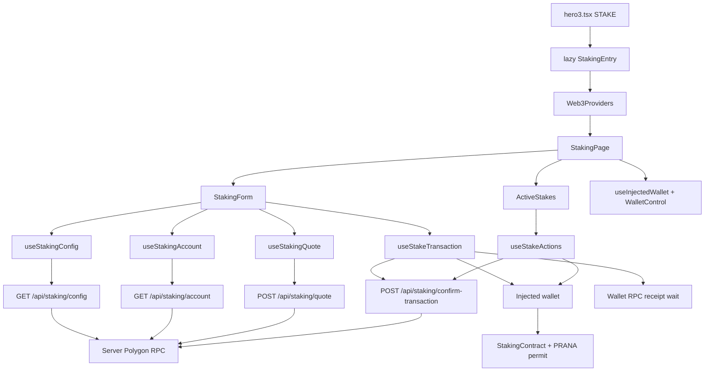
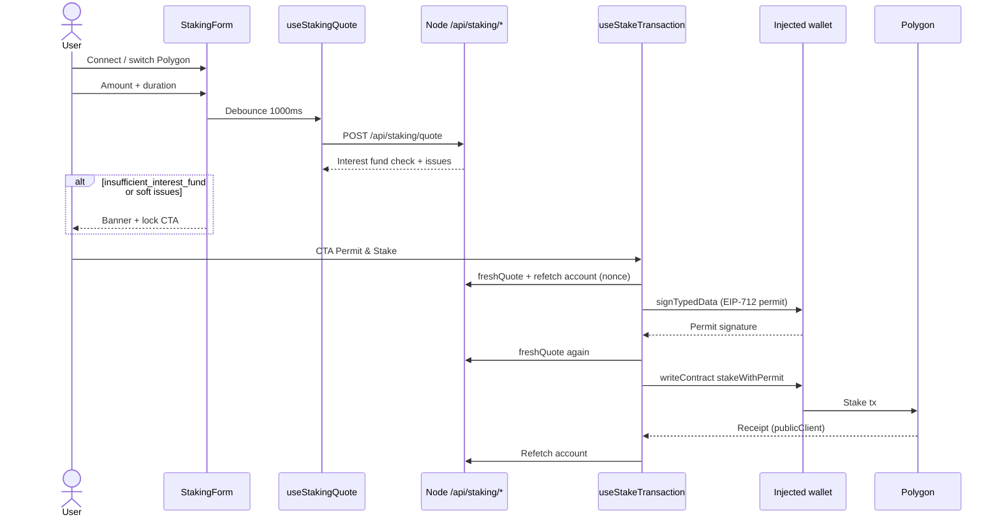

# Staking UI — Technical Overview

This document describes the Staking UI end to end: the `/stake/` route, Permit & Stake / claim / unstake flows, backend APIs, trust boundaries with the wallet, and locked design decisions. It is written for contributors who want to understand the feature before reading the code.

Related docs:

- [`add-staking-ui.md`](./add-staking-ui.md) — step-by-step implementation plan + test checklist
- [`SHARED_CODE_ARCHITECTURE.md`](./SHARED_CODE_ARCHITECTURE.md) — Web3/UI shared with Swap and Bonding
- [`CACHE_ARCHITECTURE.md`](./CACHE_ARCHITECTURE.md) — config cache vs account/quote `no-store`
- [`SECURITY_OVERVIEW.md`](./SECURITY_OVERVIEW.md) — app-wide security inventory
- User guide: `/guide/staking/` · Contracts guide: `/guide/staking-contracts/`
- Vietnamese: [`vi/staking-technical-overview.md`](./vi/staking-technical-overview.md)

Parallel templates: Bonding (`/bond/`) and the Swap modal — shared lazy entry, backend reads, CTA phases, receipt-before-success, and server confirmation fallback (`POST /api/staking/confirm-transaction`).

---

## What it is

The **`/stake/`** page lets users manage personal PRANA stakes on **Polygon mainnet**:

- **Permit & Stake:** EIP-2612 permit + `stakeWithPermit` in one CTA (two wallet prompts: sign typed data, then submit tx).
- **Active Stakes:** view positions, claim interest, unstake at maturity, or early-unstake with penalty.
- **Fully-funded gate:** live quote checks the Interest contract can cover the new stake before permit or broadcast.

There is no protocol-level donut/status that duplicates homepage `StakingStats`. Homepage aggregates use `/api/staking-stats` (24h cache); the stake CTA must **not** use that path for the fund gate.

Token amounts and permit nonces travel through JSON as **decimal strings** (never coerced to `number`) for `uint256` safety.

---

## Design goals / locked assumptions

1. **Dedicated lazy route** — `/stake/` does not pull in `StatsPage`, GLB, or homepage data.
2. **Reads via backend** — config, account, quote, and confirmation fallback use server RPC; Alchemy stays server-side. The wallet only signs permit and sends transactions.
3. **Hardcoded write target** — stake/claim/unstake call `STAKING_CONTRACT_ADDRESS` from `constants/stakingContracts.ts`, not addresses from the API for the write.
4. **One CTA for create** — Permit & Stake → Continue Stake (reuse permit) → Resume confirming; at most two wallet prompts, never auto-chained without user confirmation.
5. **Success only after receipt** — once a hash exists, never `writeContract` a second time; resume waits for the existing receipt.
6. **No hardcoded terms in the client** — durations, APR, min stake, grace period, and early penalty come from the config API / on-chain.

---

## High-level architecture



`main.tsx` lazy-loads `StakingEntry` on the `isStakePath` branch (outside the homepage shader shell). `StakingEntry` wraps `StakingPage` with shared `Web3Providers`.

Guides `/guide/staking/` and `/guide/staking-contracts/` live in the homepage/legal shell — they do **not** pull the Staking/Web3 chunk.

### Trust split

| Layer | Responsibility |
| --- | --- |
| **Browser** | UI, wallet connect, amount parse, CTA phases, EIP-712 sign, `writeContract`, wait for receipt (wallet RPC → server fallback) |
| **Node backend** | Config/account/quote reads (same `blockTag`), fund-gate math, rate limit, origin/body validation, confirmation fallback (sender/target/calldata) |
| **User wallet** | Final authority: only the wallet moves funds |
| **Polygon** | Execution on StakingContract + PRANA `permit` |

The browser does **not** build write calldata from addresses returned by the API. Permit spender and write target are `STAKING_CONTRACT_ADDRESS`. Config still exposes contract addresses for display and permit domain checks.

### RPC layers

1. **Wallet RPC** (EIP-1193) — `signTypedData` + broadcast stake/claim/unstake; after broadcast, UI waits for receipt on the same provider that sent the tx (`waitForPolygonWalletReceipt`).
2. **dRPC / publicClient** (`FRONTEND_POLYGON_RPC_URL`) — simulate / chain reads from the browser when the app needs its own HTTP transport.
3. **Server RPC** (`POLYGON_RPC_URL`) — config/account/quote and `confirm-transaction` fallback (and homepage `/api/staking-stats`, separate path).

Receipt wait: try wallet RPC first; on read failure → `POST /api/staking/confirm-transaction`. Only an explicit `reverted` receipt is a failed tx; RPC errors are not reverts. If neither path can decide, keep hash + action snapshot (localStorage, 24h TTL) and show **Resume confirming**. Fresh in-session writes may trust the browser receipt; resume/reload always re-validates on the server.

---

## Public surfaces

### Routes

| Path | Role |
| --- | --- |
| `/stake` → `/stake/` | Canonical SPA; bare path `308` (preserve query) |
| `/guide/staking/` | User guide (permit, claim, grace, early unstake) |
| `/guide/staking-contracts/` | Contracts guide (educational; cross-check Polygonscan) |

Constants: `STAKE_*`, `GUIDE_STAKING_*`, `GUIDE_STAKING_CONTRACTS_*`, `isStakePath`, `isGuideStakingPath`, `isGuideStakingContractsPath` in `constants/appRoutes.ts`.

### APIs

| Endpoint | Cache | Notes |
| --- | --- | --- |
| `GET /api/staking/config` | `private`, 30s | Paused, min, grace, penalty %, durations/APR, contracts, permit domain |
| `GET /api/staking/account?address=` | `private, no-store` | Balance, permit nonce, active stakes (checksum before rate-limit) |
| `POST /api/staking/quote` | `private, no-store` | Fully-funded Interest preflight; soft `issues[]` still HTTP 200 |
| `POST /api/staking/confirm-transaction` | `private, no-store` | UX fallback; validates sender/target/calldata; not trusted analytics |
| `GET /api/staking-stats` | `private`, 24h | Homepage card only — **not** the stake CTA fund gate |

Account rate limit: 10/IP/min + 120 global/min. Quote: 10/IP/min + 60 global/min; confirmation: separate bucket 30/IP/min + 120 global/min; body ≤ 2 KB.

Quote request: `{ amountRaw, durationSeconds }`. Soft issue codes include `paused`, `below_minimum`, `invalid_duration`, `zero_amount`, `insufficient_interest_fund`.

Raw amounts / nonces: decimal strings. Parse amount with ≤ 9 PRANA decimals; reject empty/zero/negative.

---

## End-to-end user flows

### Permit & Stake



Orchestration: `permitAndStake` → `createPermitSnapshot` / reuse / `submitStakeWithPermit` / `confirmStakeReceipt` in `useStakeTransaction` + `stakeTransactionFlow.ts`.

- Reject permit → no broadcast.
- Reject stake **before** broadcast → keep permit → CTA **Continue Stake**.
- Receipt error **after** hash → drop permit, keep hash → CTA **Resume confirming** (wait only; no second write).
- Changing amount / duration / account / chain or deadline expiry invalidates the permit.

### Claim / unstake / early unstake

Writes: `claimInterest` | `unstake` | `unstakeEarly` via `useStakeActions`, always to `STAKING_CONTRACT_ADDRESS`.

Rules (`getStakeActionState`):

- Accrual caps at maturity; claim window = maturity … maturity + `gracePeriodSeconds`.
- Matured + claimable + within grace → **claim first** (unstake blocked).
- After grace → claim off; unstake principal OK; warn if interest was never claimed through maturity.
- Before maturity → early unstake via `EarlyUnstakeDialog` (penalty %, expected principal return, accrued interest forfeited).

Form approve/create and stake actions **lock each other** while a write is in flight (`formBusy` / `actionsBusy` on `StakingPage`). Post-receipt account sync failure on actions can lock further writes until reload (`syncRequired`).

---

## CTA phase machine

Phases are **UI state**, not separate on-chain steps beyond permit + stake:

```
permit_and_stake → signing → continue_stake → submitting → confirming → success
                                              ↘ resume_confirming (hash kept)
                         error ↗ (retry correct phase)
```

| Phase | Wallet? | What happens |
| --- | --- | --- |
| `permit_and_stake` | Yes (sign + later tx) | Fresh quote → refetch nonce → EIP-712 sign → broadcast |
| `continue_stake` | Yes (1 tx) | Reuse valid permit; fresh-quote again; broadcast |
| `signing` / `submitting` / `confirming` | In progress | Busy labels |
| `resume_confirming` | No new write | Wait for existing hash receipt |
| `success` | No | Clear form amount; show hash |

Helper: `features/staking/stakeCtaPhase.ts` → `getStakeCtaPhase(status, hasValidPermit, hasPendingHash)`.

Before sign and before broadcast:

1. Successfully refetch account for the **current** wallet (no stale/cross-account cache fallback for nonce).
2. Correct wallet, Polygon, balance, minimum, duration still in config, not paused.
3. `freshQuote()` — soft issues (including `insufficient_interest_fund`) abort without opening the wallet.
4. `submitStakeWithPermit(snapshot)` takes the permit via argument — does not depend on React state flush.

---

## Quote pipeline

### Client

`useStakingQuote`:

- Debounce **1000 ms** — within the window, no API call and no `isLoading` flash.
- Abort older requests; drop stale responses via monotonic request id.
- After **60 s**, mark quote stale; CTA runs `freshQuote()` before write.
- Amount / duration / account / chain changes → invalidate.

### Server

Orchestration: `server/loaders/stakingQuote.ts` + shared mapping in `server/utils/stakingReadUtils.ts` / `stakingQuoteUtils.ts`.

- All reads in one response share the same `blockTag`.
- Fund gate: `available = max(0, balanceOf(Interest) − totalInterestNeeded)`; new stake interest via `calculateTotalInterestRaw` must fit.
- Non-executable quotes still return **200** with `issues[]` so the form can show why.

Do **not** use `/api/staking-stats` for this gate (24h float cache + different shape).

---

## Interest, grace, and claimable

UI time on Active Stakes: `blockTimestamp + elapsed` (1s tick; wall-clock fallback if no snapshot).

### Interest (Solidity order)

```text
annualInterest     = amountRaw × APR / 100
interestPerSecond  = annualInterest / 31_536_000
totalInterest      = interestPerSecond × durationSeconds
```

Accrued preview uses the same formula over:

```text
effectiveSeconds = min(now, maturity) − max(lastClaimTime, startTime)
```

### Differs from Bonding

Staking accrues **from `lastClaimTime`** (capped at maturity). Bonding claimable is cumulative vesting from `creationTime` minus `claimedRaw` — `lastClaimTime` does not change Bonding payout math.

Early penalty: `(amount × penaltyPercent) / 100` integer division (`calculateEarlyUnstakeReturn`).

Helpers: `calculateTotalInterestRaw`, `getEffectiveAccruedSeconds`, `getStakeActionState`, `getStakeProgressPercent` in `features/staking/stakingMath.ts`.

---

## File map

### Client

```
features/staking/
  StakingEntry.tsx              # lazy root + Web3Providers
  staking.types.ts
  staking.copy.ts               # VI/EN
  stakingApi.ts                 # fetchJson adapters + React Query keys
  stakingMath.ts
  stakingFundCheck.ts
  permitUtils.ts
  stakeCtaPhase.ts
  stakeTransactionFlow.ts
  formatGraceRemaining.ts
  stakingErrors.ts
  components/                   # Form, DurationSelector, ActiveStakes, StakeCard, EarlyUnstakeDialog, WalletControl
  hooks/                        # config, account, quote, useStakeTransaction, useStakeActions
pages/StakingPage.tsx           # shell: shader, wallet, form, active stakes, footer
```

Shared (Staking must not import Bonding/Swap feature internals for ownership; Web3 is shared):

- `features/web3/` — `Web3Providers`, `useInjectedWallet`, `WalletControl`, `getPolygonWalletClient`, `accountRefetch`, `transactionConfirmation`, `pendingTransactionStorage`, `hooks/usePendingTransaction`
- `components/ui/TxLink.tsx` — Polygonscan hash link
- `constants/stakingContracts.ts` — addresses, ABIs, permit domain / deadline
- `constants/sharedContracts.ts` — PRANA address/decimals
- `utils/focusTrap.ts` — EarlyUnstakeDialog

### Server

```
server/loaders/
  stakingConfig.ts
  stakingAccount.ts
  stakingQuote.ts
  stakingStats.ts               # homepage only
  activeStakes.ts               # homepage / stats helpers
  cached/stakingConfigCached.ts
  cached/stakingStatsCached.ts
server/utils/
  stakingReadUtils.ts
  stakingQuoteUtils.ts
server/getApiRoutes.ts          # GET config + account (+ stats)
server/postApiRoutes.ts         # POST quote + confirm-transaction
server/loaders/stakingTransactionConfirmation.ts
server/utils/stakingConfirmationUtils.ts
server/rateLimit.ts
```

Client confirmation helpers: thin `stakeTransactionConfirmation.ts` adapter over `features/web3/transactionConfirmation.ts`; pending storage/hook wrappers over shared `pendingTransactionStorage` + `usePendingTransaction`.

### Contracts (read-only reference in repo)

- `contracts/StakingContract.sol` — stake / claim / unstake / early unstake
- Interest contract address in `constants/stakingContracts.ts`

---

## Pending hash behavior

Like Bonding: pending hash + action snapshot persist to `localStorage` (`prana:staking:pending:v1:{chainId}:{account}`, 24h TTL).

- Form owns kind `stake`; Active Stakes owns `claim` / `unstake` / `unstakeEarly`.
- Storage is a resume hint only — never proof of success.
- Resume runs confirmation (wallet RPC → server, `requireServerValidation`) — never a second `writeContract`.

---

## Design constraints (not bugs to “fix” in current scope)

Contributors should know these when changing the flow:

1. **Permit deadline is wall-clock based (1 hour)** — signed off-device time can skew slightly; expiry invalidates Continue Stake.
2. **Fully-funded gate is soft UX** — on-chain can still revert if Interest balance moves between quote and execution; `freshQuote` reduces but does not eliminate that race.
3. **Homepage `/api/staking-stats` is a separate aggregate** — float-friendly, long cache; never drive Permit & Stake eligibility from it.
4. **Grace expiry permanently drops unclaimed interest** — UI warns; contract semantics are unchanged by the app.
5. **Confirmation body includes permit signature components** (v/r/s) only to rebuild calldata for matching — same threat model as broadcasting them on-chain.

---

## Controls already in place (summary)

- Write target hardcoded; permit spender = staking contract.
- Fresh account nonce before sign; fresh quote before sign and before broadcast.
- Soft fund-gate issues lock the CTA; success only after receipt.
- Amounts/nonces as decimal strings; bigint interest math mirrors Solidity order.
- POST quote + confirm-transaction: origin/JSON/2 KB, rate limits (separate confirm bucket), redacted `502`; confirm validates sender/target/calldata.
- Wallet errors sanitized VI/EN (`stakingErrors.ts`).
- Mutual form/actions busy locks; claim-before-unstake inside grace.

---

## Tests and useful commands

| Suite | Command / location |
| --- | --- |
| Client Staking | `npm run test:staking` → `features/staking/tests/**` |
| API / admission | `server/tests/stakingApi.test.ts` |
| Static `/stake` | `server/tests/stakeRoutes.test.ts` |
| Guides | `server/tests/guideRoutes.test.ts` |
| Typecheck / full | `npm run typecheck`, `npm test` |

When changing interest math, grace/claim rules, CTA phases, confirmation fallback, permit invalidation, fund gate, or API admission — update the matching tests and, if public behavior changes, update the guide + this doc.

---

## Deployment notes (summary)

- Production builds must keep a separate `StakingEntry` / `StakingPage` chunk; Stats must not pull staking UI.
- Nginx: `/stake/` is served by Node like `/` (no legacy static `/stake` directory).
- Bare `/stake` uses `308` like `/bond`.
- Production smoke: connect, quote, switch chain — do **not** send real permit/stake/claim in automated smoke.

Legacy migration detail: step 8 in [`add-staking-ui.md`](./add-staking-ui.md).
