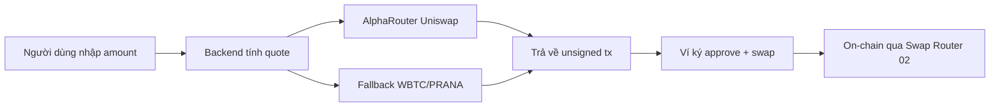

# Swap Modal — Giao dịch trực tiếp trên PRANA App

Chúng tôi vừa ra mắt **Swap Modal** — tính năng swap token ngay trên website PRANA, không cần mở tab Uniswap riêng. Nhấn nút **TRADE** trên trang chủ, kết nối ví Polygon, chọn token và swap — tất cả diễn ra trong một cửa sổ modal gọn gàng.

---

## Tại sao cần Swap Modal?

Trước đây, nút TRADE dẫn người dùng sang Uniswap UI bên ngoài. Cách đó vẫn hoạt động, nhưng có vài hạn chế:

- Người dùng phải rời khỏi app PRANA
- Uniswap UI không được tối ưu riêng cho pool PRANA (thanh khoản thấp, route phức tạp)
- Trải nghiệm bị gián đoạn khi muốn xem stats và trade cùng lúc

Swap Modal giải quyết những điểm đó: **swap ngay trên app**, route được tính trên server với logic dành riêng cho PRANA, và UX được thiết kế đồng bộ với giao diện PRANA.

---

## Bạn có thể swap những gì?

Swap Modal hỗ trợ **7 loại token** trên Polygon mainnet:

| Token | Mô tả |
|-------|--------|
| **PRANA** | Token gốc của dự án |
| **WBTC** | Wrapped Bitcoin |
| **POL** | Native token của Polygon |
| **USDC** | USD Coin |
| **USDT** | Tether USD |
| **WETH** | Wrapped Ether |
| **DAI** | Dai Stablecoin |

Bạn có thể:

- **Mua PRANA** — swap từ bất kỳ token nào ở trên sang PRANA (ví dụ USDC → PRANA, WBTC → PRANA)
- **Bán PRANA** — swap PRANA sang token khác (ví dụ PRANA → USDC)
- **Swap giữa các token khác** — không nhất thiết phải qua PRANA (ví dụ USDC → WETH, POL → USDT)

Cặp mặc định khi mở modal: **WBTC → PRANA**.

---

## Cách sử dụng

1. Nhấn **TRADE** trên trang chủ
2. **Kết nối ví** (MetaMask, Rabby, hoặc ví injected khác)
3. Đảm bảo ví đang ở mạng **Polygon**
4. Chọn token **From** và **To**, nhập số lượng
5. Đợi app tìm route tốt nhất (khoảng 1 giây sau khi nhập)
6. Xem thông tin quote: số lượng nhận, minimum received, gas estimate, route breakdown
7. Nhấn **Approve & Swap** (lần đầu với token ERC-20) hoặc **Swap**
8. Xác nhận giao dịch trên ví

Slippage mặc định: **0.5%** (cố định trong phiên bản V1).

---

## Swap Modal hoạt động như thế nào?

**Luồng kỹ thuật (đơn giản hóa):**

1. **Browser** gửi yêu cầu quote lên backend (`POST /api/swap/quote`)
2. **Backend** dùng Uniswap Smart Order Router (AlphaRouter) để tìm route qua pool V2/V3 trên Polygon
3. Nếu route thông thường không tìm được (thường gặp với PRANA), backend dùng **fallback WBTC/PRANA**: ghép route AlphaRouter đến/đi WBTC với hop trực tiếp qua pool V3 WBTC/PRANA (fee 1%)
4. Backend trả về số lượng output, route summary, và **calldata giao dịch chưa ký**
5. **Ví người dùng** ký `approve` (nếu cần) rồi gửi transaction swap lên **Uniswap Swap Router 02** chính thức trên Polygon

RPC key (Alchemy) chỉ chạy trên server — không lộ ra browser.

---

## So sánh với Uniswap UI

Uniswap Web App là sản phẩm swap đầy đủ, hỗ trợ nhiều chain và token. Swap Modal của PRANA là **swap nhúng, tối ưu cho use case PRANA** trên Polygon. Dưới đây là điểm khác biệt chính:

### Router & giao dịch on-chain

| | **PRANA Swap Modal** | **Uniswap UI** |
|---|---|---|
| Router | **Swap Router 02** (`0x68b3...Fc45`) | **Universal Router** (phiên bản mới hơn) |
| Cách encode lệnh swap | `exactInput`, `multicall`, `unwrapWETH9` qua Router 02 | Command-based qua Universal Router |
| Pool versions | V2 + V3 | V2, V3, V4 |

Swap Modal dùng **Swap Router 02** — contract Uniswap chính thức, đã được kiểm chứng rộng rãi trên Polygon. Không dùng Universal Router vì V1 tập trung vào route V2/V3 ổn định và logic fallback PRANA.

### Cơ chế approval

| | **PRANA Swap Modal** | **Uniswap UI** |
|---|---|---|
| Approval | **ERC-20 `approve`** trực tiếp cho Swap Router 02 | **Permit2** — ký message một lần, dùng lại cho nhiều swap |
| Số transaction | Có thể cần 2 tx: approve + swap (lần đầu với token đó) | Thường chỉ 1 tx swap sau khi đã setup Permit2 |
| Độ phức tạp | Đơn giản, dễ hiểu | Tối ưu gas và UX cho power user |

**Permit2** là hợp đồng trung gian của Uniswap: thay vì `approve` từng token cho từng router, người dùng cấp quyền một lần qua chữ ký off-chain, sau đó Universal Router rút token qua Permit2. Swap Modal V1 chọn cách **`approve` cổ điển** — ít bước setup hơn, phù hợp người dùng mới, dù có thể tốn thêm một transaction approve lần đầu.

### Routing & quote

| | **PRANA Swap Modal** | **Uniswap UI** |
|---|---|---|
| Nơi tính route | **Server PRANA** (Node backend) | Client hoặc Uniswap API |
| RPC | Alchemy qua server, key không lộ | RPC của người dùng hoặc infra Uniswap |
| Route PRANA | **Fallback WBTC/PRANA tùy chỉnh** khi AlphaRouter không tìm được route | Routing chung, có thể fail hoặc kém với pool thanh khoản thấp |
| Danh sách token | 7 token cố định, curated | Tìm/import bất kỳ token nào |
| Slippage | Cố định 0.5% | Người dùng tự chỉnh |

Điểm mạnh lớn nhất của Swap Modal: **backend biết pool PRANA/WBTC** và ghép route thủ công khi cần, thay vì phụ thuộc hoàn toàn vào routing tổng quát của Uniswap.

### Trải nghiệm người dùng

| | **PRANA Swap Modal** | **Uniswap UI** |
|---|---|---|
| Vị trí | Modal nhúng trên prana.app | App swap riêng biệt |
| Chain | Polygon only | Đa chain |
| Tính năng | Swap cơ bản | Swap, limit order, pools, analytics, v.v. |
| Ngôn ngữ | EN / VI | Đa ngôn ngữ |

---

## An toàn & minh bạch

- Giao dịch swap thực thi qua **Uniswap Swap Router 02 chính thức** trên Polygon — không qua contract tùy ý của PRANA
- Ví chỉ ký transaction; **private key không bao giờ rời khỏi ví**
- Quote và calldata được build trên server, nhưng **wallet là nơi duy nhất ký và gửi tx**
- Modal hiển thị route breakdown để bạn thấy token đi qua những pool nào trước khi xác nhận

---

## Hạn chế V1 (cần biết)

- Chỉ hỗ trợ **7 token** trong danh sách — chưa import token tùy ý
- Slippage **không chỉnh được** (0.5% cố định)
- Chỉ **Polygon mainnet**
- Cần backend chạy để lấy quote (trong dev: `npm run dev:all`)
- Ví injected only (MetaMask, Rabby...) — chưa hỗ trợ WalletConnect

---

## Tóm lại

**Swap Modal** mang trải nghiệm swap vào ngay trong PRANA app: mua/bán PRANA và giao dịch giữa 7 token phổ biến trên Polygon, với routing backend tối ưu cho pool PRANA. So với Uniswap UI, chúng ta chọn **Swap Router 02 + ERC-20 approve** thay vì Universal Router + Permit2 — đơn giản hơn, ít phụ thuộc setup, và có **logic route dành riêng cho PRANA** mà Uniswap UI chung không có.

Nhấn **TRADE** và thử ngay.
