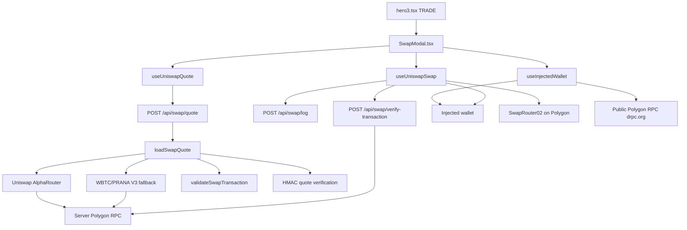
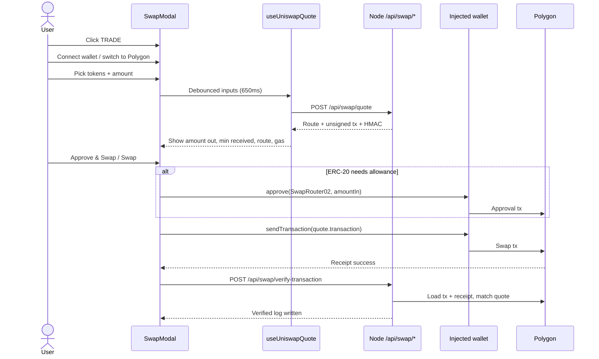
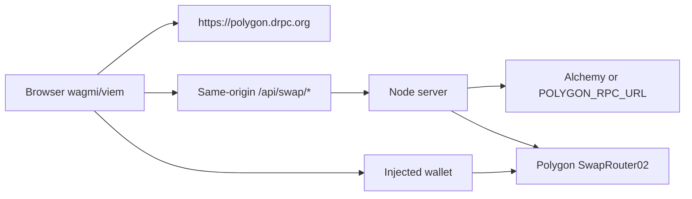

# Swap Modal — Technical Overview

This document describes the in-app Polygon swap modal end to end: UI flow, server-side routing, security boundaries, and the custom network path that serves production traffic. It is written for contributors and operators who want to understand how the feature works before reading the code.

Related docs:

- [`NETWORK_ARCHITECTURE.md`](./NETWORK_ARCHITECTURE.md) — full VPS ↔ Pi tunnel ops detail
- [`SECURITY_OVERVIEW.md`](./SECURITY_OVERVIEW.md) — inventory of infra + swap security mechanisms
- [`CACHE_ARCHITECTURE.md`](./CACHE_ARCHITECTURE.md) — stats cache layer (separate from swap)

---

## What it is

The hero **SWAP** button opens an in-app swap modal instead of sending users to an external Uniswap UI. Users connect an injected browser wallet (MetaMask, Rabby, etc.), stay on **Polygon mainnet only**, and swap among a fixed allowlist of seven tokens.

Default pair when the modal opens: **WBTC → PRANA**.

V1 tokens: `PRANA`, `WBTC`, `POL` (native), `USDC`, `USDT`, `WETH`, `DAI`.

Any two different tokens from that list can be selected as the pair, not only swaps to or from PRANA. Users can also swap among the other six tokens (for example USDT → WETH or POL → USDC). PRANA pairs may use a dedicated WBTC/PRANA fallback when AlphaRouter cannot find a route; non-PRANA pairs go through AlphaRouter alone.

Slippage is fixed at **0.5%** (`50` bps) in V1.

---

## Design goals

1. **Keep trading on the PRANA app** — no tab hop to a third-party swap UI.
2. **Server-side routing** — Uniswap Smart Order Router runs on Node so Alchemy (or other private RPC) keys never reach the browser.
3. **PRANA-aware paths** — thin WBTC/PRANA liquidity gets a dedicated fallback when AlphaRouter cannot find a usable route.
4. **Wallet signs everything** — the server returns unsigned calldata; the user’s wallet approves and sends the swap.
5. **Trust but verify confirmations** — browser telemetry is untrusted; successful swaps are confirmed against Polygon before they count as verified.

This stack does **not** use LiFi, 0x, RainbowKit, or WalletConnect. Wagmi + injected connectors only.

---

## High-level architecture



### Trust split

| Layer | Responsibility |
| --- | --- |
| **Browser** | UI, wallet connect, balance/allowance reads, signing approve + swap, fire-and-forget lifecycle logs |
| **Node backend** | Quote routing, calldata construction, calldata validation, HMAC signing, rate limits, on-chain verification, structured logs |
| **User wallet** | Final authority: only the wallet can move funds |
| **Polygon** | Execution via Uniswap SwapRouter02 ([`0x68b3465833fb72A70ecDF485E0e4C7bD8665Fc45`](https://polygonscan.com/address/0x68b3465833fb72a70ecdf485e0e4c7bd8665fc45#tokentxns)) |

The browser **never builds swap calldata**. It sends `quote.transaction.{to, data, value}` exactly as returned by the server.

---

## End-to-end user flow



### Step by step

1. **Open** — `hero3.tsx` sets `isSwapOpen`; `SwapModal` mounts with WBTC → PRANA.
2. **Connect** — `useInjectedWallet.connectWallet()` picks the first available injected connector.
3. **Network** — if `chainId !== 137`, `ensurePolygon()` calls wagmi `switchChain`.
4. **Quote** — when connected, on Polygon, and amount &gt; 0, `useUniswapQuote` clears any previous quote immediately, waits **650ms**, then `POST /api/swap/quote`.
5. **Review** — modal shows output amount, minimum received, route steps, and gas estimate.
6. **Execute** — `useUniswapSwap.executeSwap()`:
   - Refuses stale quotes (`isQuoteCurrent` + deadline buffer).
   - Approves exact `amountInRaw` on the ERC-20 if allowance is low (native POL skips approve).
   - Sends the server-provided swap transaction.
7. **Success** — in-modal success view with Polygonscan link; optional “Swap again”.
8. **Telemetry** — approval/swap lifecycle events go to `/api/swap/log`; confirmed swaps go to `/api/swap/verify-transaction`.

### Primary CTA state machine

The modal’s main button is driven by wallet + quote + swap status:

`Connect Wallet` → `Switch to Polygon` → `Finding Best Route` → `Refresh Quote` (if expired) → `Approve & Swap` / `Swap` → wallet confirmation labels → success view.

Swap execution status (`SwapTransactionStatus`):

```
idle → approving → approval-confirming → approved → swapping → swap-confirming → success
                                                                              ↘ error
```

---

## Quote pipeline (server)

Orchestration lives in `server/loaders/swapQuote.ts`.

### 1. Primary: Uniswap AlphaRouter

`loadPrimaryRoute()` uses `@uniswap/smart-order-router` against Polygon with `SwapType.SWAP_ROUTER_02`. When a route and `methodParameters` exist, that calldata becomes the quote transaction.

### 2. Fallback: WBTC/PRANA stitch

PRANA’s main liquidity sits in a known Uniswap V3 WBTC/PRANA pool (1% fee). When AlphaRouter cannot produce a usable route for PRANA pairs (except the direct WBTC↔PRANA case handled naturally), the fallback:

- **Buy PRANA:** AlphaRouter leg `tokenIn → WBTC`, then append the WBTC/PRANA V3 hop.
- **Sell PRANA:** Quote `PRANA → WBTC` via QuoterV2, then AlphaRouter leg `WBTC → tokenOut`.
- Builds `exactInput` calldata manually and wraps it in `multicall(uint256 deadline, bytes[])` so the fallback has an on-chain deadline like AlphaRouter quotes.
- Native POL output adds `unwrapWETH9` inside the multicall.

### 3. Validate before return

`validateSwapTransaction()` in `server/loaders/swapValidations.ts` decodes router calldata (including nested `multicall` batches) and checks:

- Router `to` address is SwapRouter02
- Native `value` matches expectations
- Recipients are the user wallet or router custody
- Input / min-out amounts
- V3 path endpoints (strict for fallback)
- Multicall deadline and nesting depth
- Only whitelisted router functions (`exactInput`, `exactInputSingle`, `swapExactTokensForTokens`, wrap/unwrap/sweep/refund helpers)

Malformed or unexpected calldata is rejected with a **generic** client error; internals stay server-side.

### 4. Sign the quote

`attachSwapQuoteVerification()` attaches an HMAC token (version 2) over normalized quote + transaction fields, with a short TTL. Verification later proves the client did not invent or tamper with the quote used for a “confirmed” swap.

### 5. Log

Selected routes and failures are written as structured JSON logs (`server/loaders/swapLogs.ts`), with URL / API-key redaction.

---

## Frontend quote freshness

Quotes expire after **3 minutes** (`SWAP_DEADLINE_SECONDS`). The frontend also:

- Echoes request metadata on every quote (`tokenInSymbol`, `tokenOutSymbol`, `amountInRaw`, `recipient`, `slippageBps`, `chainId`)
- Clears the on-screen quote as soon as inputs change (not only after debounce)
- Blocks approve/swap unless `isQuoteCurrent` passes and the deadline is not within a 5-second buffer
- Offers manual refresh with a **60s** cooldown

If the user edits amount or tokens after a quote arrives, they must get a fresh quote before swapping.

---

## Approval and swap execution

Implemented in `features/swap/hooks/useUniswapSwap.ts`.

**Native POL in**

- No ERC-20 approval
- Swap tx `value` equals `amountInRaw`

**ERC-20 in**

1. Read `balanceOf` + `allowance(owner, SwapRouter02)` on the public frontend RPC
2. If allowance &lt; quoted amount, send `approve(SwapRouter02, amountInRaw)` for the **exact** quote amount (not unlimited)
3. Wait for approval receipt
4. `walletClient.sendTransaction` to SwapRouter02 with server calldata
5. Wait for swap receipt; reverted receipts are treated as failures

Wallet / viem failures are sanitized before they reach the modal (`features/swap/utils/sanitizeSwapWalletError.ts`). User cancellations show **Transaction canceled.**; unknown internals collapse to a short approval/swap fallback so long calldata never overflows the UI. Full error details still go to lifecycle logs.

Balances and allowances use the **browser** RPC. Routing and verification use the **server** RPC.

---

## API surface

All swap endpoints are POST-only, same-origin, JSON `Content-Type`, with body size caps and per-IP rate limits (`server/postApiRoutes.ts`, `server/rateLimit.ts`).

| Endpoint | Purpose | Body cap | Rate limit (per IP / min) |
| --- | --- | --- | --- |
| `POST /api/swap/quote` | Route + unsigned tx + HMAC | 2 KB | 5 (+ 30 global) |
| `POST /api/swap/log` | Untrusted lifecycle telemetry | 8 KB | 30 |
| `POST /api/swap/verify-transaction` | Trusted `swap_confirmed` after on-chain proof | 32 KB | 10 |

### Quote request

```json
{
  "tokenInSymbol": "USDT",
  "tokenOutSymbol": "PRANA",
  "amountIn": "1",
  "recipient": "0x...",
  "slippageBps": 50
}
```

### Quote response (shape)

Returns echoed `request` metadata, token descriptors, human + raw amounts, `minimumAmountOut`, route steps, optional gas fields, `routerAddress`, `transaction { to, data, value }`, `deadline`, `quoteUpdatedAt`, and `verification`.

### Logging vs verification

- `/api/swap/log` accepts browser-reported events (`approval_*`, `swap_submitted`, `swap_failed`, …). Treat these as telemetry only.
- On `swap_confirmed`, the client calls `/api/swap/verify-transaction` with owner, tx hash, and the full quote. The server:
  1. Checks HMAC + replay guard
  2. Loads tx + receipt from Polygon
  3. Asserts sender, router target, calldata, and value match the signed quote
  4. Writes a verified `swap_confirmed` log

Clients cannot invent verified swap analytics without a matching on-chain transaction.

---

## RPC and wallet configuration



| Consumer | RPC | Config |
| --- | --- | --- |
| Frontend (balances, allowance, send/wait) | Public `https://polygon.drpc.org` | `constants/network.ts` → `utils/wagmiConfig.ts` |
| Backend (AlphaRouter, QuoterV2, verification) | Alchemy preferred, else `POLYGON_RPC_URL`, else `polygon-rpc.com` | `server/utils/providers.ts` |

CSP `connect-src` allows same-origin API calls plus the frontend RPC host (`server/securityHeaders.ts`).

---

## Custom network infrastructure (production)

Production is not “Node on a public VPS.” The app origin runs on a **Raspberry Pi** at home; a **VPS** is the public HTTPS edge. They are linked by a **reverse SSH tunnel**.

```
Internet
   │
   ▼
VPS (public IP, DNS, Let’s Encrypt)
  nginx :443 → proxy to 127.0.0.1:9000
   │
   │  reverse SSH tunnel (Pi initiates)
   │  VPS:9000  ◄──────►  Pi:80
   ▼
Raspberry Pi (behind NAT)
  nginx :80
    /        → 127.0.0.1:4173  (Node app: static + API, incl. lazy /stake/)
    /bond/   → static legacy SPA
```

### Why this shape

- **No home port forwarding** — the Pi opens SSH to the VPS; the VPS never needs to dial into the home network.
- **TLS and edge rate limits live on the VPS** — the Pi only sees traffic that already passed the public edge.
- **App stays on one machine** — Node + local nginx on the Pi; the VPS is mostly nginx + SSH.

### Rate-limit identity across proxies

Both VPS nginx and Pi nginx append to `X-Forwarded-For`. Production Node must set:

```bash
TRUSTED_PROXY_HOP_COUNT=2
```

so swap rate limiting attributes requests to the real client IP, not the localhost hop from Pi nginx. See `server/rateLimit.ts` and [`NETWORK_ARCHITECTURE.md`](./NETWORK_ARCHITECTURE.md).

### Local development mirror

- Vite dev server: port **5173**, proxies `/api` to the Node API
- Dev API: port **4174** (`npm run serve:dev` / `npm run dev:all`)
- Production Node default: port **4173**

Hitting the wrong process in preview often returns HTML instead of JSON — that is why the quote hook detects non-JSON error pages and asks you to restart the backend.

Full tunnel/nginx ops: [`NETWORK_ARCHITECTURE.md`](./NETWORK_ARCHITECTURE.md).

---

## Security model (summary)

1. **Private RPC stays on the server** — browser uses a public RPC only.
2. **Calldata validation** — every quote is decoded and audited before return.
3. **Quote staleness guards** — request echo + deadline + clear-on-edit.
4. **Origin + Content-Type checks** on swap POSTs.
5. **Body size caps** and **per-IP / global rate limits**.
6. **Error sanitization** — RPC URLs, stacks, and Uniswap internals are not forwarded to the client.
7. **Log sanitization** — truncates fields; redacts `http(s)://` and Alchemy key-like segments.
8. **HMAC + on-chain verification** for trusted swap confirmations.
9. **Fixed token allowlist** — no arbitrary token import in V1.
10. **CSP + framing headers** on all responses.

---

## Key source map

### Frontend

| Path | Role |
| --- | --- |
| `hero3.tsx` | TRADE entry; mounts modal |
| `features/swap/SwapModal.tsx` | UI orchestration |
| `hooks/useInjectedWallet.ts` | Connect / disconnect / switch to Polygon |
| `features/swap/hooks/useUniswapQuote.ts` | Debounced quote fetch |
| `features/swap/hooks/useUniswapSwap.ts` | Balances, approve, swap, status machine |
| `features/web3/walletFormatting.ts` | Pure compact address helper (Swap + staking) |
| `features/web3/web3.types.ts` | Shared wallet hook result type |
| `features/swap/utils/sanitizeSwapWalletError.ts` | Map wallet/viem errors to short UI messages |
| `utils/wagmiConfig.ts` | Polygon + injected connectors |
| `features/swap/utils/swapTransactionLogs.ts` | Log vs verify client routing |
| `features/swap/utils/swapTokenFormatting.ts` | Swap amount parse/format helpers (viem) |
| `utils/tokenAmounts.ts` | Pure bigint ↔ decimal helpers (no ethers/viem) |
| `utils/swapTokens.ts` | Shared token lookup (frontend + backend) |
| `constants/swapContracts.ts` | Tokens, router, deadlines, ABIs |
| `types/swap.types.ts` | Shared Swap API and UI types |

### Backend

| Path | Role |
| --- | --- |
| `server/index.ts` | HTTP server composition |
| `server/postApiRoutes.ts` | Swap POST routes |
| `server/loaders/swapQuote.ts` | Quote orchestration |
| `server/utils/swapQuoteUtils.ts` | AlphaRouter + path helpers |
| `server/loaders/swapValidations.ts` | Calldata audit |
| `server/loaders/swapQuoteVerification.ts` | HMAC sign / verify |
| `server/loaders/swapTransactionVerification.ts` | On-chain confirmation |
| `server/loaders/swapLogs.ts` | Structured logging |
| `server/rateLimit.ts` | Per-IP + global limits |
| `server/utils/providers.ts` | Server Polygon/Arbitrum providers |
| `server/securityHeaders.ts` | CSP and related headers |

### Tests

- `server/tests/swapQuote.test.ts`
- `server/tests/swapTransactionVerification.test.ts`
- `server/tests/swapLogs.test.ts`
- `server/tests/rateLimit.test.ts`
- `server/tests/apiBoundary.test.ts`

---

## Terms / Risk Disclosure

Public legal copy for end users lives at **`/terms`** (footer link + launch posts) and **`/privacy`**. Terms content is markdown under `data/terms-risk-vi.md` / `data/terms-risk-en.md`; privacy under `data/privacy-vi.md` / `data/privacy-en.md`. Both render through `components/LegalMarkdownPage.tsx` via `utils/inlineMarkdown.tsx` (bold, inline code, external + same-site links). Headers show the legal effective date, UI build version (`getAppBuildInfo` / same label as the footer), and a short scope note. The Swap modal shows an acceptance line under the primary action linking to `/terms`. The SwapRouter02 address in the terms links to [Polygonscan token transfers](https://polygonscan.com/address/0x68b3465833fb72a70ecdf485e0e4c7bd8665fc45#tokentxns). Path matching uses `constants/appRoutes.ts` (no React Router). Production and Vite SPA both fall back to `index.html` for these paths.

---

## V1 limitations

- Polygon mainnet only; no cross-chain bridging
- Seven tokens; no custom token import
- Fixed 0.5% slippage UI
- Injected wallets only (no WalletConnect / mobile deep-link flow)
- Quote HMAC + replay cache are **process-local** — multi-instance deploys need a shared secret and shared replay store
- Production availability depends on the Pi ↔ VPS SSH tunnel staying up (use `autossh` or a systemd unit)

---

## Mental model for new contributors

Think of the swap modal as three thin frontend hooks around one careful backend:

1. **Wallet** — connection and chain
2. **Quote** — ask the server what to sign
3. **Swap** — approve if needed, sign what the server returned, then ask the server to prove the confirmation

Everything else (fallback routing, validation, HMAC, rate limits, reverse tunnel) exists so that path stays safe and PRANA-aware without putting private RPC credentials or route construction in the browser.
