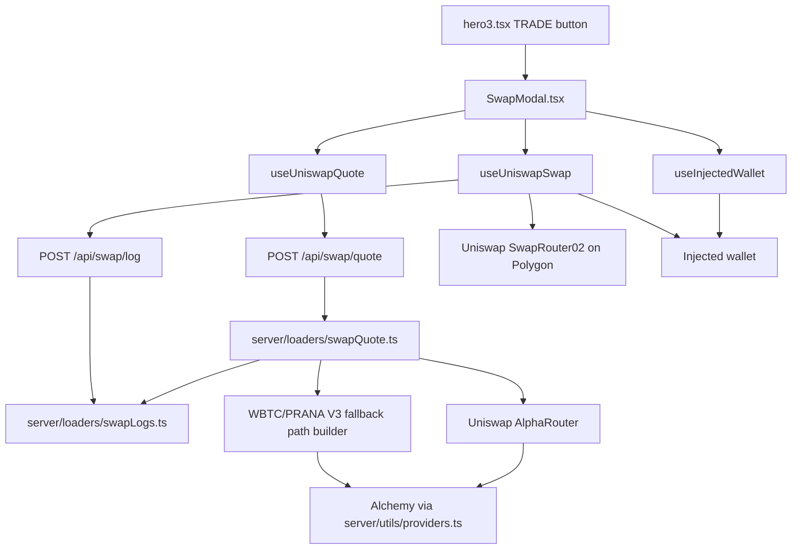

# Swap UI V1 — Review Guide

This document is a map of everything added for the in-app Polygon swap feature. Use it to review the code in a sensible order, from shared definitions up through UI and backend routing.

## What this feature does

- The hero **TRADE** button opens an in-app swap modal instead of linking to Uniswap.
- Users connect an injected wallet (MetaMask, Rabby, etc.) on **Polygon only**.
- The browser asks the **Node backend** for a quote and unsigned transaction data.
- The backend uses **Uniswap Smart Order Router** (and a custom fallback for PRANA routes) with the existing **Alchemy RPC** env var — the API key never goes to the browser.
- The wallet signs **approval** (no need for native POL) and the **swap** transaction locally.
- The backend writes structured swap logs for selected routes, quote failures, and browser-reported approval/swap transaction outcomes.

## Architecture (high level)



## New dependencies (`package.json`)

| Package | Role |
| --- | --- |
| `wagmi` | React hooks for wallet connect, chain switch, clients |
| `viem` | Low-level Ethereum types/calls (used by wagmi and formatting) |
| `@tanstack/react-query` | Required by wagmi v2+ |
| `@uniswap/smart-order-router` | Backend route calculation |
| `@uniswap/sdk-core` | Token/currency types for Uniswap SDK |
| `@uniswap/router-sdk`, `@uniswap/v2-sdk`, `@uniswap/v3-sdk` | Peer deps for smart-order-router |
| `@ethersproject/providers` | ethers v5 provider for Uniswap SDK on the server |

Existing packages reused: `ethers`, `framer-motion`, `lucide-react`.

## File inventory

### New files (swap-specific)

| File | Lines (approx) | Purpose |
| --- | --- | --- |
| `types/swap.types.ts` | 119 | All swap-related TypeScript types |
| `constants/swapContracts.ts` | 123 | V1 token list, router addresses, slippage defaults, ERC-20 ABI |
| `utils/wagmiConfig.ts` | 17 | wagmi config: Polygon + injected connectors |
| `utils/swapTokenFormatting.ts` | 33 | Parse/format amounts, compact address, input validation |
| `utils/swapTransactionLogs.ts` | 39 | Fire-and-forget browser reporting to `/api/swap/log` |
| `hooks/useInjectedWallet.ts` | 40 | Connect, disconnect, switch to Polygon |
| `hooks/useUniswapQuote.ts` | 102 | Debounced fetch to `/api/swap/quote` |
| `hooks/useUniswapSwap.ts` | 179 | Balance, allowance, approve, send swap tx |
| `components/SwapModal.tsx` | 360 | Modal UI (token pickers, quote, CTA, errors) |
| `server/loaders/swapQuote.ts` | 356 | Uniswap routing + PRANA fallback + calldata |
| `server/loaders/swapLogs.ts` | 130 | Structured swap quote/transaction logging helpers |

### Modified files (integration touchpoints)

| File | What changed |
| --- | --- |
| `main.tsx` | Wraps app in `WagmiProvider` + `QueryClientProvider` |
| `hero3.tsx` | TRADE link → button; renders `<SwapModal />` |
| `server/index.ts` | Adds `POST /api/swap/quote` and `POST /api/swap/log` routes |
| `server/requestHelpers.ts` | Adds `readJsonBody()` for POST bodies |
| `server/utils/providers.ts` | Adds `getServerPolygonRpcUrl()` export |
| `package.json` / `package-lock.json` | New dependencies |

### Not part of this feature (ignore during review)

- `utils/uniswapV3Helpers.ts` — existing LP math for stats, not swap UI
- `contracts/UniswapV3*.sol` — unrelated to this React swap flow

### Existing file reused (not new)

- `constants/sharedContracts.ts` — `PRANA_ADDRESS`, `WBTC_ADDRESS`, `WBTC_PRANA_V3_POOL`

## V1 supported tokens

Fixed list in `constants/swapContracts.ts` → `V1_SWAP_TOKENS`:

| Symbol | Kind | Notes |
| --- | --- | --- |
| PRANA | ERC-20 | Default output when opening from TRADE |
| WBTC | ERC-20 | Direct V3 pool with PRANA |
| POL | Native | Routes via WMATIC internally |
| USDC | ERC-20 | Native Polygon USDC |
| USDT | ERC-20 | |
| WETH | ERC-20 | |
| DAI | ERC-20 | |

Default pair when modal opens: **WBTC → PRANA** (`DEFAULT_SWAP_TOKEN_IN_SYMBOL` / `DEFAULT_SWAP_TOKEN_OUT_SYMBOL`).

## Recommended review order

Read in this order so each layer builds on the last.

### 1. Types — `types/swap.types.ts`

Start here. Everything else imports from this file.

**Look for:**
- `SwapToken`, `SwapQuoteRequest`, `SwapQuoteResponse` — API contract between frontend and backend
- `SwapTransactionLogEvent`, `SwapTransactionLogRequest` — browser-to-server transaction log contract
- `SwapTransactionStatus` — UI state machine for approve/swap
- Hook input/output types — keeps components thin

### 2. Constants — `constants/swapContracts.ts`

**Look for:**
- Token addresses and decimals match Polygon mainnet
- `UNISWAP_SWAP_ROUTER_02_ADDRESS` = `0x68b3465833fb72A70ecDF485E0e4C7bD8665Fc45`
- `WBTC_PRANA_POOL_ADDRESS` matches existing `sharedContracts.ts`
- `DEFAULT_SWAP_SLIPPAGE_BPS` = 50 (0.5%)
- `SWAP_ERC20_ABI` — minimal approve/allowance/balanceOf for frontend

### 3. App wiring — `utils/wagmiConfig.ts` + `main.tsx`

**Look for:**
- Only Polygon chain configured
- `injected()` connectors for browser wallets
- `WagmiProvider` wraps the whole app (required for hooks anywhere)

### 4. Backend quote loader — `server/loaders/swapQuote.ts` (most complex file)

This is the core routing logic. Budget the most review time here.

**Two paths:**

1. **Primary:** Uniswap `AlphaRouter.route()` → returns `methodParameters` (calldata) when it finds a full route.
2. **Fallback:** `loadWbtcPranaFallbackQuote()` — used when AlphaRouter cannot combine PRANA’s low-liquidity pool with other tokens. It:
   - Routes token → WBTC via AlphaRouter
   - Appends the known WBTC/PRANA V3 pool (1% fee = `10000`)
   - Quotes the combined path via QuoterV2
   - Builds `exactInput` calldata manually

**Critical detail (already fixed once):** SwapRouter02 on Polygon uses `exactInput` **without** a `deadline` in the tuple. Correct selector: `0xb858183f`. Wrong (reverts immediately): `0xc04b8d59`.

**Also note:**
- Uses `createRequire()` for Uniswap packages (Node ESM compatibility)
- Alchemy RPC via `getServerPolygonRpcUrl()` — not exposed to browser
- Native POL output uses `multicall` + `unwrapWETH9` in fallback path
- Calls `logSwapQuoteRoute()` when a route is selected. Log payload includes source (`alpha_router` or `wbtc_prana_fallback`), token pair, amount in/out, minimum out, slippage, recipient, gas fields, and `routePath`.
- Calls `logSwapQuoteFailure()` for AlphaRouter failures, fallback failures, and final no-route failures.

### 5. API endpoints — `server/index.ts`

**Look for:**
- `POST` only on `/api/swap/quote`
- Body parsed via `readJsonBody<SwapQuoteRequest>`
- Errors return JSON `{ error, message }` with 400 status
- `POST` only on `/api/swap/log`
- Log body parsed via `readJsonBody<unknown>` and validated by `parseSwapTransactionLogRequest()`
- Transaction logs are accepted as fire-and-forget telemetry from the browser; failed log writes should not block the user's swap flow

### 6. Server helpers — `server/requestHelpers.ts`, `server/utils/providers.ts`

Small changes. Confirm `readJsonBody` is straightforward and `getServerPolygonRpcUrl` reads the same env vars as the rest of the app (`VITE_ALCHEMY_POLYGON_MAIN` / `POLYGON_RPC_URL`).

### 7. Quote hook — `hooks/useUniswapQuote.ts`

**Look for:**
- Debounce (`SWAP_QUOTE_DEBOUNCE_MS` = 650ms)
- Only fetches when wallet connected, on Polygon, amount > 0
- Non-JSON response → clear “restart backend” error (avoids `Unexpected token '<'`)

### 8. Swap execution hook — `hooks/useUniswapSwap.ts`

**Look for:**
- Reads balance + allowance for ERC-20 input
- `needsApproval` → `approve` on SwapRouter02 before swap
- Sends `quote.transaction.to/data/value` from backend unchanged
- Native POL: `value` field on transaction, no approval needed
- Reports approval/swap events through `logSwapTransactionEvent()`:
  `approval_submitted`, `approval_confirmed`, `approval_failed`, `swap_submitted`, `swap_confirmed`, `swap_failed`
- Checks receipt status and treats `reverted` receipts as failures
- `as never` casts on viem calls (typing workaround, not logic)

### 9. Wallet hook — `hooks/useInjectedWallet.ts`

Thin wrapper over wagmi. Connect, disconnect, `ensurePolygon()`.

### 10. Formatting utils — `utils/swapTokenFormatting.ts`

Pure helpers. No side effects.

### 10a. Transaction log helper — `utils/swapTransactionLogs.ts`

Fire-and-forget helper that posts transaction lifecycle events to `/api/swap/log`. It includes the wallet address, tx hash, quote pair, raw/display amounts, minimum amount out, router address, route summary, receipt status, and error message when present.

### 11. UI component — `components/SwapModal.tsx`

**Look for:**
- Matches site glass/gold style (similar to `Covenants.tsx`)
- Local state: token in/out, amount, slippage (fixed 0.5% for v1)
- Composes the three hooks
- Primary button flow: Connect → Switch network → Approve & Swap → Swap
- Route summary, min received, gas estimate display
- Error display for quote errors, swap errors, insufficient balance

### 12. Entry point — `hero3.tsx`

**Look for:**
- `isSwapOpen` state
- TRADE is a `<button>`, not external `<a>`
- `<SwapModal isOpen={...} onClose={...} />` at bottom of section

### 13. Dev proxy — `vite.config.js`

Unchanged for swap, but required for local dev: `/api` proxies to `http://localhost:4173`. Run backend with `npm run serve` or `npm run dev:all`.

## Request/response shape

**POST `/api/swap/quote`**

```json
{
  "tokenInSymbol": "USDT",
  "tokenOutSymbol": "PRANA",
  "amountIn": "1",
  "recipient": "0x...",
  "slippageBps": 50
}
```

**Response (success):**

```json
{
  "tokenIn": { "symbol": "USDT", ... },
  "tokenOut": { "symbol": "PRANA", ... },
  "amountIn": "1",
  "amountOut": "14.601566589",
  "amountOutRaw": "...",
  "minimumAmountOut": "...",
  "route": [{ "protocol": "V3", "path": ["USDT", "WBTC", "PRANA"], "percent": 100 }],
  "routerAddress": "0x68b3465833fb72A70ecDF485E0e4C7bD8665Fc45",
  "transaction": {
    "to": "0x68b3465833fb72A70ecDF485E0e4C7bD8665Fc45",
    "data": "0xb858183f...",
    "value": "0"
  },
  "quoteUpdatedAt": "..."
}
```

The frontend never constructs calldata — it only submits `transaction` from the backend quote.

**POST `/api/swap/log`**

```json
{
  "event": "swap_confirmed",
  "ownerAddress": "0x...",
  "tokenInSymbol": "USDT",
  "tokenOutSymbol": "PRANA",
  "amountIn": "1",
  "amountOut": "14.601566589",
  "amountOutRaw": "...",
  "minimumAmountOut": "...",
  "route": [{ "protocol": "V3", "path": ["USDT", "WBTC", "PRANA"], "percent": 100 }],
  "routerAddress": "0x68b3465833fb72A70ecDF485E0e4C7bD8665Fc45",
  "transactionHash": "0x...",
  "receiptStatus": "success"
}
```

The endpoint returns `{ "ok": true }` when the log event is accepted. Client logging is intentionally non-blocking.

**Structured server log examples**

```json
{"scope":"swap","event":"quote_route_selected","source":"wbtc_prana_fallback","routePath":"USDT -> WBTC -> PRANA (100% V3)"}
{"scope":"swap","event":"transaction_event","swapEvent":"swap_confirmed","transactionHash":"0x...","routePath":"USDT -> WBTC -> PRANA (100% V3)"}
```

## Manual test checklist

Run with `npm run dev:all` (or `npm run serve` + `npm run dev`), hard-refresh after deploy.

1. Click **TRADE** → modal opens, default WBTC → PRANA
2. **Connect wallet** on Polygon
3. Enter amount → quote loads (spinner, then output amount)
4. Check **route** section shows sensible path
5. **USDT → PRANA** (exercises fallback path + approval)
6. **WBTC → PRANA** (direct pool, AlphaRouter path)
7. **PRANA → USDC** (reverse fallback)
8. **POL → PRANA** (native input, `value` on tx)
9. Approve flow for ERC-20 (button shows “Approve & Swap” first)
10. Complete a small swap and confirm on Polygonscan
11. Wrong network → “Switch to Polygon”
12. Backend stopped → friendly error, not JSON parse error
13. Local server terminal shows `"scope":"swap"` logs for quote route selection and transaction events
14. Production service logs show swap entries with `sudo journalctl -u prana-stats-revamp.service -f | grep '"scope":"swap"'`

## Known limitations (V1)

- Fixed 7-token list only; no custom token import
- Slippage hardcoded to 0.5% in UI (not user-adjustable yet)
- No quote expiry UI warning (backend uses 20-minute deadline for AlphaRouter; fallback path has no deadline in calldata)
- Bundle size increased (~1.1 MB JS) due to wagmi/viem
- `swapQuote.ts` uses `any` for Uniswap SDK types (SDK is ethers v5, app is ethers v6)
- Transaction result logs depend on the browser successfully posting `/api/swap/log`; route quote logs are server-side and do not depend on the browser after the quote request
- Production deploy requires **rebuild + restart** `prana-stats-revamp.service` so `/api/swap/quote` and `/api/swap/log` exist in the running server

## Quick smoke test (terminal)

```bash
# After npm run serve is running:
curl -s -X POST http://localhost:4173/api/swap/quote \
  -H 'content-type: application/json' \
  -d '{"tokenInSymbol":"USDT","tokenOutSymbol":"PRANA","amountIn":"1","recipient":"0x000000000000000000000000000000000000dEaD","slippageBps":50}' \
  | head -c 200
```

Expect JSON with `"amountOut"` and transaction `data` starting with `0xb858183f`.

To inspect local logs while testing swaps:

```bash
npm run serve
```

For production service logs:

```bash
sudo journalctl -u prana-stats-revamp.service -f | grep '"scope":"swap"'
```
