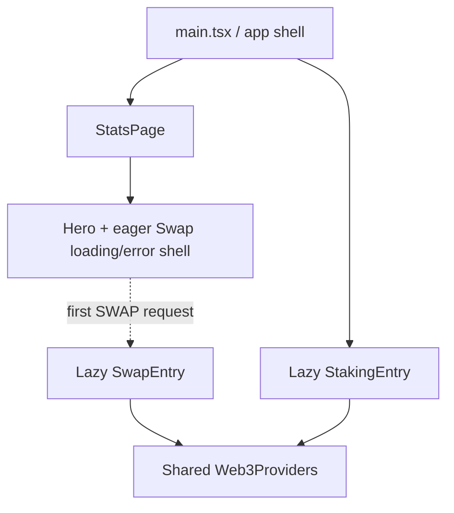

# Shared Code và ranh giới feature

Tài liệu này giải thích cách trang Stats chính, Swap modal lazy, và Staking UI
tái sử dụng utilities, helpers, constants, UI primitives, và hạ tầng Web3.

Nó mô tả cây mã nguồn hiện tại. Đây là hướng dẫn về ownership và dependency,
không phải yêu cầu rằng mọi module shared phải được cả ba bề mặt sử dụng.

Tài liệu liên quan:

- [`CACHE_ARCHITECTURE.md`](../CACHE_ARCHITECTURE.md) — cache dữ liệu trên browser và server
- [`swap-modal-technical-overview.md`](./swap-modal-technical-overview.md) — luồng Swap client/server
- [`add-staking-ui.md`](../add-staking-ui.md) — Staking UI và luồng giao dịch
- Bản tiếng Anh: [`SHARED_CODE_ARCHITECTURE.md`](../SHARED_CODE_ARCHITECTURE.md)

---

## 1. Thành phần runtime

Ứng dụng có một root shell và hai entry ở cấp trang được lazy-load:

- `main.tsx` sở hữu routing, site-language provider, các trang legal, và
  lazy boundary cho `StatsPage` cùng `StakingEntry`.
- `StatsPage` sở hữu dashboard protocol công khai và hero.
- Hero import `SwapLazyShell` một cách eager để vẫn hiện được modal accessible
  khi loading hoặc khi chunk lỗi. `SwapEntry` đầy đủ chỉ được import sau khi
  user yêu cầu Swap.
- `SwapEntry` và `StakingEntry` mỗi cái mount boundary `Web3Providers` dùng chung.
  Root shell và trang Stats thông thường không mount sẵn Wagmi hay React Query
  Web3 providers.

Sự phân biệt này quan trọng khi nói về sharing:

- **Feature ownership** hỏi feature nào sở hữu hoặc import trực tiếp một module.
- **Route dependency** gồm cả các feature lồng nhau. Ví dụ, route Stats chứa
  Swap launcher nên cũng bao gồm eager Swap shell và dependency `focusTrap`
  của shell đó.

---

## 2. Trách nhiệm theo thư mục

| Vị trí | Trách nhiệm |
| --- | --- |
| `utils/` | Helper thuần hoặc tái sử dụng rộng, browser data adapters, và một số helper Stats đã ổn định |
| `constants/` | Route chuẩn, giá trị network, địa chỉ đã deploy, token metadata, cache policy, và cấu hình feature |
| `components/` | UI cấp app và component của trang Stats |
| `components/ui/` | Presentation primitives generic; hiện chủ yếu dùng bởi Staking |
| `hooks/` | Hook App/Stats và site-language context |
| `features/web3/` | Khả năng wallet/provider dùng chung, chỉ bởi Swap và Staking |
| `features/swap/` | Swap UI, quote state, transaction state, và formatting/logging riêng của Swap |
| `features/staking/` | Staking UI, API adapters, math, validation, và transaction flows |
| `server/helpers/` | Helper chỉ dành cho server: HTTP, cache, logging, address, và static-file |
| `server/utils/` | Providers chỉ dành cho server cộng hỗ trợ loader cho Stats, Swap, và Staking |

Một file không cần ba consumer mới được đặt ở vị trí shared. Nó thuộc về đó khi
hành vi trung lập, ổn định, và hữu ích ngoài một feature. Hành vi đặc thù
feature nên ở lại với feature dù trông giống helper generic.

---

## 3. Utilities và helpers dùng chung

### Helpers xuyên bề mặt hiện tại

| Module | Trang Stats chính | Swap modal | Staking UI | Ghi chú |
| --- | --- | --- | --- | --- |
| `utils/focusTrap.ts` | Route dependency qua `SwapLazyShell` | `SwapModal`, `SwapLazyShell` | `EarlyUnstakeDialog` | Focus containment accessible, xử lý Escape, và khôi phục focus tùy chọn |
| `utils/fetchJson.ts` | Stats hooks/components và API adapters | Không dùng theo nghĩa semantic | `stakingApi.ts` | Dedupe GET đồng thời; Swap dùng POST chuyên biệt với abort và lỗi có cấu trúc |
| `utils/formatters.ts` | Dùng trực tiếp rộng rãi | Không | Không dùng trực tiếp trên client | Cũng dùng bởi Stats/Staking-related server loaders và scripts |
| `utils/tokenAmounts.ts` | Gián tiếp qua `formatters.ts` | Không | Không dùng trực tiếp trên client | Chuyển đơn vị raw không phụ thuộc Web3, tránh thêm thư viện Web3 vào formatting cơ bản |
| `utils/polygonscanUrls.ts` | Link Buy Dips và top-holder | Chưa có consumer | Chưa có consumer | Builder URL explorer token trung lập, dựa trên `constants/network.ts` |
| `utils/swapTokens.ts` | Không có consumer thuộc Stats | Swap client và server | Không | Lookup trên Swap allowlist |

Thư mục gốc `utils/` cũng chứa các module dữ liệu và tính toán hướng Stats.
Các nhóm quan trọng gồm:

- JSON/API adapters: `pranaStatsApi.ts`, `stakingStatsApi.ts`,
  `bondMetricsApi.ts`, `prana730Data.ts`, `pranaSatsData.ts`, và
  `buyDipsJson.ts`
- primitive fetch/cache dùng chung: `fetchJson.ts` và `browserJsonCache.ts`
- Tính toán Stats: `protocolCapital.ts`, `supplyMetrics.ts`,
  `liquidityMetrics.ts`, `pranaStatsPerformance.ts`, và bonding helpers
- Helper nội dung và presentation: parser FAQ/legal, build-info helpers,
  model-viewer helpers, formatters, và builder URL explorer

Các module này được giữ tách riêng thay vì gom vào một object `sharedUtils`
lớn. Named modules giữ ownership rõ ràng và giúp bundler chỉ include code cần
thiết.

### Helpers local theo feature

Swap giữ hành vi với Swap khi phụ thuộc vào semantic của Swap:

- `features/swap/utils/swapTokenFormatting.ts` dùng decimals theo token và
  ngưỡng hiển thị của Swap.
- `sanitizeSwapWalletError.ts` đưa lỗi wallet an toàn ra modal.
- `swapTransactionLogs.ts` gửi telemetry vòng đời Swap.
- `useUniswapQuote.ts` dùng POST abortable chuyên biệt thay vì
  `fetchJson` hướng GET dùng chung.

Staking giữ domain behavior riêng:

- `stakingMath.ts` triển khai interest math tương thích Solidity, parse PRANA,
  xử lý duration, truncation, quy tắc grace-window, và kết quả early-unstake.
- `stakingErrors.ts`, `permitUtils.ts`, `accountRefetch.ts`,
  `stakeCtaPhase.ts`, và `stakeTransactionFlow.ts` mô hình hóa validation và
  transaction state riêng của Staking.
- `stakingApi.ts` là browser adapter cho endpoint config và account của Staking
  và tái sử dụng `fetchJson`.

---

## 4. Constants dùng chung và dữ liệu chuẩn

### Constants toàn app và xuyên feature

| Module | Mục đích | Consumer chính |
| --- | --- | --- |
| `constants/appRoutes.ts` | Path Terms, privacy, và Staking chuẩn cộng route matchers | Root shell, hero, footer, link terms của Swap, static routing và summary phía server |
| `constants/network.ts` | Polygon chain ID, frontend RPC, base Polygonscan, và đơn vị thời gian | Explorer helpers, Swap, Staking, Web3, server security/loaders |
| `constants/sharedContracts.ts` | Địa chỉ/decimals PRANA/WBTC, pool dùng chung, Multicall, và decimals token dùng chung | Stats UI/loaders, Swap token registry/quote server, Staking amount math/loaders |
| `constants/protocolAddresses.ts` | Ví vận hành và reserve chuẩn | Capital UI/loader, top-holder registry, Buy Dips, Arbitrum LP owner |
| `constants/cachePolicy.ts` | Chính sách TTL browser/server | Browser caches, server API caches, static responses |

`sharedContracts.ts` được share ở cấp file, nhưng mỗi export có phạm vi riêng:

- `PRANA_ADDRESS` và `PRANA_DECIMALS` xuyên Stats, Swap, và Staking.
- WBTC metadata và pool WBTC/PRANA chủ yếu dùng chung bởi Stats và Swap.
- Địa chỉ/ABI Multicall dùng bởi Stats và hạ tầng server.
- `USDT_DECIMALS` dùng chung bởi Swap registry và capital loader.

`protocolAddresses.ts` đặt cho mỗi địa chỉ vận hành một tên chuẩn:

- `PRANA_PROTOCOL_ADDRESS`
- `PROTOCOL_RESERVE_ADDRESS`
- `BUY_DIPS_WALLET_ADDRESS`
- `DEX_POOL_BONDS_RESERVE_ADDRESS`

UI links, capital reads, LP ownership, và top-holder registry nên import các
giá trị này thay vì lặp lại address literals.

### Constants theo feature

| Module | Ownership và consumers |
| --- | --- |
| `constants/swapContracts.ts` | Timing, slippage, router/quoter deployments, token allowlist, và ABI của Swap; capital loader hiện cũng tái dùng địa chỉ Polygon USDT |
| `constants/stakingContracts.ts` | Staking/interest deployments, ABI đọc PRANA account, permit constants, và ABI Staking; cũng cung cấp địa chỉ dùng bởi top-holder/staking statistics trên homepage |
| `constants/topHoldingAddresses.ts` | Registry presentation của Stats, lắp từ địa chỉ protocol, pool, bond, và Staking chuẩn |
| `constants/arbitrumWbtcUsdtLp.ts` | Cấu hình Stats/server và ABI cho vị thế Arbitrum WBTC/USDT LP |
| `constants/bonds.ts` và file liên quan | Bond deployments, ABI, và input tính toán Stats/bond |
| `constants/pranaStats.ts`, `bondStats.ts`, `stakingStats.ts` | Initial UI state cho các card API độc lập trên homepage |

Swap import network constants trực tiếp từ `network.ts`; `swapContracts.ts`
không re-export giá trị network. Cách này giữ cấu hình chain và cấu hình
feature là hai nguồn sự thật tách biệt.

---

## 5. Ownership ABI

Không có ABI nào được cả ba bề mặt client tiêu thụ.

| ABI | Vị trí | Consumers |
| --- | --- | --- |
| `MULTICALL3_ABI` | `constants/sharedContracts.ts` | Capital, LP capital, và các đường server/update top-holder |
| `PRANA_TOKEN_ABI` | `constants/stakingContracts.ts` | Staking account server loader (`balanceOf`, `nonces`) |
| `STAKING_CONTRACT_ABI` | `constants/stakingContracts.ts` | Staking client writes, Staking API reads, và homepage staking-stat loaders |
| `SWAP_ROUTER_02_ABI` | `constants/swapContracts.ts` | Swap server calldata validation |
| `QUOTER_V2_ABI` | `constants/swapContracts.ts` | Swap server fallback quoting |
| Bond và LP ABIs | File constants hướng feature | Stats/server loaders tương ứng |

ABI nằm gần deployment/configuration mà chúng mô tả. Không nên tạo ABI shared
chỉ để ba feature trông đối xứng.

---

## 6. UI dùng chung và application hooks

| Shared UI/hook | Trang Stats chính | Swap modal | Staking UI |
| --- | --- | --- | --- |
| `SiteLanguageProvider` / `useSiteLanguage` | Có | Có | Có |
| `AppFooter` | Có | Không | Có |
| `LanguageToggle` | Root/main shell | Chỉ dùng locale hiện tại | Có |
| `InfoTooltip` | Nhiều Stats cards | Help cho quote/minimum-received | Không |
| `FlutterShaderBackground` | Có | Kế thừa từ page phía sau modal | Có, độ sáng thấp hơn |
| `GlassPanel` | Stats hiện chưa dùng | Không | Panel trang/form/active-stake |
| `StatusBanner` | Stats hiện chưa dùng | Không | Status form, wallet, stake, và dialog |
| `Web3Providers` | Không mount sẵn | Có | Có |
| `useInjectedWallet` | Không có use thuộc Stats | Có | Có |
| `formatCompactAddress` | Không | Có | Có |

Vị trí generic không có nghĩa là đang được dùng rộng. Ví dụ `GlassPanel` và
`StatusBanner` là UI primitives tái sử dụng được nhưng hiện chỉ Staking dùng.

---

## 7. Mỗi bề mặt dùng gì

### Trang Stats chính

Trang Stats chủ yếu dùng:

- Stats hooks và API/JSON adapters từ `hooks/` và `utils/`
- number/date/token formatters dùng chung
- máy tính protocol, supply, liquidity, bond, và performance
- `sharedContracts`, `protocolAddresses`, Stats constants, và route constants
- dựng URL explorer cho link token PRANA
- UI language, footer, tooltip, shader, và build-identity dùng chung
- eager Swap loading/error shell và `focusTrap`

Nó không mount sẵn cây Web3 provider. Đường Swap/Web3 đầy đủ bắt đầu tại
`SwapEntry` lazy.

### Swap modal

Swap modal chủ yếu dùng:

- `SwapLazyShell`, `SwapEntry`, và `SwapModal`
- `focusTrap` cho trạng thái loading, error, và modal đầy đủ
- `Web3Providers`, `useInjectedWallet`, và format địa chỉ wallet
- `network.ts` cho cấu hình Polygon chain/explorer
- `swapContracts.ts` cho token allowlist, router, slippage, quote timing,
  defaults, và Swap ABIs
- `sharedContracts.ts` gián tiếp qua Swap token registry và trực tiếp
  trong logic quote phía server
- formatting số lượng, sanitize lỗi wallet, quote state, transaction state,
  và telemetry local theo feature
- app language context, `InfoTooltip`, và shared terms route

Swap không dùng `fetchJson` cho quotes. Request quote của nó là POST debounced,
abortable với kiểm tra content-type và lỗi server có cấu trúc.

### Staking UI

Staking UI chủ yếu dùng:

- `StakingEntry` và `Web3Providers` dùng chung
- `useInjectedWallet`, `wagmiConfig`, và format địa chỉ wallet
- React Query hooks dựa trên `stakingApi.ts` và `fetchJson` dùng chung
- `network.ts` cho Polygon, link explorer, và đơn vị thời gian
- `sharedContracts.ts` cho consumers decimals/địa chỉ PRANA
- `stakingContracts.ts` cho contract đã deploy, permit typed data, và ABIs
- math, config/account adapters, error mapping, và transaction state machines
  local của Staking
- UI language/footer/shader dùng chung cộng `GlassPanel` và `StatusBanner`
- `focusTrap` trong dialog xác nhận early-unstake

Card `StakingStats` trên homepage không phải Staking transaction UI. Nó là
component Stats dựa trên đường dữ liệu aggregate `/api/staking-stats`.

---

## 8. Quy tắc bảo trì

1. Giữ một nguồn chuẩn duy nhất cho địa chỉ đã deploy, token decimals, chain IDs,
   explorer bases, routes, và TTL policy.
2. Ưu tiên named exports từ module nhỏ hơn một object `sharedData` toàn cục.
3. Giữ semantic của feature ở local. Formatting hoặc request code giống nhau chỉ
   nên share khi error behavior, precision, caching, và lifecycle requirements
   cũng giống nhau.
4. Giữ helper chỉ dành cho server dưới `server/`; client code không được import chúng.
5. Giữ Web3 providers dưới lazy Swap và Staking entries.
6. Xóa address literals khỏi consumers khi đã có named constant chuẩn.
7. Coi thư mục generic là quyền được tái sử dụng module, không phải yêu cầu
   mọi feature phải tiêu thụ nó.
