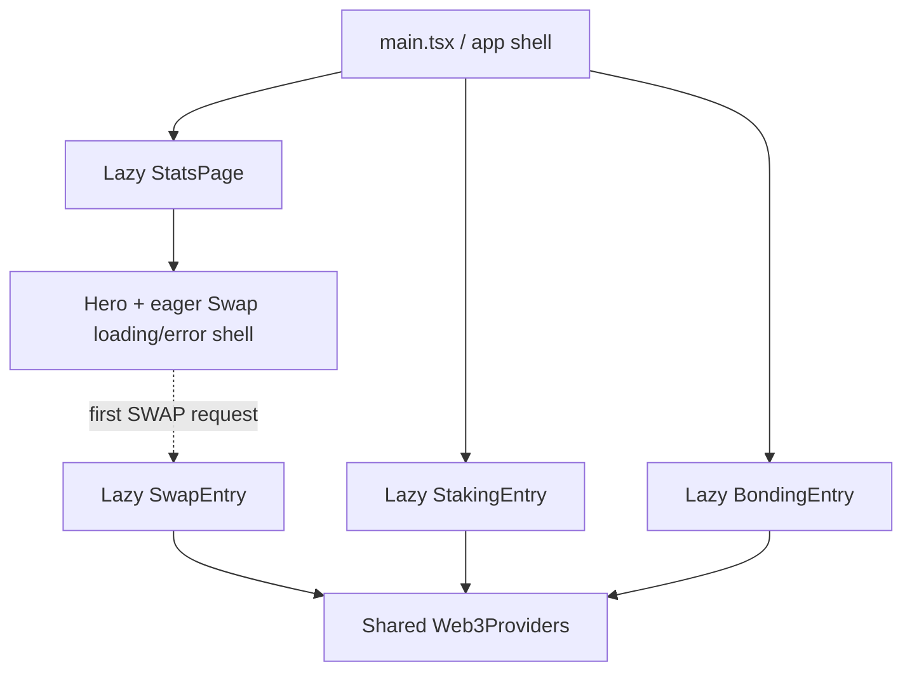

# Shared Code và ranh giới feature

Tài liệu này giải thích cách trang Stats chính, Swap modal lazy, Staking UI,
và Bonding UI tái sử dụng utilities, helpers, constants, UI primitives, và hạ tầng Web3.

Nó mô tả cây mã nguồn hiện tại. Đây là hướng dẫn về ownership và dependency,
không phải yêu cầu rằng mọi module shared phải được cả bốn bề mặt sử dụng.

Tài liệu liên quan:

- [`CACHE_ARCHITECTURE.md`](../CACHE_ARCHITECTURE.md) — cache dữ liệu trên browser và server
- [`swap-modal-technical-overview.md`](./swap-modal-technical-overview.md) — luồng Swap client/server
- [`add-staking-ui.md`](../add-staking-ui.md) — Staking UI và luồng giao dịch
- [`staking-technical-overview.md`](./staking-technical-overview.md) — luồng Staking client/server
- [`add-bonding-ui.md`](../add-bonding-ui.md) — Bonding UI và luồng giao dịch
- [`bonding-technical-overview.md`](./bonding-technical-overview.md) — luồng Bonding client/server
- Bản tiếng Anh: [`SHARED_CODE_ARCHITECTURE.md`](../SHARED_CODE_ARCHITECTURE.md)

---

## 1. Thành phần runtime

Ứng dụng có một root shell, ba route entry được lazy-load (`StatsPage`,
`StakingEntry`, `BondingEntry`), và một `SwapEntry` lazy lồng trong hero của
trang Stats:

```mermaid
flowchart TD
  root["main.tsx / app shell"]
  stats["Lazy StatsPage"]
  hero["Hero + eager Swap loading/error shell"]
  swap["Lazy SwapEntry"]
  staking["Lazy StakingEntry"]
  bonding["Lazy BondingEntry"]
  web3["Shared Web3Providers"]

  root --> stats
  root --> staking
  root --> bonding
  stats --> hero
  hero -. "first SWAP request" .-> swap
  swap --> web3
  staking --> web3
  bonding --> web3
```

- `main.tsx` sở hữu routing, site-language provider, các trang legal/guide, và
  lazy boundary cho `StatsPage`, `StakingEntry`, và `BondingEntry`.
- `StatsPage` sở hữu dashboard protocol công khai và hero.
- Hero import `SwapLazyShell` một cách eager để vẫn hiện được modal accessible
  khi loading hoặc khi chunk lỗi. `SwapEntry` đầy đủ chỉ được import sau khi
  user yêu cầu Swap.
- `SwapEntry`, `StakingEntry`, và `BondingEntry` mỗi cái mount boundary
  `Web3Providers` dùng chung. Root shell và trang Stats thông thường không
  mount sẵn Wagmi hay React Query Web3 providers.

Sự phân biệt này quan trọng khi nói về sharing:

- **Feature ownership** hỏi feature nào sở hữu hoặc import trực tiếp một module.
- **Route dependency** gồm cả các feature lồng nhau. Ví dụ, route Stats chứa
  Swap launcher nên cũng bao gồm eager Swap shell và dependency `focusTrap`
  của shell đó.

---

## 2. Trách nhiệm theo thư mục

| Vị trí | Trách nhiệm |
| --- | --- |
| `utils/` | Helper thuần hoặc tái sử dụng rộng, browser data adapters, và một số helper Stats đã ổn định |
| `constants/` | Route chuẩn, giá trị network, địa chỉ đã deploy, token metadata, cache policy, và cấu hình feature |
| `components/` | UI cấp app và component của trang Stats |
| `components/ui/` | Presentation primitives generic; dùng bởi Staking và Bonding |
| `hooks/` | Hook App/Stats và site-language context |
| `pages/` | Route UI cho Stats, Staking, và Bonding; orchestration giữa hooks và feature components |
| `types/` | Type dùng chung xuyên app/feature như blockchain, locale, Swap, và props của UI primitives; domain types của Staking/Bonding ở lại trong feature |
| `features/web3/` | Khả năng wallet/provider dùng chung bởi Swap, Staking, và Bonding |
| `features/swap/` | Swap UI, quote state, transaction state, và formatting/logging riêng của Swap |
| `features/staking/` | Staking UI, API adapters, math, validation, và transaction flows |
| `features/bonding/` | Bonding UI, API adapters, math, validation, và transaction flows |
| `server/helpers/` | Helper chỉ dành cho server: HTTP, cache, logging, address, và static-file |
| `server/loaders/` | Đọc provider/API và dựng response cho Stats, Swap, Staking, Bonding; `cached/` bọc các GET loader có cache |
| `server/utils/` | Providers chỉ dành cho server cộng hỗ trợ loader cho Stats, Swap, Staking, và Bonding |

Một file không cần ba consumer mới được đặt ở vị trí shared. Nó thuộc về đó khi
hành vi trung lập, ổn định, và hữu ích ngoài một feature. Hành vi đặc thù
feature nên ở lại với feature dù trông giống helper generic.

---

## 3. Utilities và helpers dùng chung

### Helpers xuyên bề mặt hiện tại

| Module | Trang Stats chính | Swap modal | Staking UI | Bonding UI | Ghi chú |
| --- | --- | --- | --- | --- | --- |
| `utils/focusTrap.ts` | Route dependency qua `SwapLazyShell` | `SwapModal`, `SwapLazyShell` | `EarlyUnstakeDialog` | Không | Focus containment accessible, xử lý Escape, và khôi phục focus tùy chọn |
| `utils/fetchJson.ts` | Stats hooks/components và API adapters | Không dùng theo nghĩa semantic | `features/staking/utils/stakingApi.ts` | `features/bonding/utils/bondingApi.ts` | Dedupe GET đồng thời; Staking/Bonding tắt dedupe cho POST quote/confirmation; Swap giữ request POST chuyên biệt |
| `utils/formatters.ts` | Dùng trực tiếp rộng rãi | Không | Không dùng trực tiếp trên client | Không dùng trực tiếp trên client | Cũng dùng bởi server loaders và scripts |
| `utils/tokenAmounts.ts` | Gián tiếp qua `formatters.ts` | Không | Không dùng trực tiếp trên client | Không dùng trực tiếp trên client | Chuyển đơn vị raw không phụ thuộc Web3, tránh thêm thư viện Web3 vào formatting cơ bản |
| `utils/polygonscanUrls.ts` | Link Buy Dips và top-holder | Chưa có consumer | Chưa có consumer | Chưa có consumer | Builder URL explorer token trung lập, dựa trên `constants/network.ts` |
| `utils/swapTokens.ts` | Không có consumer thuộc Stats | Swap client và server | Không | Không | Lookup trên Swap allowlist |
| `features/web3/getPolygonWalletClient.ts` và `waitForPolygonPublicReceipt.ts` | Không | Transaction hooks | Transaction hooks | Transaction hooks | Lấy wallet client Polygon mới nhất; chờ receipt trên public RPC của app (dRPC) dùng chung bởi Swap/Staking/Bonding |
| `features/web3/accountRefetch.ts` | Không | Không | Transaction flows/hooks | Transaction flows/hooks | Gate refetch thành công dùng chung; từ chối cache cũ và address mismatch trước write |
| `features/web3/transactionConfirmation.ts` | Không | Không | Thin stake adapter | Thin bond adapter | Confirmation browser-receipt → server-fallback; Swap tạm giữ helper riêng |
| `features/web3/pendingTransactionStorage.ts` + `hooks/usePendingTransaction.ts` | Không | Không | Thin stake wrappers | Thin bond wrappers | Factory envelope + hook dùng chung; parser/prefix vẫn thuộc feature |
| `features/web3/syncAccountAfterConfirm.ts` | Không | Không | Post-success hooks | Post-success hooks | Refetch account nền sau receipt; `syncFailed` không chặn success UI |
| `hooks/useDebouncedAbortableQuote.ts` | Không | Không | Thin `useStakingQuote` | Thin `useBondingQuote` | Debounce / AbortController / race guard / stale tick dùng chung; request key, fetcher, và error fallback vẫn thuộc feature |
| `utils/fetchActiveStakesUtils.ts` | Stats/server scripts | Không | Server loaders | Server loaders | Primitive chuyển đổi RPC, sleep, và nhận diện rate limit; tên file cũ nhưng consumer hiện đã xuyên Staking/Bonding |
| `server/utils/parseUnsignedDecimalRaw.ts` | Không | Không | Quote/confirmation server | Quote/confirmation server | Parse decimal `uint256` chuẩn và chặn input quá giới hạn |
| `server/utils/swapQuoteRequest.ts` | Không | Route POST quote Swap | Không | Không | Parse shape/allowlist trước khi tiêu budget RPC quote Swap |
| `server/utils/transactionConfirmationLookup.ts` | Không | Không | Thin stake loader | Thin bond loader | Confirmation RPC dùng chung (sender/target/calldata); `buildExpectedCall` + mismatch error vẫn thuộc feature; Swap giữ đường verify riêng |

### Quyết định cố ý không share

Staking và Bonding **cố ý giữ riêng API adapters và React Query hooks**. Không
tạo factory dùng chung như `useWalletAccountQuery` hay `useFeatureConfigQuery`
chỉ vì wrapper trông giống nhau.

Giữ feature-local:

- `features/staking/utils/stakingApi.ts` và `features/bonding/utils/bondingApi.ts`
- `useStakingConfig` / `useBondingConfig`
- `useStakingAccount` / `useBondingAccount`

Lớp dùng chung dừng ở `utils/fetchJson.ts` (dedupe GET; POST quote/confirmation
đặt `dedupeKey: null`). Named fetch helpers, query keys, và query options ở lại
từng feature để endpoint cùng hành vi cache/refetch vẫn dễ tìm.

Thư mục gốc `utils/` cũng chứa các module dữ liệu và tính toán hướng Stats.
Các nhóm quan trọng gồm:

- JSON/API adapters: `pranaStatsApi.ts`, `stakingStatsApi.ts`,
  `bondMetricsApi.ts`, `prana730Data.ts`, `pranaSatsData.ts`, và
  `buyDipsJson.ts`
- primitive fetch/cache dùng chung: `fetchJson.ts` và `browserJsonCache.ts`
- Tính toán Stats: `protocolCapital.ts`, `supplyMetrics.ts`,
  `liquidityMetrics.ts`, `pranaStatsPerformance.ts`, và bonding helpers
- Helper nội dung và presentation: parser FAQ/legal, build-info helpers,
  model-viewer helpers, formatters, và builder URL explorer

Các module này được giữ tách riêng thay vì gom vào một object `sharedUtils`
lớn. Named modules giữ ownership rõ ràng và giúp bundler chỉ include code cần
thiết.

### Helpers local theo feature

Swap giữ hành vi với Swap khi phụ thuộc vào semantic của Swap:

- `features/swap/utils/swapTokenFormatting.ts` dùng decimals theo token và
  ngưỡng hiển thị của Swap.
- `sanitizeSwapWalletError.ts` đưa lỗi wallet an toàn ra modal.
- `swapTransactionLogs.ts` gửi telemetry vòng đời Swap.
- `swapTransactionConfirmation.ts` phân biệt receipt revert với lỗi đọc RPC và
  fallback sang verify phía server; `useUniswapSwap.ts` orchestration write và
  confirmation state của Swap.
- `useUniswapQuote.ts` dùng POST abortable chuyên biệt thay vì
  `fetchJson` hướng GET dùng chung.

Staking giữ domain behavior riêng:

- `stakingMath.ts` triển khai interest math tương thích Solidity, parse PRANA,
  xử lý duration, truncation, quy tắc grace-window, và kết quả early-unstake.
- `formatGraceRemaining.ts` giữ formatting countdown grace-window riêng của
  Staking.
- `stakingFundCheck.ts` dựng kết quả quote thuần theo quy tắc quỹ Interest; server
  loader gọi lại helper feature này thay vì lặp math.
- `stakingErrors.ts`, `permitUtils.ts`, `permitConfigGuard.ts`, `stakeCtaPhase.ts`, và
  `stakeTransactionFlow.ts` mô hình hóa validation, pin/assert permit, submit/CTA
  orchestration, và thin `confirmStakeReceipt` trên shared
  `transactionConfirmation`. Gate account refetch dùng
  `features/web3/accountRefetch.ts`; sync sau success dùng
  `features/web3/syncAccountAfterConfirm.ts` để UI không bị block khi refresh
  account. `stakeTransactionConfirmation.ts` là thin
  adapter trên `features/web3/transactionConfirmation.ts`.
- `stakePendingTransactionStorage.ts` và `usePendingStakeTransaction.ts` là
  thin wrapper trên pending storage/hook dùng chung; giữ prefix staking và
  parser permit/stakeId để chỉ resume confirmation sau reload, không gửi lại
  write.
- `stakingApi.ts` là browser adapter cho endpoint config và account của Staking
  cộng quote/confirmation POST, và tái sử dụng `fetchJson`.
- `useStakingQuote` là thin wrapper trên `hooks/useDebouncedAbortableQuote`, giữ
  request key staking (`amount` + `duration`), constants, và fetcher/error
  fallback của staking ở local.

Bonding giữ semantic Buy/Sell, deployment version, và quote riêng:

- `features/bonding/utils/bondingMath.ts`, `bondAllowance.ts`,
  `bondClaimTarget.ts`, `bondQuoteEcho.ts`, và `bondingErrors.ts` xử lý amount,
  allowance, target V1/V2, quote snapshot, và error mapping của Bonding.
- `bondTransactionFlow.ts` orchestration approve/create/claim và thin
  `confirmBondReceipt` trên shared `transactionConfirmation`.
  Sync account sau success dùng `syncAccountAfterConfirm` (nền; không block UI).
  `bondPendingTransactionStorage.ts` và `usePendingBondTransaction.ts` là thin
  wrapper trên pending storage/hook dùng chung (prefix + parser bonding).
  `bondTransactionConfirmation.ts` là thin adapter trên
  `features/web3/transactionConfirmation.ts`.
- `bondingApi.ts` là browser adapter cho config/account/quote/confirmation và
  tái sử dụng `fetchJson`.
- `useBondingQuote` là thin wrapper trên `hooks/useDebouncedAbortableQuote`, giữ
  request key bonding (`mode` + `amount` + `term`), constants, và fetcher/error
  fallback của bonding ở local.
- Quote math đọc contract/pool riêng của Bonding nằm dưới
  `server/utils/bondingQuoteMath.ts` và được `bondingReadUtils.ts` export lại cho
  loader; nó không phải math dùng chung với Staking.

---

## 4. Constants dùng chung và dữ liệu chuẩn

### Constants toàn app và xuyên feature

| Module | Mục đích | Consumer chính |
| --- | --- | --- |
| `constants/appRoutes.ts` | Path chuẩn và matcher cho Terms, Privacy, Swap/Staking/Bonding guides, Staking, và Bonding | Root shell, feature pages, hero, footer, Swap terms, static routing và summary phía server |
| `constants/network.ts` | Polygon chain ID, frontend RPC, base Polygonscan, và đơn vị thời gian | Explorer helpers, Swap, Staking, Bonding, Web3, server security/loaders |
| `constants/sharedContracts.ts` | Địa chỉ/decimals PRANA/WBTC, pool và ABI pool dùng chung, Multicall, và decimals token dùng chung | Stats UI/loaders, Swap token registry/quote server, Staking amount math/loaders, Bonding client/server |
| `constants/protocolAddresses.ts` | Ví vận hành và reserve chuẩn | Capital UI/loader, top-holder registry, Buy Dips, Arbitrum LP owner |
| `constants/cachePolicy.ts` | Chính sách TTL browser/server | Browser caches, server API caches, static responses |

`sharedContracts.ts` được share ở cấp file, nhưng mỗi export có phạm vi riêng:

- `PRANA_ADDRESS` và `PRANA_DECIMALS` xuyên Stats, Swap, Staking, và Bonding.
- WBTC metadata và pool WBTC/PRANA dùng bởi Stats, Swap, và Bonding.
- Địa chỉ/ABI Multicall dùng bởi Stats và hạ tầng server.
- `USDT_DECIMALS` dùng chung bởi Swap registry và capital loader.
- `UNISWAP_V3_POOL_ABI` phục vụ đọc pool cho quote math của Bonding phía server.

`protocolAddresses.ts` đặt cho mỗi địa chỉ vận hành một tên chuẩn:

- `PRANA_PROTOCOL_ADDRESS`
- `PROTOCOL_RESERVE_ADDRESS`
- `BUY_DIPS_WALLET_ADDRESS`
- `DEX_POOL_BONDS_RESERVE_ADDRESS`

UI links, capital reads, LP ownership, và top-holder registry nên import các
giá trị này thay vì lặp lại address literals.

### Constants theo feature

| Module | Ownership và consumers |
| --- | --- |
| `constants/swapContracts.ts` | Timing, slippage, router/quoter deployments, token allowlist, và ABI của Swap; capital loader hiện cũng tái dùng địa chỉ Polygon USDT |
| `constants/stakingContracts.ts` | Staking/interest deployments, ABI đọc PRANA account, permit constants, và ABI Staking; cũng cung cấp địa chỉ dùng bởi top-holder/staking statistics trên homepage |
| `constants/topHoldingAddresses.ts` | Registry presentation của Stats, lắp từ địa chỉ protocol, pool, bond, và Staking chuẩn |
| `constants/arbitrumWbtcUsdtLp.ts` | Cấu hình Stats/server và ABI cho vị thế Arbitrum WBTC/USDT LP |
| `constants/bonds.ts` và file liên quan | Bond deployments, ABI, và input tính toán Stats/bond |
| `constants/pranaStats.ts`, `bondStats.ts`, `stakingStats.ts` | Initial UI state cho các card API độc lập trên homepage |

Swap import network constants trực tiếp từ `network.ts`; `swapContracts.ts`
không re-export giá trị network. Cách này giữ cấu hình chain và cấu hình
feature là hai nguồn sự thật tách biệt.

---

## 5. Ownership ABI

Không có ABI nào được cả ba bề mặt client tiêu thụ.

| ABI | Vị trí | Consumers |
| --- | --- | --- |
| `MULTICALL3_ABI` | `constants/sharedContracts.ts` | Capital, LP capital, và các đường server/update top-holder |
| `PRANA_TOKEN_ABI` | `constants/stakingContracts.ts` | Staking account và quote server loaders (`balanceOf`, `nonces`) |
| `STAKING_CONTRACT_ABI` | `constants/stakingContracts.ts` | Staking client writes, Staking API reads, và homepage staking-stat loaders |
| `SWAP_ROUTER_02_ABI` | `constants/swapContracts.ts` | Swap server calldata validation |
| `QUOTER_V2_ABI` | `constants/swapContracts.ts` | Swap server fallback quoting |
| `UNISWAP_V3_POOL_ABI` | `constants/sharedContracts.ts` | Bonding quote reads trên pool WBTC/PRANA dùng chung |
| Bond và LP ABIs | File constants hướng feature | Stats/server loaders tương ứng |

ABI nằm gần deployment/configuration mà chúng mô tả. Không nên tạo ABI shared
chỉ để ba feature trông đối xứng.

---

## 6. UI dùng chung và application hooks

| Shared UI/hook | Trang Stats chính | Swap modal | Staking UI | Bonding UI |
| --- | --- | --- | --- | --- |
| `SiteLanguageProvider` / `useSiteLanguage` | Có | Có | Có | Có |
| `AppFooter` | Có | Không | Có | Có |
| `LanguageToggle` | Root/main shell | Không; modal chỉ dùng locale hiện tại | Có | Có |
| `InfoTooltip` | Nhiều Stats cards | Help cho quote/minimum-received | Không | Không |
| `FlutterShaderBackground` | Có | Kế thừa từ page phía sau modal | Có, độ sáng thấp hơn | Có, độ sáng thấp hơn |
| `GlassPanel` | Stats hiện chưa dùng | Không | Panel trang/form/active-stake | Panel trang/form/active-bond |
| `StatusBanner` | Stats hiện chưa dùng | Không | Form, wallet, stake, và dialog | Form, wallet, và bond |
| `Web3Providers` | Không mount sẵn | Có | Có | Có |
| `useInjectedWallet` | Không có use thuộc Stats | Có | Có | Có |
| `formatCompactAddress` | Không | Có | Có, qua shared wallet control | Có, qua shared wallet control |
| `features/web3/WalletControl` | Không | Không, Swap có UI riêng | Có, qua wrapper copy/error | Có |
| `waitForPolygonPublicReceipt` | Không | Có | Có | Có |
| `TxLink` | Không | Không | Có | Có |
| `usePageMetadata` | Có | Kế thừa từ trang Stats | Có | Có |

Vị trí generic không có nghĩa là mọi bề mặt đều phải dùng. Ví dụ `GlassPanel`,
`StatusBanner`, và `TxLink` hiện được Staking/Bonding chia sẻ nhưng Swap vẫn có
presentation và transaction link riêng phù hợp với modal.

---

## 7. Mỗi bề mặt dùng gì

### Trang Stats chính

Trang Stats chủ yếu dùng:

- Stats hooks và API/JSON adapters từ `hooks/` và `utils/`
- number/date/token formatters dùng chung
- máy tính protocol, supply, liquidity, bond, và performance
- `sharedContracts`, `protocolAddresses`, Stats constants, và route constants
- dựng URL explorer cho link token PRANA
- UI language, footer, tooltip, shader, và build-identity dùng chung
- eager Swap loading/error shell và `focusTrap`

Nó không mount sẵn cây Web3 provider. Đường Swap/Web3 đầy đủ bắt đầu tại
`SwapEntry` lazy.

### Swap modal

Swap modal chủ yếu dùng:

- `SwapLazyShell`, `SwapEntry`, và `SwapModal`
- `focusTrap` cho trạng thái loading, error, và modal đầy đủ
- `Web3Providers`, `useInjectedWallet`, và format địa chỉ wallet
- `network.ts` cho cấu hình Polygon chain/explorer
- `swapContracts.ts` cho token allowlist, router, slippage, quote timing,
  defaults, và Swap ABIs
- `sharedContracts.ts` gián tiếp qua Swap token registry và trực tiếp
  trong logic quote phía server
- formatting số lượng, sanitize lỗi wallet, quote state, transaction state,
  và telemetry local theo feature
- xác nhận receipt trên browser với fallback
  `/api/swap/verify-transaction`; Swap không có pending-storage/resume flow như
  Staking và Bonding
- app language context, `InfoTooltip`, và shared terms route

Swap không dùng `fetchJson` cho quotes. Request quote của nó là POST debounced,
abortable với kiểm tra content-type và lỗi server có cấu trúc.

### Staking UI

Staking UI chủ yếu dùng:

- `StakingEntry` và `Web3Providers` dùng chung
- `useInjectedWallet`, `wagmiConfig`, và format địa chỉ wallet
- React Query hooks dựa trên `stakingApi.ts` feature-local và `fetchJson` dùng
  chung (config/account hooks cố ý ở lại feature staking)
- Lifecycle quote debounce qua shared `useDebouncedAbortableQuote`, bọc bởi
  `useStakingQuote` feature-local
- `network.ts` cho Polygon, link explorer, và đơn vị thời gian
- `sharedContracts.ts` cho consumers decimals/địa chỉ PRANA
- `stakingContracts.ts` cho contract đã deploy, permit typed data, và ABIs
- math, config/account adapters, error mapping, và transaction state machines
  local của Staking
- shared `WalletControl`, `waitForPolygonPublicReceipt`, và `TxLink`
- pending transaction storage theo account/chain; resume sau reload phải xác
  thực sender/target/calldata qua server trước khi báo thành công
- UI language/footer/shader dùng chung cộng `GlassPanel` và `StatusBanner`
- `focusTrap` trong dialog xác nhận early-unstake

Card `StakingStats` trên homepage không phải Staking transaction UI. Nó là
component Stats dựa trên đường dữ liệu aggregate `/api/staking-stats`.

### Bonding UI

Bonding UI chủ yếu dùng:

- `BondingEntry` và `Web3Providers` dùng chung
- `useInjectedWallet`, `WalletControl`, `wagmiConfig`, và format địa chỉ ví
- React Query hooks qua `features/bonding/utils/bondingApi.ts` feature-local và
  `fetchJson` dùng chung (config/account hooks cố ý ở lại feature bonding)
- Lifecycle quote debounce qua shared `useDebouncedAbortableQuote`, bọc bởi
  `useBondingQuote` feature-local
- `network.ts` cho Polygon, explorer links, và đơn vị thời gian
- `sharedContracts.ts` cho decimals/địa chỉ PRANA/WBTC
- `bonds.ts` cho contract Buy/Sell V1/V2 và ABI
- Math, adapter config/account/quote, map lỗi, và state machine approve/create/claim riêng của Bonding
- shared `WalletControl`, `waitForPolygonPublicReceipt`, và `TxLink`
- pending transaction storage theo account/chain; resume sau reload phải xác
  thực sender/target/calldata qua server trước khi báo thành công
- UI language/footer/shader dùng chung cộng `GlassPanel` và `StatusBanner`

Các thẻ Bonding Stats trên homepage không phải Bonding transaction UI. Chúng dùng
`/api/bond-metrics` và các đường dữ liệu Stats liên quan.

---

## 8. Quy tắc bảo trì

1. Giữ một nguồn chuẩn duy nhất cho địa chỉ đã deploy, token decimals, chain IDs,
   explorer bases, routes, và TTL policy.
2. Ưu tiên named exports từ module nhỏ hơn một object `sharedData` toàn cục.
3. Giữ semantic của feature ở local. Formatting hoặc request code giống nhau chỉ
   nên share khi error behavior, precision, caching, và lifecycle requirements
   cũng giống nhau.
4. Giữ helper chỉ dành cho server dưới `server/`; client code không được import chúng.
5. Giữ Web3 providers dưới lazy Swap, Staking, và Bonding entries.
6. Xóa address literals khỏi consumers khi đã có named constant chuẩn.
7. Coi thư mục generic là quyền được tái sử dụng module, không phải yêu cầu
   mọi feature phải tiêu thụ nó.
