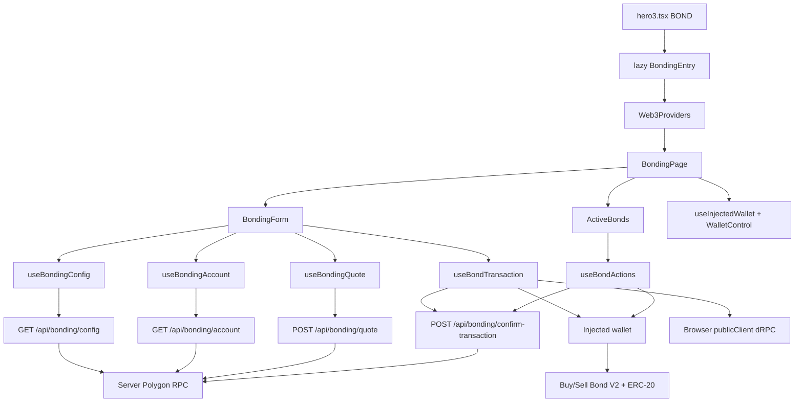
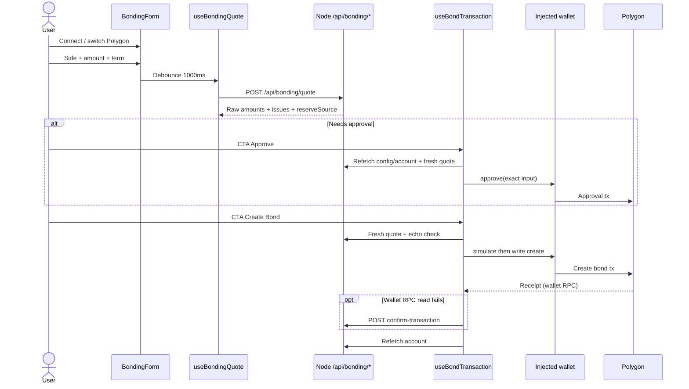

# Bonding UI — Technical Overview

Tài liệu này mô tả Bonding UI end-to-end: route `/bond/`, luồng Buy/Sell/claim, API backend, ranh giới trust với ví, và các quyết định thiết kế đã khóa. Viết cho contributors muốn hiểu feature trước khi đọc code.

Related docs:

- [`add-bonding-ui.md`](../add-bonding-ui.md) — kế hoạch triển khai từng bước + checklist test
- [`BONDING-UI SECURITY REVIEW.md`](../BONDING-UI%20SECURITY%20REVIEW.md) — threat model, accepted design risks, hardening đã ship
- [`SHARED_CODE_ARCHITECTURE.md`](./SHARED_CODE_ARCHITECTURE.md) — Web3/UI dùng chung với Swap và Staking
- [`CACHE_ARCHITECTURE.md`](../CACHE_ARCHITECTURE.md) — config cache vs account/quote `no-store`
- [`SECURITY_OVERVIEW.md`](./SECURITY_OVERVIEW.md) — inventory bảo mật toàn app
- Guide người dùng: `/guide/bonding/` · Guide contract: `/guide/bonding-contracts/`
- Bản tiếng Anh: [`bonding-technical-overview.md`](../bonding-technical-overview.md)

Template song song: Staking (`/stake/` — [`staking-technical-overview.md`](./staking-technical-overview.md)) và Swap modal — cùng lazy entry, API, CTA phases và confirmation fallback.

---

## What it is

Trang **`/bond/`** cho phép user tạo và claim bond PRANA trên **Polygon mainnet**:

- **Buy Bond (V2):** gửi exact WBTC → nhận PRANA vesting theo kỳ hạn.
- **Sell Bond (V2):** gửi exact PRANA → nhận WBTC vesting theo kỳ hạn.
- **Active Bonds:** xem + claim bond đang vesting từ cả **Buy/Sell × V1/V2**. Bond mới chỉ tạo trên V2; V1 chỉ còn lịch sử/claim.

Không có donut/status trùng Bonding Stats trên homepage. Không expose path `buyBondForPranaAmount` (target PRANA) trong UI/API.

Token amounts, allowance và bond ID đi qua JSON dưới dạng **decimal string** (không ép `number`) để an toàn với `uint256`.

---

## Design goals / giả định đã khóa

1. **Lazy route riêng** — `/bond/` không kéo `StatsPage`, GLB hay dữ liệu homepage.
2. **Reads qua backend** — config, account, quote và fallback confirmation dùng RPC server; ví chỉ trực tiếp `approve` / create / `claim`.
3. **Write target cố định trong code** — create/claim không nhận contract address từ API hay UI; mapping nội bộ `side` × `version`.
4. **Exact input only** — Buy khóa WBTC; Sell khóa PRANA. Contract không có `minOut` / deadline; residual quote↔execution risk được chấp nhận ở quy mô hiện tại.
5. **Một CTA theo phase** — Approve → Create Bond → Confirming; tối đa hai wallet prompts (approve + create), không tự mở liên tiếp.
6. **Confirmation không suy diễn** — lỗi đọc RPC ≠ revert on-chain; sau khi đã có hash không broadcast lần hai.

---

## High-level architecture



`main.tsx` lazy-load `BondingEntry` trên nhánh `isBondPath` (ngoài homepage shader shell), giống `isStakePath`. `BondingEntry` bọc `BondingPage` bằng shared `Web3Providers`.

Guides `/guide/bonding/` và `/guide/bonding-contracts/` nằm trong homepage/legal shell — **không** kéo chunk Bonding/Web3.

### Trust split

| Layer | Responsibility |
| --- | --- |
| **Browser** | UI, connect ví, parse amount, phase CTA, `simulateContract` + `writeContract`, chờ receipt trên wallet RPC |
| **Node backend** | Config/account/quote reads (cùng `blockTag`), quote math mirror Solidity, rate limit, origin/body validation, confirmation fallback (sender/target/calldata) |
| **User wallet** | Final authority: chỉ ví mới move funds |
| **Polygon** | Execution trên Buy/Sell Bond V1/V2 + ERC-20 `approve` |

Browser **không** xây create/claim calldata từ địa chỉ do API trả. Input create lấy từ form snapshot; target lấy từ `constants/bonds.ts` + `bondClaimTarget.ts`.

### Ba lớp RPC

Bonding write-path đi qua tối thiểu ba lớp độc lập:

1. **dRPC / publicClient** (`FRONTEND_POLYGON_RPC_URL`) — `simulateContract` và đọc chain từ browser khi cần HTTP transport của app.
2. **RPC của ví** (EIP-1193) — broadcast `approve` / create / claim; sau broadcast, chờ receipt trên **cùng** provider đã gửi tx (`waitForPolygonWalletReceipt`).
3. **RPC server** (`POLYGON_RPC_URL`) — config/account/quote và fallback `confirm-transaction`.

Lỗi đọc receipt trên dRPC **không** đồng nghĩa transaction failed. Flow đúng: catch → server fallback → chỉ coi failed khi receipt explicit `reverted`.

---

## Public surfaces

### Routes

| Path | Vai trò |
| --- | --- |
| `/bond` → `/bond/` | Canonical SPA; bare path `308` (giữ query) |
| `/guide/bonding/` | User guide (approve, Buy/Sell, vesting, claim) |
| `/guide/bonding-contracts/` | Contracts guide (educational; đối chiếu Polygonscan) |

Constants: `BOND_*`, `GUIDE_BONDING_*`, `GUIDE_BONDING_CONTRACTS_*`, `isBondPath`, `isGuideBondingPath`, `isGuideBondingContractsPath` trong `constants/appRoutes.ts`.

### APIs

| Endpoint | Cache | Ghi chú |
| --- | --- | --- |
| `GET /api/bonding/config` | `private`, 30s | Paused × 4, min, terms V2, addresses |
| `GET /api/bonding/account?address=` | `private, no-store` | Balances, allowances V2, active bonds V1+V2 |
| `POST /api/bonding/quote` | `private, no-store` | Union `buy_exact_wbtc` \| `sell_exact_prana` |
| `POST /api/bonding/confirm-transaction` | `private, no-store` | Fallback UX; không ghi trusted analytics |

Admission POST: Content-Type / origin → body ≤ 2 KB / shape parse → rồi mới rate-limit → RPC. Invalid request không tiêu global quote/confirmation budget.

Raw amounts: canonical decimal (`0` hoặc `[1-9]\d*`), `≤ MAX_UINT256`. Quote/create/claim require `> 0`; approve `0` (revoke) được hỗ trợ.

---

## End-to-end user flows

### Create bond (Buy hoặc Sell)



### Claim bond

Claim chọn target từ `resolveBondClaimTarget(side, version)` — không tin địa chỉ từ API. Cùng pattern: switch Polygon → simulate → write → wallet receipt / server fallback → refetch. Pending hash persist theo `{account, chainId}` (TTL 24h); reload chỉ resume confirmation, không broadcast lại. Resume bắt buộc server validate sender/target/calldata.

Form approve/create và claim **khóa lẫn nhau** khi một write đang chạy (`formBusy` / `actionsBusy` trên `BondingPage`).

---

## CTA phase machine

Phases là **trạng thái UI**, không phải ba lần ký ví:

```
approve → create → confirming → success
                             ↘ confirmation_unavailable
                error ↗ (retry đúng phase)
```

| Phase | Wallet? | Việc xảy ra |
| --- | --- | --- |
| `approve` | Có (1 tx) | `approve` exact input nếu allowance thiếu |
| `create` | Có (1 tx) | Fresh-quote → simulate → write create |
| `confirming` | Không | Chờ receipt |
| `confirmation_unavailable` | Không | Giữ hash + snapshot; CTA “Tiếp tục xác nhận” |
| `success` / `error` | Không | Reset form hoặc cho retry |

Helper: `features/bonding/utils/bondCtaPhase.ts` → `getBondCtaPhase(status, needsApproval, hasPendingHash)`.

Trước approve và trước create:

1. Refetch account/config/quote thành công (không fallback cached account lỗi).
2. Đúng wallet, Polygon, balance, minimum, term, paused, treasury.
3. Validate quote echo (`bondQuoteEcho.ts`): Buy khớp `mode` + `termId` + `wbtcAmountRaw`; Sell khớp `pranaAmountRaw`. Mismatch → dừng với `quote_issues`.
4. Calldata input từ form snapshot — **không** lấy input leg từ quote response.
5. `simulateContract` rồi chỉ truyền `{ request }` vào `writeContract`.

Exact Buy/Sell: allowance `>=` input là đủ; không hạ allowance lớn hơn khi không cần.

---

## Quote pipeline

### Client

`useBondingQuote` (thin wrapper trên shared `hooks/useDebouncedAbortableQuote`):

- Debounce **1000 ms** — trong cửa sổ debounce không gọi API và không bật `isLoading` (tránh flash mỗi lần gõ).
- Abort request cũ; bỏ response stale theo monotonic request id.
- Sau **60 s** đánh dấu quote stale; CTA tự `freshQuote()` trước write.
- Đổi side / term / amount / account / chain → invalidate.
- Request key gồm mode + amount + term nên object request mới với cùng dữ liệu
  không kích hoạt fetch lại.

Parsers: WBTC tối đa **8** decimals, PRANA **9**. MAX dùng raw balance exact (`rawBalanceToAmountInput`), không qua `Number`/`parseFloat`.

### Server

Orchestration: `server/loaders/bondingQuote.ts` + math thuần `server/utils/bondingQuoteMath.ts` / `bondingReadUtils.ts`.

- Mọi reads trong một response dùng cùng `blockTag`.
- Mirror thứ tự bigint / rounding / **1% fee** của Solidity và nhánh tự đồng bộ market reserve.
- Contract chọn nhánh output bất lợi hơn giữa **impacted** và **market** reserves → response có `reserveSource: 'impacted' | 'market'`.
- Non-executable (paused, below min, vượt reserve, thiếu treasury, …) vẫn **200** kèm `issues[]` để form hiển thị lý do.

Quote ổn định theo reserves/rates/treasury tại block đọc — thời gian trôi qua hoặc block mới **tự nó** không đổi raw amount nếu state không đổi. UI vẫn fresh-quote vì calldata không khóa `minOut`.

### Modes

| Mode | Exact input | Expected output | On-chain create |
| --- | --- | --- | --- |
| `buy_exact_wbtc` | WBTC | PRANA payout | `buyBondForWbtcAmount(wbtcAmount, period)` |
| `sell_exact_prana` | PRANA | WBTC payout | `sellBond(pranaAmount, period)` |

Contract vẫn có `buyBondForPranaAmount` nhưng app **không** quote / create qua path đó.

---

## Vesting và claimable

Thời gian UI: `blockTimestamp + elapsed` (không chỉ clock thiết bị).

### Bonding (cumulative từ `creationTime`)

```text
totalVestedRaw = floor(totalPayoutRaw × (now - creationTime) / (maturityTime - creationTime))
claimableRaw   = max(totalVestedRaw - claimedRaw, 0)
```

Từ maturity: claim toàn bộ `totalPayoutRaw - claimedRaw`; contract đánh dấu `claimed = true`.

`lastClaimTime` chỉ chặn hai claim cùng timestamp — **không** tham gia công thức payout. Progress bar = % thời gian creation→maturity (clamp `0..100`), độc lập với `lastClaimTime`.

### Khác Staking

Staking tính lãi mới từ `lastClaimTime` (sau khi cap tại maturity). Bonding trừ `claimedPrana` / `claimedWbtc` khỏi tổng đã vest từ `creationTime`. Đổi `lastClaimTime` mà giữ `claimedRaw` **không** đổi Bonding claimable.

Helpers: `getBondClaimableRaw`, `getBondProgressPercent`, `sortActiveBonds` trong `features/bonding/utils/bondingMath.ts`.

Active bonds sort: maturity gần nhất → side → version → id. React key / claim identity: `bondClaimKey(side, version, bondId)` vì id có thể trùng giữa deployments.

---

## File map

### Client

```
features/bonding/
  BondingEntry.tsx              # lazy root + Web3Providers
  bonding.types.ts              # config, account, quote, tx lifecycle
  bonding.copy.ts               # VI/EN
  components/                   # Form, tabs, TermSelector, ActiveBonds, BondCard
  hooks/                        # config, account, quote, useBondTransaction, useBondActions, pending
  utils/
    bondingApi.ts               # fetchJson adapters + React Query keys
    bondCtaPhase.ts
    bondQuoteEcho.ts
    bondAllowance.ts
    bondClaimTarget.ts
    bondTransactionFlow.ts
    bondTransactionConfirmation.ts
    bondPendingTransactionStorage.ts
    bondingMath.ts
    bondingErrors.ts
pages/BondingPage.tsx           # shell: shader, wallet, form, active bonds, footer
```

Shared (không import ngược Bonding → Staking):

- `features/web3/` — `Web3Providers`, `useInjectedWallet`, `WalletControl`, `getPolygonWalletClient`, `waitForPolygonWalletReceipt`, `accountRefetch`, `transactionConfirmation`, `confirmReceiptWithAccountSync`, `pendingTransactionStorage`, `hooks/usePendingTransaction`
- `components/ui/TxLink.tsx` — Polygonscan hash link
- `constants/bonds.ts` + `bonds.types.ts` — addresses + ABI (không nhân đôi ABI)
- `constants/sharedContracts.ts` — PRANA/WBTC/pool/decimals

### Server

```
server/loaders/
  bondingConfig.ts
  bondingAccount.ts
  bondingQuote.ts
  bondingTransactionConfirmation.ts  # buildExpectedCall + shared lookup
  cached/bondingConfigCached.ts
server/utils/
  bondingReadUtils.ts           # shared mapping / parse / normalize
  bondingQuoteMath.ts
  parseUnsignedDecimalRaw.ts
  transactionConfirmationLookup.ts  # shared sender/target/calldata RPC
server/types/
  transactionConfirmationTypes.ts
server/getApiRoutes.ts          # GET config + account (+ BondingApiLoaders)
server/postApiRoutes.ts         # POST quote + confirm (+ BondingPostApiLoaders)
server/rateLimit.ts             # buckets trong createSwapRateLimiters()
```

Server confirm dùng shared `confirmTransactionOnChain` sau `buildExpectedCall`
local của bonding (approve/create/claim → target + calldata cố định).

### Contracts (read-only reference trong repo)

- `contracts/BuyPranaBondV2.sol`, `SellPranaBondV2.sol` — create + claim live
- `contracts/BuyPranaBondV1.sol`, `SellPranaBondV1.sol` — claim/history

Deployments (Polygon): xem `constants/bonds.ts` (`BUY_BOND_ADDRESS_V1/V2`, `SELL_BOND_ADDRESS_V1/V2`).

---

## Pending transaction persistence

`bondPendingTransactionStorage` lưu `{version, chainId, account, hash, action, createdAt}` vào `localStorage` (TTL 24h), key bind theo account/chain.

- Reload/reconnect: restore đúng action kind; khóa write đến khi storage load xong và không còn pending của flow đó.
- Đổi ví giữa chừng: không báo success cho ví mới; storage ví cũ giữ để resume khi quay lại.
- Resume / reload: `requireServerValidation` — kể cả khi browser receipt success vẫn phải qua server đối chiếu sender/target/full calldata.

---

## Design constraints (không phải bug cần “fix” trong scope hiện tại)

Chi tiết đầy đủ: [`BONDING-UI SECURITY REVIEW.md`](../BONDING-UI%20SECURITY%20REVIEW.md). Contributors cần biết khi thay đổi flow:

1. **Không có `minOut` / deadline** — user luôn chi đúng exact input; payout có thể lệch so với quote nếu state đổi giữa quote và execution. Fresh-quote + simulate là guard UX, không phải bảo đảm on-chain.
2. **Fresh quote trước create không bắt confirm in-app riêng** — form đã hiện amount/term/quote; CTA Create Bond fresh-quote rồi mở ví. Echo check vẫn bắt `mode` / `termId` / exact input khớp form snapshot.
3. **Account API scan `getUserActiveBonds` trên cả bốn deployment** — chi phí tăng theo tổng lịch sử bond; rate limit giảm tải nhưng không thay indexer dài hạn.
4. Bonding confirmation **không** tái dùng HMAC / `/api/swap/verify-transaction` — mapping contract/function cố định; endpoint chỉ dự phòng UX, không ghi verified analytics.

Re-evaluate `minOut` / second consent chỉ khi volume, concurrency, MEV exposure hoặc giá trị trung bình mỗi bond tăng đáng kể — và khi đó cần **contract mới** để enforce.

---

## Controls đã có (tóm tắt)

- Write target từ mapping nội bộ; confirmation kiểm tra sender, fixed target, full calldata.
- Exact approval; simulate trước broadcast; không retry write sau khi đã có hash.
- Quote/account cùng `blockTag`; bigint = decimal string; `uint256` bounds ở parse.
- POST: origin, JSON, 2 KB body, validate-before-rate-limit, redact RPC secrets, `private, no-store`.
- CSP / frame denial / `nosniff`; lỗi ví được sanitize VI/EN (`bondingErrors.ts`).

---

## Tests và lệnh hữu ích

| Suite | Lệnh / vị trí |
| --- | --- |
| Client Bonding | `npm run test:bonding` → `features/bonding/tests/**` |
| API / admission | `server/tests/bondingApi.test.ts` |
| Static `/bond` | `server/tests/bondRoutes.test.ts` |
| Guides | `server/tests/guideRoutes.test.ts` |
| Typecheck / full | `npm run typecheck`, `npm test` |

Khi đổi bonding math, claimable, CTA phases, echo, pending storage hoặc API admission — cập nhật test tương ứng và, nếu đổi hành vi public, cập nhật guide + doc này.

---

## Deployment notes (tóm tắt)

- Production build phải có chunk `BondingEntry` / `BondingPage` riêng; Stats/Staking không kéo bonding.
- Cutover nginx: bỏ alias legacy `/bond/assets/`; bare `/bond` dùng `308` như `/stake`.
- Smoke production: connect, quote, switch chain — **không** tự gửi approve/create/claim thật trong automated smoke.

Chi tiết migration legacy: bước 8 trong [`add-bonding-ui.md`](../add-bonding-ui.md).
