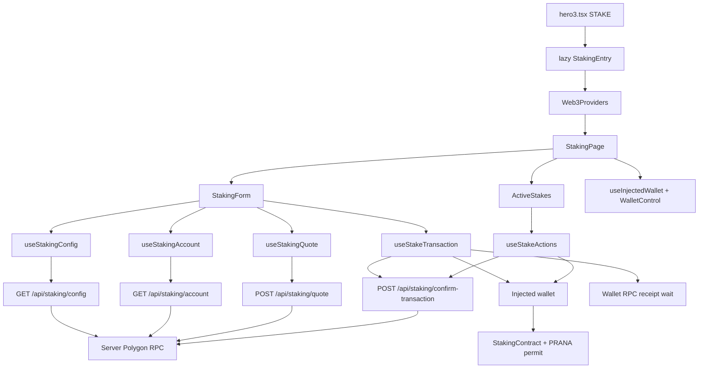
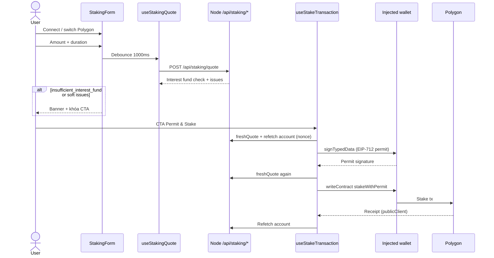

# Staking UI — Technical Overview

Tài liệu này mô tả Staking UI end-to-end: route `/stake/`, luồng Permit & Stake / claim / unstake, API backend, ranh giới trust với ví, và các quyết định thiết kế đã khóa. Viết cho contributors muốn hiểu feature trước khi đọc code.

Related docs:

- [`add-staking-ui.md`](../add-staking-ui.md) — kế hoạch triển khai từng bước + checklist test
- [`SHARED_CODE_ARCHITECTURE.md`](./SHARED_CODE_ARCHITECTURE.md) — Web3/UI dùng chung với Swap và Bonding
- [`CACHE_ARCHITECTURE.md`](../CACHE_ARCHITECTURE.md) — config cache vs account/quote `no-store`
- [`SECURITY_OVERVIEW.md`](./SECURITY_OVERVIEW.md) — inventory bảo mật toàn app
- Guide người dùng: `/guide/staking/` · Guide contract: `/guide/staking-contracts/`
- Bản tiếng Anh: [`staking-technical-overview.md`](../staking-technical-overview.md)

Template song song: Bonding (`/bond/`) và Swap modal — cùng lazy entry, backend reads, CTA phases, receipt-before-success và server confirmation fallback (`POST /api/staking/confirm-transaction`).

---

## What it is

Trang **`/stake/`** cho phép user quản lý stake PRANA cá nhân trên **Polygon mainnet**:

- **Permit & Stake:** EIP-2612 permit + `stakeWithPermit` trong một CTA (hai wallet prompts: ký typed data, rồi gửi tx).
- **Active Stakes:** xem vị thế, claim lãi, unstake khi đáo hạn, hoặc early-unstake có phạt.
- **Fully-funded gate:** quote sống kiểm tra Interest contract đủ cover stake mới trước khi permit hoặc broadcast.

Không có donut/status cấp protocol trùng homepage `StakingStats`. Aggregate homepage dùng `/api/staking-stats` (cache 24h); CTA stake **không** được dùng path đó cho fund gate.

Token amounts và permit nonce đi qua JSON dưới dạng **decimal string** (không ép `number`) để an toàn với `uint256`.

---

## Design goals / giả định đã khóa

1. **Lazy route riêng** — `/stake/` không kéo `StatsPage`, GLB hay dữ liệu homepage.
2. **Reads qua backend** — config, account, quote và fallback confirmation dùng RPC server; Alchemy chỉ ở server. Ví chỉ ký permit và gửi transaction.
3. **Write target cố định trong code** — stake/claim/unstake gọi `STAKING_CONTRACT_ADDRESS` từ `constants/stakingContracts.ts`, không lấy địa chỉ write từ API.
4. **Một CTA cho create** — Permit & Stake → Continue Stake (tái dùng permit) → Resume confirming; tối đa hai wallet prompts, không tự mở liên tiếp.
5. **Success chỉ sau receipt** — đã có hash thì không `writeContract` lần hai; resume chỉ chờ receipt hiện có.
6. **Không hardcode kỳ hạn trên client** — duration, APR, min stake, grace period và early penalty lấy từ config API / on-chain.

---

## High-level architecture



`main.tsx` lazy-load `StakingEntry` trên nhánh `isStakePath` (ngoài homepage shader shell). `StakingEntry` bọc `StakingPage` bằng shared `Web3Providers`.

Guides `/guide/staking/` và `/guide/staking-contracts/` nằm trong homepage/legal shell — **không** kéo chunk Staking/Web3.

### Trust split

| Layer | Responsibility |
| --- | --- |
| **Browser** | UI, connect ví, parse amount, phase CTA, EIP-712 sign, `writeContract`, chờ receipt (wallet RPC → server fallback) |
| **Node backend** | Config/account/quote reads (cùng `blockTag`), math fund-gate, rate limit, origin/body validation, confirmation fallback (sender/target/calldata) |
| **User wallet** | Final authority: chỉ ví mới move funds |
| **Polygon** | Execution trên StakingContract + PRANA `permit` |

Browser **không** xây write calldata từ địa chỉ do API trả. Permit spender và write target là `STAKING_CONTRACT_ADDRESS`. Config vẫn expose địa chỉ contract cho display và kiểm tra permit domain.

### Các lớp RPC

1. **RPC của ví** (EIP-1193) — `signTypedData` + broadcast stake/claim/unstake; sau broadcast, UI chờ receipt trên cùng provider đã gửi tx (`waitForPolygonWalletReceipt`).
2. **dRPC / publicClient** (`FRONTEND_POLYGON_RPC_URL`) — simulate / đọc chain từ browser khi cần HTTP transport của app.
3. **RPC server** (`POLYGON_RPC_URL`) — config/account/quote và fallback `confirm-transaction` (và homepage `/api/staking-stats`, path riêng).

Khi chờ receipt: thử wallet RPC trước; nếu đọc fail → `POST /api/staking/confirm-transaction`. Receipt explicit `reverted` mới là failed; lỗi RPC ≠ revert. Nếu cả hai chưa xác nhận được, giữ hash + action snapshot (localStorage, TTL 24h), CTA **Resume confirming**. Fresh in-session có thể tin browser receipt; resume/reload luôn validate lại trên server.

---

## Public surfaces

### Routes

| Path | Vai trò |
| --- | --- |
| `/stake` → `/stake/` | Canonical SPA; bare path `308` (giữ query) |
| `/guide/staking/` | User guide (permit, claim, grace, early unstake) |
| `/guide/staking-contracts/` | Contracts guide (educational; đối chiếu Polygonscan) |

Constants: `STAKE_*`, `GUIDE_STAKING_*`, `GUIDE_STAKING_CONTRACTS_*`, `isStakePath`, `isGuideStakingPath`, `isGuideStakingContractsPath` trong `constants/appRoutes.ts`.

### APIs

| Endpoint | Cache | Ghi chú |
| --- | --- | --- |
| `GET /api/staking/config` | `private`, 30s | Paused, min, grace, penalty %, durations/APR, contracts, permit domain |
| `GET /api/staking/account?address=` | `private, no-store` | Balance, permit nonce, active stakes (checksum trước rate-limit) |
| `POST /api/staking/quote` | `private, no-store` | Fully-funded Interest preflight; soft `issues[]` vẫn HTTP 200 |
| `POST /api/staking/confirm-transaction` | `private, no-store` | Fallback UX; validate sender/target/calldata; không ghi trusted analytics |
| `GET /api/staking-stats` | `private`, 24h | Chỉ homepage card — **không** dùng cho fund gate CTA |

Rate limit account: 10/IP/phút + 120 global/phút. Quote: 10/IP/phút + 60 global/phút; confirmation: bucket riêng 30/IP/phút + 120 global/phút; body ≤ 2 KB.

Quote request: `{ amountRaw, durationSeconds }`. Soft issue gồm `paused`, `below_minimum`, `invalid_duration`, `zero_amount`, `insufficient_interest_fund`.

Raw amounts / nonces: decimal string. Parse amount tối đa 9 decimals PRANA; reject rỗng/zero/âm.

---

## End-to-end user flows

### Permit & Stake



Orchestration: `permitAndStake` → `createPermitSnapshot` / reuse / `submitStakeWithPermit` / `confirmStakeReceipt` trong `useStakeTransaction` + `stakeTransactionFlow.ts`.

- Từ chối permit → không broadcast.
- Từ chối stake **trước** broadcast → giữ permit → CTA **Continue Stake**.
- Lỗi receipt **sau** hash → bỏ permit, giữ hash → CTA **Resume confirming** (chỉ chờ; không write lần hai).
- Đổi amount / duration / account / chain hoặc hết deadline → invalidate permit.

### Claim / unstake / early unstake

Writes: `claimInterest` | `unstake` | `unstakeEarly` qua `useStakeActions`, luôn tới `STAKING_CONTRACT_ADDRESS`.

Rules (`getStakeActionState`):

- Accrual cap tại maturity; cửa sổ claim = maturity … maturity + `gracePeriodSeconds`.
- Matured + còn claimable + trong grace → **claim first** (khóa unstake).
- Sau grace → tắt claim; unstake principal OK; cảnh báo nếu lãi chưa claim tới maturity.
- Trước maturity → early unstake qua `EarlyUnstakeDialog` (penalty %, principal dự kiến nhận, lãi accrued bị mất).

Form create và stake actions **khóa lẫn nhau** khi một write đang chạy (`formBusy` / `actionsBusy` trên `StakingPage`). Account sync fail sau receipt trên actions có thể khóa write tiếp đến khi reload (`syncRequired`).

---

## CTA phase machine

Phases là **trạng thái UI**, không phải các bước on-chain tách ngoài permit + stake:

```
permit_and_stake → signing → continue_stake → submitting → confirming → success
                                              ↘ resume_confirming (giữ hash)
                         error ↗ (retry đúng phase)
```

| Phase | Wallet? | Việc xảy ra |
| --- | --- | --- |
| `permit_and_stake` | Có (ký + sau đó tx) | Fresh quote → refetch nonce → EIP-712 sign → broadcast |
| `continue_stake` | Có (1 tx) | Tái dùng permit hợp lệ; fresh-quote lại; broadcast |
| `signing` / `submitting` / `confirming` | Đang chạy | Label busy |
| `resume_confirming` | Không write mới | Chờ receipt của hash hiện có |
| `success` | Không | Xóa amount form; hiện hash |

Helper: `features/staking/stakeCtaPhase.ts` → `getStakeCtaPhase(status, hasValidPermit, hasPendingHash)`.

Trước ký và trước broadcast:

1. Refetch account thành công cho **đúng** ví đang thao tác (không fallback cache stale/cross-account cho nonce).
2. Đúng wallet, Polygon, balance, minimum, duration còn trong config, không paused.
3. `freshQuote()` — soft issues (kể cả `insufficient_interest_fund`) dừng, không mở ví.
4. `submitStakeWithPermit(snapshot)` nhận permit qua tham số — không phụ thuộc React state đã flush.

---

## Quote pipeline

### Client

`useStakingQuote` (thin wrapper trên shared `hooks/useDebouncedAbortableQuote`):

- Debounce **1000 ms** — trong cửa sổ không gọi API và không bật `isLoading`.
- Abort request cũ; bỏ response stale theo monotonic request id.
- Sau **60 s** đánh dấu quote stale; CTA tự `freshQuote()` trước write.
- Đổi amount / duration / account / chain → invalidate.
- Request key chỉ gồm amount + duration nên object request mới với cùng dữ liệu
  không kích hoạt fetch lại.

### Server

Orchestration: `server/loaders/stakingQuote.ts` + mapping chung trong `server/utils/stakingReadUtils.ts` / `stakingQuoteUtils.ts`.

- Mọi reads trong một response dùng cùng `blockTag`.
- Fund gate: `available = max(0, balanceOf(Interest) − totalInterestNeeded)`; lãi stake mới qua `calculateTotalInterestRaw` phải vừa quỹ.
- Quote không executable vẫn **200** kèm `issues[]` để form hiển thị lý do.

**Không** dùng `/api/staking-stats` cho gate này (cache 24h + float + shape khác).

---

## Interest, grace và claimable

Thời gian UI trên Active Stakes: `blockTimestamp + elapsed` (tick 1s; fallback clock thiết bị nếu chưa có snapshot).

### Interest (thứ tự Solidity)

```text
annualInterest     = amountRaw × APR / 100
interestPerSecond  = annualInterest / 31_536_000
totalInterest      = interestPerSecond × durationSeconds
```

Accrued preview dùng cùng công thức trên:

```text
effectiveSeconds = min(now, maturity) − max(lastClaimTime, startTime)
```

### Khác Bonding

Staking tính lãi **từ `lastClaimTime`** (cap tại maturity). Bonding claimable = vesting tích lũy từ `creationTime` trừ `claimedRaw` — `lastClaimTime` không đổi công thức payout Bonding.

Early penalty: `(amount × penaltyPercent) / 100` chia nguyên (`calculateEarlyUnstakeReturn`).

Helpers: `calculateTotalInterestRaw`, `getEffectiveAccruedSeconds`, `getStakeActionState`, `getStakeProgressPercent` trong `features/staking/stakingMath.ts`.

---

## File map

### Client

```
features/staking/
  StakingEntry.tsx              # lazy root + Web3Providers
  staking.types.ts
  staking.copy.ts               # VI/EN
  stakingApi.ts                 # fetchJson adapters + React Query keys
  stakingMath.ts
  stakingFundCheck.ts
  permitUtils.ts
  stakeCtaPhase.ts
  stakeTransactionFlow.ts
  formatGraceRemaining.ts
  stakingErrors.ts
  components/                   # Form, DurationSelector, ActiveStakes, StakeCard, EarlyUnstakeDialog, WalletControl
  hooks/                        # config, account, quote, useStakeTransaction, useStakeActions
pages/StakingPage.tsx           # shell: shader, wallet, form, active stakes, footer
```

Shared (Staking không import nội bộ Bonding/Swap để giữ ownership; Web3 dùng chung):

- `features/web3/` — `Web3Providers`, `useInjectedWallet`, `WalletControl`, `getPolygonWalletClient`, `accountRefetch`, `transactionConfirmation`, `confirmReceiptWithAccountSync`, `pendingTransactionStorage`, `hooks/usePendingTransaction`
- `components/ui/TxLink.tsx` — Polygonscan hash link
- `constants/stakingContracts.ts` — addresses, ABIs, permit domain / deadline
- `constants/sharedContracts.ts` — PRANA address/decimals
- `utils/focusTrap.ts` — EarlyUnstakeDialog

### Server

```
server/loaders/
  stakingConfig.ts
  stakingAccount.ts
  stakingQuote.ts
  stakingStats.ts               # chỉ homepage
  activeStakes.ts               # homepage / stats helpers
  cached/stakingConfigCached.ts
  cached/stakingStatsCached.ts
server/utils/
  stakingReadUtils.ts
  stakingQuoteUtils.ts
server/getApiRoutes.ts          # GET config + account (+ stats)
server/postApiRoutes.ts         # POST quote + confirm-transaction
server/loaders/stakingTransactionConfirmation.ts  # buildExpectedCall + shared lookup
server/utils/stakingConfirmationUtils.ts
server/utils/transactionConfirmationLookup.ts     # shared sender/target/calldata RPC
server/types/transactionConfirmationTypes.ts
server/rateLimit.ts
```

Client confirmation helpers: thin adapter `stakeTransactionConfirmation.ts` trên `features/web3/transactionConfirmation.ts`; pending storage/hook wrapper trên shared `pendingTransactionStorage` + `usePendingTransaction`. Server confirm dùng shared `confirmTransactionOnChain` sau `buildExpectedCall` local của staking.

### Contracts (read-only reference trong repo)

- `contracts/StakingContract.sol` — stake / claim / unstake / early unstake
- Interest contract address trong `constants/stakingContracts.ts`

---

## Pending hash behavior

Giống Bonding: pending hash + action snapshot persist vào `localStorage` (`prana:staking:pending:v1:{chainId}:{account}`, TTL 24h).

- Form sở hữu kind `stake`; Active Stakes sở hữu `claim` / `unstake` / `unstakeEarly`.
- Storage chỉ là gợi ý resume — không bao giờ là proof of success.
- Resume gọi confirmation (wallet RPC → server, `requireServerValidation`) — không bao giờ `writeContract` lần hai.

---

## Design constraints (không phải bug cần “fix” trong scope hiện tại)

Contributors cần biết khi thay đổi flow:

1. **Permit deadline theo wall-clock (1 giờ)** — đồng hồ thiết bị có thể lệch nhẹ; hết hạn invalidate Continue Stake.
2. **Fully-funded gate là soft UX** — on-chain vẫn có thể revert nếu Interest balance đổi giữa quote và execution; `freshQuote` giảm nhưng không triệt tiêu race.
3. **Homepage `/api/staking-stats` là aggregate riêng** — thân thiện float, cache dài; không dùng để quyết định eligibility Permit & Stake.
4. **Hết grace thì lãi chưa claim mất vĩnh viễn** — UI cảnh báo; semantics contract không đổi bởi app.
5. **Confirmation body chứa permit signature components** (v/r/s) chỉ để rebuild calldata match — cùng threat model với việc broadcast chúng lên chain.

---

## Controls đã có (tóm tắt)

- Write target hardcoded; permit spender = staking contract.
- Fresh account nonce trước khi ký; fresh quote trước ký và trước broadcast.
- Soft fund-gate issues khóa CTA; success chỉ sau receipt.
- Amounts/nonces = decimal string; bigint interest math mirror thứ tự Solidity.
- POST quote + confirm-transaction: origin/JSON/2 KB, rate limit (bucket riêng cho confirm), `502` đã redact; confirm validate sender/target/calldata.
- Lỗi ví sanitize VI/EN (`stakingErrors.ts`).
- Khóa form/actions lẫn nhau; claim-before-unstake trong grace.

---

## Tests và lệnh hữu ích

| Suite | Lệnh / vị trí |
| --- | --- |
| Client Staking | `npm run test:staking` → `features/staking/tests/**` |
| API / admission | `server/tests/stakingApi.test.ts` |
| Static `/stake` | `server/tests/stakeRoutes.test.ts` |
| Guides | `server/tests/guideRoutes.test.ts` |
| Typecheck / full | `npm run typecheck`, `npm test` |

Khi đổi interest math, rule grace/claim, CTA phases, confirmation fallback, invalidate permit, fund gate hoặc API admission — cập nhật test tương ứng và, nếu đổi hành vi public, cập nhật guide + doc này.

---

## Deployment notes (tóm tắt)

- Production build phải có chunk `StakingEntry` / `StakingPage` riêng; Stats không kéo staking UI.
- Nginx: `/stake/` đi qua Node giống `/` (không còn static `/stake` legacy).
- Bare `/stake` dùng `308` như `/bond`.
- Smoke production: connect, quote, switch chain — **không** tự gửi permit/stake/claim thật trong automated smoke.

Chi tiết migration legacy: bước 8 trong [`add-staking-ui.md`](../add-staking-ui.md).
