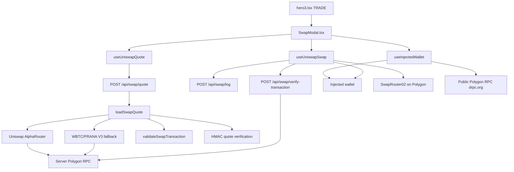
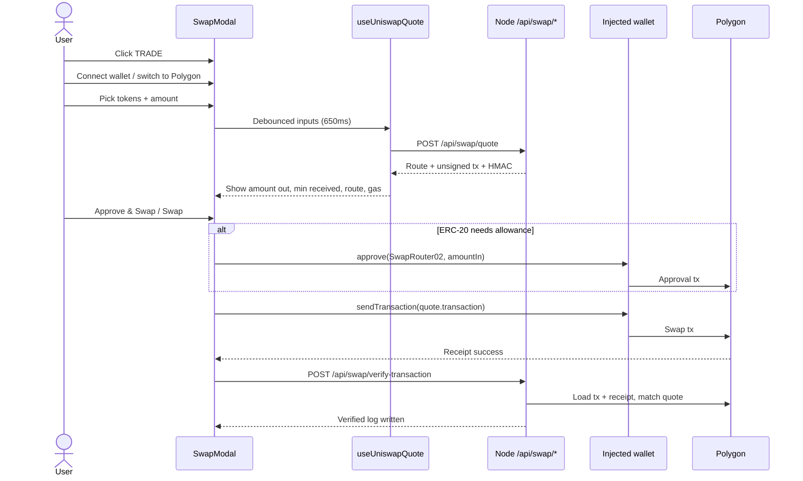
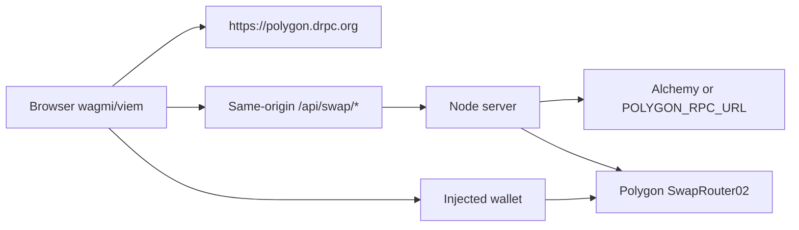

# Swap Modal — Tổng quan kỹ thuật

Tài liệu này mô tả swap modal Polygon trong app từ đầu đến cuối: luồng UI, routing phía server, ranh giới bảo mật, và đường dẫn mạng tùy chỉnh phục vụ traffic production. Viết cho contributor và operator muốn hiểu feature trước khi đọc code.

Tài liệu liên quan:

- `[NETWORK_ARCHITECTURE.md](./NETWORK_ARCHITECTURE.md)` — chi tiết vận hành tunnel VPS ↔ Pi
- `[SECURITY_OVERVIEW.md](./SECURITY_OVERVIEW.md)` — liệt kê cơ chế bảo mật infra + swap
- Bản tiếng Anh: `[swap-modal-technical-overview.md](../swap-modal-technical-overview.md)`

---

## Đây là gì

Nút **TRADE** trên hero mở swap modal trong app thay vì đưa user sang UI Uniswap bên ngoài. User kết nối browser wallet (MetaMask, Rabby, …), chỉ ở **Polygon mainnet**, và swap trong allowlist cố định gồm bảy token.

Cặp mặc định khi mở modal: **WBTC → PRANA**.

Danh sách 7 token đang được hỗ trợ: `PRANA`, `WBTC`, `POL` (native), `USDC`, `USDT`, `WETH`, `DAI`.

User có thể chọn bất kỳ hai token khác nhau trong danh sách đó, không chỉ swap tới hoặc từ PRANA. Họ cũng có thể swap qua lại giữa sáu token còn lại (ví dụ USDT → WETH hoặc POL → USDC). Cặp có PRANA có thể dùng fallback WBTC/PRANA riêng khi AlphaRouter không tìm được route; cặp không có PRANA đi qua AlphaRouter thôi.

Slippage cố định **0.5%** (`50` bps).

---

## Mục tiêu thiết kế

1. **Giữ giao dịch trên app PRANA** — không nhảy tab sang UI swap bên thứ ba.
2. **Routing phía server** — Uniswap Smart Order Router chạy trên Node để key Alchemy (hoặc RPC private khác) không bao giờ tới browser.
3. **Path nhận biết PRANA** — thanh khoản WBTC/PRANA có fallback riêng khi AlphaRouter không tìm được route dùng được.
4. **Wallet ký mọi thứ** — server trả calldata; user approve và gửi swap.
5. **Tin nhưng vẫn verify confirmation** — telemetry từ browser không thể được tin cậy 100%; swap thành công được xác nhận đối chiếu Polygon trước khi tính là verified.

Stack này **không** dùng LiFi, 0x, RainbowKit hay WalletConnect. Chỉ Wagmi + injected connector.

---

## Kiến trúc mức cao




### Phân tách trust


| Lớp              | Trách nhiệm                                                                                         |
| ---------------- | --------------------------------------------------------------------------------------------------- |
| **Browser**      | UI, kết nối ví, đọc balance/allowance, ký approve + swap, log vòng đời fire-and-forget              |
| **Node backend** | Route quote, dựng calldata, validate calldata, ký HMAC, rate limit, verify on-chain, structured log |
| **Ví user**      | Quyền cuối: chỉ ví mới chuyển được tiền                                                             |
| **Polygon**      | Thực thi qua Uniswap SwapRouter02 (`0x68b3465833fb72A70ecDF485E0e4C7bD8665Fc45`)                    |


Browser **không bao giờ tự dựng swap calldata**. Nó gửi đúng `quote.transaction.{to, data, value}` như server trả về.

---

## Luồng user end-to-end




### Từng bước

1. **Mở** — `hero3.tsx` set `isSwapOpen`; `SwapModal` mount với WBTC → PRANA.
2. **Kết nối** — `useInjectedWallet.connectWallet()` chọn injected connector đầu tiên có sẵn.
3. **Mạng** — nếu `chainId !== 137`, `ensurePolygon()` gọi wagmi `switchChain`.
4. **Quote** — khi đã connect, đang trên Polygon, và amount > 0, `useUniswapQuote` xóa quote cũ ngay, chờ **650ms**, rồi `POST /api/swap/quote`.
5. **Xem lại** — modal hiện amount out, minimum received, các bước route, và ước lượng gas.
6. **Thực thi** — `useUniswapSwap.executeSwap()`:
  - Từ chối quote cũ (`isQuoteCurrent` + buffer deadline).
  - Approve đúng `amountInRaw` trên ERC-20 nếu allowance thấp (native POL bỏ qua approve).
  - Gửi swap transaction do server cung cấp.
7. **Thành công** — màn success trong modal kèm link Polygonscan; tùy chọn “Swap again”.
8. **Telemetry** — event vòng đời approval/swap tới `/api/swap/log`; swap confirmed tới `/api/swap/verify-transaction`.

### Máy trạng thái CTA chính

Nút chính của modal được điều khiển bởi trạng thái wallet + quote + swap:

`Connect Wallet` → `Switch to Polygon` → `Finding Best Route` → `Refresh Quote` (nếu hết hạn) → `Approve & Swap` / `Swap` → nhãn xác nhận ví → màn success.

Trạng thái thực thi swap (`SwapTransactionStatus`):

```
idle → approving → approval-confirming → approved → swapping → swap-confirming → success
                                                                              ↘ error
```

---

## Pipeline quote (server)

Điều phối nằm ở `server/loaders/swapQuote.ts`.

### 1. Chính: Uniswap AlphaRouter

`loadPrimaryRoute()` dùng `@uniswap/smart-order-router` trên Polygon với `SwapType.SWAP_ROUTER_02`. Khi có route và `methodParameters`, calldata đó trở thành transaction của quote.

### 2. Fallback: ghép WBTC/PRANA

Thanh khoản chính của PRANA nằm ở pool Uniswap V3 WBTC/PRANA đã biết (fee 1%). Khi AlphaRouter không tạo được route dùng được cho cặp PRANA (trừ case WBTC↔PRANA trực tiếp đã xử lý tự nhiên), fallback:

- **Mua PRANA:** Leg AlphaRouter `tokenIn → WBTC`, rồi nối hop V3 WBTC/PRANA.
- **Bán PRANA:** Quote `PRANA → WBTC` qua QuoterV2, rồi leg AlphaRouter `WBTC → tokenOut`.
- Tự dựng calldata `exactInput` và bọc trong `multicall(uint256 deadline, bytes[])` để fallback có deadline on-chain giống quote AlphaRouter.
- Output native POL thêm `unwrapWETH9` trong multicall.

### 3. Validate trước khi trả về

`validateSwapTransaction()` trong `server/loaders/swapValidations.ts` decode calldata router (kể cả batch `multicall` lồng nhau) và kiểm tra:

- Địa chỉ router `to` là SwapRouter02
- Native `value` khớp kỳ vọng
- Recipient là ví user hoặc custody của router
- Input / min-out
- Endpoint V3 path (strict với fallback)
- Deadline multicall và độ sâu lồng nhau
- Chỉ function router trong whitelist (`exactInput`, `exactInputSingle`, `swapExactTokensForTokens`, helper wrap/unwrap/sweep/refund)

Calldata sai hoặc không mong đợi bị từ chối bằng lỗi client **chung**; chi tiết nội bộ giữ phía server.

### 4. Ký quote

`attachSwapQuoteVerification()` gắn HMAC token trên các trường quote + transaction đã chuẩn hóa, với TTL ngắn. Verify sau đó chứng minh client không tự bịa hay sửa quote dùng cho swap “confirmed”.

### 5. Log

Route được chọn và các lần thất bại được ghi structured JSON log (`server/loaders/swapLogs.ts`), có che URL / API key.

---

## Độ tươi của quote phía frontend

Quote hết hạn sau **3 phút** (`SWAP_DEADLINE_SECONDS`). Frontend còn:

- Echo metadata request trên mọi quote (`tokenInSymbol`, `tokenOutSymbol`, `amountInRaw`, `recipient`, `slippageBps`, `chainId`)
- Xóa quote trên màn hình ngay khi input đổi (không chỉ sau debounce)
- Chặn approve/swap trừ khi `isQuoteCurrent` đạt và deadline không nằm trong buffer 5 giây
- Cho refresh thủ công với cooldown **60s**

Nếu user sửa amount hoặc token sau khi đã có quote, họ phải lấy quote mới trước khi swap.

---

## Approval và thực thi swap

Implement trong `hooks/useUniswapSwap.ts`.

**Input native POL**

- Không approve ERC-20
- Swap tx `value` bằng `amountInRaw`

**Input ERC-20**

1. Đọc `balanceOf` + `allowance(owner, SwapRouter02)` trên RPC public của frontend
2. Nếu allowance < số lượng quote, gửi `approve(SwapRouter02, amountInRaw)` đúng số lượng quote (**không** unlimited)
3. Chờ approval receipt
4. `walletClient.sendTransaction` tới SwapRouter02 với calldata từ server
5. Chờ swap receipt; receipt reverted được coi là thất bại

Balance và allowance dùng RPC **browser**. Routing và verification dùng RPC **server**.

---

## Bề mặt API

Mọi endpoint swap chỉ nhận POST, same-origin, `Content-Type` JSON, giới hạn kích thước body và rate limit theo IP (`server/postApiRoutes.ts`, `server/rateLimit.ts`).


| Endpoint                            | Mục đích                                         | Giới hạn body | Rate limit (mỗi IP / phút) |
| ----------------------------------- | ------------------------------------------------ | ------------- | -------------------------- |
| `POST /api/swap/quote`              | Route + unsigned tx + HMAC                       | 2 KB          | 5 (+ 30 global)            |
| `POST /api/swap/log`                | Telemetry vòng đời không tin cậy                 | 8 KB          | 30                         |
| `POST /api/swap/verify-transaction` | `swap_confirmed` tin cậy sau chứng minh on-chain | 32 KB         | 10                         |


### Quote request

```json
{
  "tokenInSymbol": "USDT",
  "tokenOutSymbol": "PRANA",
  "amountIn": "1",
  "recipient": "0x...",
  "slippageBps": 50
}
```

### Quote response (hình dạng)

Trả về metadata `request` đã echo, mô tả token, amount dạng human + raw, `minimumAmountOut`, các bước route, field gas tùy chọn, `routerAddress`, `transaction { to, data, value }`, `deadline`, `quoteUpdatedAt`, và `verification`.

### Logging so với verification

- `/api/swap/log` nhận event báo từ browser (`approval_*`, `swap_submitted`, `swap_failed`, …). Chỉ coi là telemetry.
- Với `swap_confirmed`, client gọi `/api/swap/verify-transaction` kèm owner, tx hash và quote đầy đủ. Server:
  1. Kiểm tra HMAC + chống replay
  2. Tải tx + receipt từ Polygon
  3. Khẳng định sender, đích router, calldata và value khớp quote đã ký
  4. Ghi log `swap_confirmed` đã verify

Client không thể bịa analytics swap đã verify nếu không có giao dịch on-chain khớp.

---

## Cấu hình RPC và ví




| Bên dùng                                      | RPC                                                                       | Cấu hình                                        |
| --------------------------------------------- | ------------------------------------------------------------------------- | ----------------------------------------------- |
| Frontend (balance, allowance, send/wait)      | Public `https://polygon.drpc.org`                                         | `constants/network.ts` → `utils/wagmiConfig.ts` |
| Backend (AlphaRouter, QuoterV2, verification) | Ưu tiên Alchemy, không thì `POLYGON_RPC_URL`, không thì `polygon-rpc.com` | `server/utils/providers.ts`                     |


CSP `connect-src` cho phép gọi API same-origin cộng host RPC frontend (`server/securityHeaders.ts`).

---

## Hạ tầng mạng tùy chỉnh (production)

Production không phải “Node trên VPS công khai.” Origin app chạy trên **Raspberry Pi 5** ở nhà; **VPS** là edge HTTPS công khai. Chúng nối bằng **reverse SSH tunnel**.

```
Internet
   │
   ▼
VPS (IP public, DNS, Let’s Encrypt)
  nginx :443 → proxy tới 127.0.0.1:9000
   │
   │  reverse SSH tunnel (Pi khởi tạo)
   │  VPS:9000  ◄──────►  Pi:80
   ▼
Raspberry Pi (sau NAT)
  nginx :80
    /        → 127.0.0.1:4173  (Node app: static + API)
    /stake/  → static SPA cũ
    /bond/   → static SPA cũ
```

### Vì sao hình dạng này

- **Không port forwarding ở nhà** — Pi mở SSH tới VPS; VPS không cần quay vào mạng nhà.
- **TLS và rate limit edge nằm trên VPS** — Pi chỉ thấy traffic đã qua edge công khai.
- **App ở một máy** — Node + nginx local trên Pi; VPS chủ yếu là nginx + SSH.

### Định danh rate-limit qua proxy

Cả VPS nginx và Pi nginx đều append vào `X-Forwarded-For`. Node production phải set:

```bash
TRUSTED_PROXY_HOP_COUNT=2
```

để rate limit swap gán request theo IP client thật, không phải hop localhost từ Pi nginx. Xem `server/rateLimit.ts` và `[NETWORK_ARCHITECTURE.md](./NETWORK_ARCHITECTURE.md)`.

### Gương local development

- Vite dev server: port **5173**, proxy `/api` tới Node API
- Dev API: port **4174** (`npm run serve:dev` / `npm run dev:all`)
- Node production mặc định: port **4173**

Hit nhầm process khi preview thường trả HTML thay vì JSON — đó là lý do quote hook phát hiện trang lỗi không phải JSON và bảo restart backend.

Chi tiết tunnel/nginx: `[NETWORK_ARCHITECTURE.md](./NETWORK_ARCHITECTURE.md)`.

---

## Mô hình bảo mật (tóm tắt)

1. **RPC private ở lại server** — browser chỉ dùng RPC public.
2. **Validate calldata** — mọi quote được decode và audit trước khi trả về.
3. **Guard độ cũ của quote** — echo request + deadline + xóa khi edit.
4. **Kiểm tra Origin + Content-Type** trên POST swap.
5. **Giới hạn kích thước body** và **rate limit theo IP / global**.
6. **Sanitize lỗi** — URL RPC, stack và nội bộ Uniswap không forward sang client.
7. **Sanitize log** — cắt ngắn field; che `http(s)://` và đoạn giống Alchemy key.
8. **HMAC + verify on-chain** cho confirmation swap tin cậy.
9. **Allowlist token cố định** — không import token tùy ý trong V1.
10. **CSP + framing header** trên mọi response.

---

## Bản đồ mã nguồn chính

### Frontend


| Path                           | Vai trò                                    |
| ------------------------------ | ------------------------------------------ |
| `hero3.tsx`                    | Entry TRADE; mount modal                   |
| `components/SwapModal.tsx`     | Điều phối UI                               |
| `hooks/useInjectedWallet.ts`   | Connect / disconnect / chuyển sang Polygon |
| `hooks/useUniswapQuote.ts`     | Fetch quote có debounce                    |
| `hooks/useUniswapSwap.ts`      | Balance, approve, swap, máy trạng thái     |
| `utils/wagmiConfig.ts`         | Polygon + injected connector               |
| `utils/swapTransactionLogs.ts` | Routing client log vs verify               |
| `utils/swapTokenFormatting.ts` | Helper parse/format amount                 |
| `constants/swapContracts.ts`   | Token, router, deadline, ABI               |
| `types/swap.types.ts`          | Type API và UI dùng chung                  |


### Backend


| Path                                            | Vai trò                               |
| ----------------------------------------------- | ------------------------------------- |
| `server/index.ts`                               | Ghép HTTP server                      |
| `server/postApiRoutes.ts`                       | Route POST swap                       |
| `server/loaders/swapQuote.ts`                   | Điều phối quote                       |
| `server/utils/swapQuoteUtils.ts`                | AlphaRouter + helper path             |
| `server/loaders/swapValidations.ts`             | Audit calldata                        |
| `server/loaders/swapQuoteVerification.ts`       | Ký / verify HMAC                      |
| `server/loaders/swapTransactionVerification.ts` | Confirmation on-chain                 |
| `server/loaders/swapLogs.ts`                    | Structured logging                    |
| `server/rateLimit.ts`                           | Limit theo IP + global                |
| `server/utils/providers.ts`                     | Provider Polygon/Arbitrum phía server |
| `server/securityHeaders.ts`                     | CSP và header liên quan               |


### Tests

- `server/tests/swapQuote.test.ts`
- `server/tests/swapTransactionVerification.test.ts`
- `server/tests/swapLogs.test.ts`
- `server/tests/rateLimit.test.ts`
- `server/tests/apiBoundary.test.ts`

---

## Giới hạn V1

- Chỉ Polygon mainnet; không bridge cross-chain
- 7 token; không import token tùy ý
- UI slippage cố định 0.5%
- Chỉ injected wallet (không WalletConnect / luồng deep-link mobile)
- HMAC quote + cache replay là **local theo process** — deploy nhiều instance cần shared secret và shared replay store
- Availability production phụ thuộc tunnel SSH Pi ↔ VPS còn sống

---

## Mô hình tư duy cho contributor mới

Hãy nghĩ swap modal như ba hook frontend mỏng quanh một backend cẩn thận:

1. **Wallet** — kết nối và chain
2. **Quote** — hỏi server nên ký gì
3. **Swap** — approve nếu cần, ký những gì server trả, rồi nhờ server chứng minh confirmation

Mọi thứ còn lại (fallback routing, validation, HMAC, rate limit, reverse tunnel) tồn tại để đường đi đó an toàn và nhận biết PRANA, mà không đưa credential RPC private hay việc dựng route vào browser.