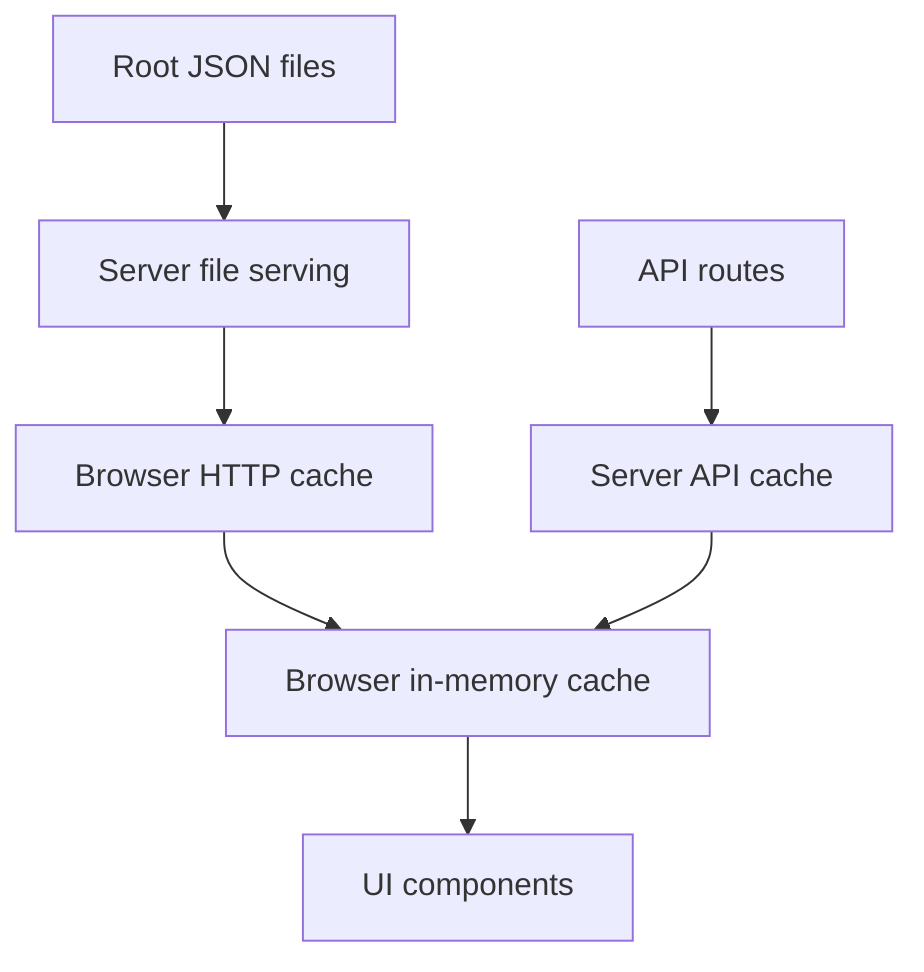

# Cache Architecture

This document describes the current caching model in this app after the cache refactor.

The goal is to keep caching:
- consistent
- easy to reason about
- short-lived for changing JSON data
- shared between development and production

## Principles

### 1. One source of truth per data type
- Raw generated datasets stay as root JSON files such as `data_*.json`, `bonds_v2.json`, and `buy_dips.json`.
- Computed app snapshots stay behind API routes such as `/api/prana-stats`, `/api/staking-stats`, and `/api/bond-metrics`.
- Refresh/update side effects stay behind explicit API routes such as `/api/bonds-v2/refresh-bonds`.
- Top holding addresses are now loaded directly via `/api/top-holding-addresses` with server memory cache (no JSON file handoff).

### 2. Short-lived data should have short-lived caches
- Root JSON files can be reused briefly by the browser before revalidation.
- API responses are browser-revalidated on each use.
- In-browser memory caches are short-lived and shared.

### 3. Dev and prod should behave the same
- The Vite dev server proxies API requests and root JSON requests to the Node server.
- The Node server is the single place that applies root JSON cache headers.

## Cache Layers

There are four main cache layers in the app.



### Browser HTTP cache
- Controlled by `Cache-Control` headers from the Node server.
- Applies to root JSON files and built assets.

### Browser in-memory cache
- Used by small client helpers created with `createBrowserJsonCache(...)` (API snapshot helpers only).
- Prevents duplicate fetches and avoids repeated requests during a short window.
- Supports forced refresh when needed.

Root JSON files (`bonds_v2.json`, `buy_dips.json`) are fetched with `fetchJson` / `fetchJsonSafe` only: concurrent GET dedupe still applies, but there is no TTL in-memory layer on top of the browser HTTP cache.

### Server API cache
- Used for computed API endpoints.
- Keeps expensive loader work from running on every request.

### Server file serving
- Serves root JSON files and static files.
- Adds HTTP cache headers, `ETag`, and `Last-Modified`.

## Central TTL Registry

All shared TTL values live in `constants/cachePolicy.js`.

### Millisecond TTLs
- `apiResponse`: `30_000`
- `bondMetricsApiResponse`: `86_400_000` (24 hours)
- `stakingStatsApiResponse`: `86_400_000` (24 hours)
- `lpTokenId`: `86_400_000` (24 hours) — see [LP position NFT id cache](#lp-position-nft-id-cache)
- `topHoldingsRefresh`: `30_000`

`bonds_v2.json` and `buy_dips.json` rely on HTTP cache and `fetchJson` dedupe only; they do not use a millisecond TTL in `createBrowserJsonCache(...)`.

### HTTP cache TTLs in seconds
- `apiResponseBrowserHttp`: `30`
- `bondMetricsApiResponseBrowserHttp`: `60 * 60 * 24` (24 hours)
- `stakingStatsApiResponseBrowserHttp`: `60 * 60 * 24` (24 hours)
- `rootDataJsonHttp`: `30`
- `rootBondsJsonHttp`: `30`
- `rootBuyDipsJsonHttp`: `30`
- `staticAssetsHttp`: `31536000`

Rule of thumb:
- changing protocol/app data: 30 seconds by default
- longer-lived computed API snapshots can use 24 hours when intentional, such as `/api/bond-metrics` and `/api/staking-stats`
- long-lived hashed assets: 1 year immutable

## Browser Cache Helper

The shared browser helper is `utils/browserJsonCache.ts`.

It provides:
- a short-lived in-memory cache
- in-flight request sharing
- forced refresh support
- optional safe fallback behavior

Main API:
- `getCachedValue()`
- `fetchCached({ force?: boolean })`
- `fetchSafe(fallback, { force?: boolean })`
- `clear()`

Behavior:
- If cached data is still within TTL, return it immediately.
- If a non-forced request is already in flight, reuse that Promise.
- If `force: true` is passed, bypass the local cache and fetch again.
- Forced refresh also disables the lower-level `fetchJson()` dedupe for that request by setting `dedupeKey: null`.

## Low-Level Fetch Dedupe

`utils/fetchJson.ts` still handles request deduplication for concurrent GET requests.

This is different from the browser cache helper:
- `fetchJson.ts` dedupes only simultaneous requests
- `browserJsonCache.ts` caches successful results for a TTL window

Both are useful:
- dedupe avoids duplicate network traffic during one render burst
- TTL cache avoids repeated fetching across a short period

## Current Browser Data Paths

### Computed API snapshot: PRANA stats
- `hooks/usePranaStats.ts`
- `hooks/usePranaPrices.ts`
- `utils/pranaStatsApi.ts`

These now share the same current snapshot source:
- `/api/prana-stats`

This endpoint is now focused on market cap and price-performance inputs.

This means the market-cap card and converter read the same pricing inputs:
- `latestSatPrice`
- `btcPriceUsd`
- `usdToVndRate`

It no longer carries staking or bond card payloads.

### Computed API snapshot: staking stats
- `hooks/useStakingStats.ts`
- `utils/stakingStatsApi.ts`

These use:
- `/api/staking-stats`

Browser behavior:
- fetches `/api/staking-stats` directly with `fetchJson(...)`
- relies on browser HTTP cache and concurrent GET dedupe
- does not keep a TTL in-memory browser snapshot

This endpoint owns the staking card payload:
- `stakedPrana`
- `stakedVnd`
- `interestContractBalancePrana`
- `interestContractBalanceVnd`
- `interestPrana`
- `interestVnd`

### Computed API snapshot: bond metrics
- `hooks/useBondStats.ts`
- `utils/bondMetricsApi.ts`

These use:
- `/api/bond-metrics`

Browser behavior:
- fetches `/api/bond-metrics` directly with `fetchJson(...)`
- relies on browser HTTP cache and concurrent GET dedupe
- does not keep a TTL in-memory browser snapshot

This endpoint is now the single bond API. It includes:
- raw `buy` and `sell` metric blocks
- a computed `summary` payload used by the bond cards and supply UI

This avoids duplicating bond summary fields in `/api/prana-stats`.

### Raw JSON helpers

**`fetchJson` / `fetchJsonSafe` only (HTTP cache + in-flight GET dedupe, no TTL memory cache):**
- `utils/bondsV2Json.ts` → `/bonds_v2.json`
- `utils/buyDipsJson.ts` → `/buy_dips.json`
- `utils/stakingStatsApi.ts` → `/api/staking-stats` (with legacy fallback to `/api/prana-stats` during rollout)

### Top holding addresses API path

- `hooks/useTopHoldingAddresses.ts` fetches `/api/top-holding-addresses` directly (no `page` param).
- The server caches the single top-holding payload in memory for `CACHE_TTL_MS.topHoldingsRefresh` (30 seconds) using `createServerCache(...)`.
- There is no `top_holding_addresses.json` read/write in the runtime request flow.

**`createBrowserJsonCache(...)` (TTL in-memory + force + safe wrapper):**
- used by API snapshot helpers that need a shared browser-memory snapshot, such as `pranaStatsApi.ts`

### Chart JSON

Charts fetch the JSON directly with `fetchJson(...)`, but they now rely on the shared HTTP cache policy instead of forcing `cache: 'no-store'`.

Files:
- `components/SatsPriceChart.tsx`
- `components/PranaVndPriceChart.tsx`

Main data sources:
- `/data_sats.json`
- `/data_30_days.json`
- `/data_90_days.json`
- `/data_180_days.json`
- `/data_365_days.json`
- `/data_max.json`

## Server Cache Behavior

### Server cache factory

`server/cacheHelpers.ts` exports shared cache factories (`createServerCache(ttlMs)` and `createKeyedServerCache(ttlMs)`) used by API response caching and keyed short-lived caches.

Each instance holds its own TTL-checked value and in-flight promise. Callers pass a loader function; the cache returns the cached value when fresh, shares an in-flight promise when one is already running, or invokes the loader otherwise.

API response caches:
- `/api/prana-stats`
- `/api/capital`
- `/api/lp-capital`
- `/api/bond-metrics` (TTL = `CACHE_TTL_MS.bondMetricsApiResponse`, 24h)

Staking stats response cache:
- `/api/staking-stats` (TTL = `CACHE_TTL_MS.stakingStatsApiResponse`, 24h)

Refresh request dedupe:
- `ensureBondsRefreshed()` — shares the in-flight `updateBondsV2` run and does not keep a TTL cache after it completes

Top holdings in-memory cache (TTL = `CACHE_TTL_MS.topHoldingsRefresh`):
- `/api/top-holding-addresses` — caches the top-holding payload (first 10 addresses) in Node memory

### LP position NFT id cache

`server/loaders/lpCapital.ts` keeps an in-memory **Uniswap V3 position NFT token id** for `TARGET_OWNER`, separate from the `/api/lp-capital` response cache (`CACHE_TTL_MS.apiResponse`).

- TTL is `CACHE_TTL_MS.lpTokenId` (24 hours).
- Each `loadLpCapital()` call still reads on-chain `positions(tokenId)` and checks the position is still active in the configured pool; if not, the id cache is cleared and the loader rescans wallet NFTs.
- Server restart clears this cache.

Purpose: avoid repeating `balanceOf` / `tokenOfOwnerByIndex` scans on every request while keeping USD value and pool state fresh for each response.

### Price loader cache

`server/loaders/pranaPrices.ts` now uses the same short API TTL model rather than a special longer TTL.

That keeps the server-side price snapshot aligned with the rest of the API freshness model.

## HTTP Cache Headers

### Root JSON headers

Defined in `server/cacheControl.ts`.

These files use short-lived browser caching:
- `data_*.json`
- `bonds_v2.json`
- `buy_dips.json`

Header shape:
- `public, max-age=30`

This means:
- the browser may reuse the response locally for up to 30 seconds without a roundtrip
- after that, normal revalidation can happen with the server
- because filenames are not content-hashed, these are not `immutable`

### API headers

Defined via `sendJson(...)` in `server/requestHelpers.ts`.

Primary JSON API routes send:
- `Cache-Control: private, max-age=30`

Exception:
- `/api/staking-stats` sends `Cache-Control: private, max-age=24h`

These currently include:
- `/api/prana-stats`
- `/api/staking-stats`
- `/api/capital`
- `/api/lp-capital`
- `/api/bond-metrics`
- `/api/refresh-bonds`
- `/api/top-holding-addresses`
- `/api/bonds-v2/refresh-bonds`

This means:
- browsers can reuse the API response locally for up to 30 seconds without a roundtrip (24h for `/api/staking-stats`)
- shared caches should not store it because the response is marked `private`
- after 30 seconds, the browser will fetch again and the server API cache still applies (24h for `/api/staking-stats`)

Error responses still send:
- `Cache-Control: no-cache`

### Built assets

Hashed built assets use:
- `public, max-age=31536000, immutable`

This is safe because their filenames change when content changes.

## Dev vs Prod Behavior

`vite.config.js` proxies both API routes and root JSON files to the Node server:
- `/api`
- `/data_*.json`
- `/bonds_v2.json`
- `/buy_dips.json`

Why this matters:
- dev and prod now use the same Node server cache headers
- root JSON handling is no longer duplicated between Vite middleware and the Node server
- freshness bugs are easier to reproduce consistently

Important development note:
- when running the frontend in dev, the Node server must also be running for these proxied routes
- if the Node server is stale, new API routes such as `/api/staking-stats` may fall through to `index.html` and surface as JSON parse errors in the browser

## Force Refresh Rules

Use `force: true` only when you specifically need to bypass the short-lived browser cache.

Current examples:
- after `/api/bonds-v2/refresh-bonds` reports new data, `prefetchInitialJson` calls `fetchBondsV2TotalsSafe({ force: true })` so `bonds_v2.json` is refetched with a cache-busting query string and avoids a stale HTTP cache entry for the plain URL

Top holding addresses no longer use forced file refetch. They are served directly from `/api/top-holding-addresses` with server-side memory TTL.

Do not use forced refresh for normal page load unless there is a clear reason.

## What Was Removed

The old extra client-side price bundle path was removed:
- deleted `utils/pranaPrices.ts`

Why:
- it created a second current-price data path
- it could drift from `/api/prana-stats`
- it made the converter and stats card disagree

Now:
- current price snapshot for app UI comes from `/api/prana-stats`
- staking card data comes from `/api/staking-stats`
- bond card data comes from `/api/bond-metrics`

## Current API Shapes

These are shortened example payloads that reflect the current responsibility split.

### `/api/prana-stats`

```json
{
  "btcPriceUsd": 70666,
  "btcPriceVnd": 1859387378,
  "usdToVndRate": 26312.33,
  "latestSatPrice": 73.58,
  "marketCapVnd": 13681372327,
  "priceChange": {
    "m1": 8.03,
    "m3": -4.68,
    "m6": -19.46,
    "y1": 9.19,
    "atl": 2958.59
  },
  "priceChangeBtc": {
    "m1": 4.63,
    "m3": 20.18,
    "m6": 31.06,
    "y1": 33.03,
    "atl": 242.55
  }
}
```

### `/api/staking-stats`

```json
{
  "stakedPrana": 915954.74,
  "stakedVnd": 1253151790.19,
  "interestContractBalancePrana": 139945.45,
  "interestContractBalanceVnd": 191464583.51,
  "interestPrana": 74806.22,
  "interestVnd": 102345186.55
}
```

### `/api/bond-metrics`

```json
{
  "buy": {
    "v1CommittedRaw": "21078512925681",
    "v2CommittedRaw": "29792747402335",
    "v2BalanceRaw": "145025716082335",
    "totalBalanceRaw": "166104229008016",
    "totalCommittedRaw": "50871260328016",
    "totalVolumeRaw": "185073000000000"
  },
  "sell": {
    "v1CommittedRaw": "95322",
    "v2CommittedRaw": "0",
    "v2BalanceRaw": "761928",
    "totalBalanceRaw": "857250",
    "totalCommittedRaw": "95322",
    "totalVolumeRaw": "349040000000000"
  },
  "summary": {
    "buyBondPrana": 185073,
    "buyBondVnd": 252690120.95,
    "sellBondPrana": 349040,
    "sellBondVnd": 476563084.93,
    "buyBondProgressBaseDisplay": "166,104",
    "buyBondCommittedDisplay": "50,871",
    "buyBondCapacityDisplay": "115,233",
    "buyBondCommittedPercent": 30.62,
    "buyBondCapacityPercent": 69.38,
    "sellBondProgressBaseDisplay": "857,250",
    "sellBondCommittedDisplay": "95,322",
    "sellBondCapacityDisplay": "761,928",
    "sellBondCommittedPercent": 11.11,
    "sellBondCapacityPercent": 88.89
  }
}
```

## Guidelines For Future Changes

When adding a new cached data source:

1. Decide whether it is:
- raw JSON
- computed API
- refresh side effect

2. Put its TTL in `constants/cachePolicy.js`.

3. If it is browser-consumed JSON that many hooks hit repeatedly, prefer `createBrowserJsonCache(...)`. For on-demand reads or simple root JSON helpers, `fetchJson` plus HTTP headers in `cacheControl.ts` is often enough.

4. If it is a computed API endpoint, use the server cache helpers instead of inventing a one-off cache.

5. If it is served as a root JSON file, add HTTP cache policy in `server/cacheControl.ts`.

6. If the frontend needs it in dev, make sure `vite.config.js` proxies it to the Node server.

## Anti-Patterns To Avoid

- adding another module-level `cached` value that never expires
- adding a separate custom cache helper for one file when `createBrowserJsonCache(...)` already fits
- using different current-price sources for UI that users compare side by side
- using `cache: 'no-store'` by default when short browser-fresh HTTP headers are enough
- making dev JSON routing different from prod routing

## Quick Reference

If you are not sure where to put a new cache:

- Raw generated JSON file:
  - serve from Node root route
  - give it short browser-fresh HTTP headers
  - use `createBrowserJsonCache(...)` if multiple consumers need the same snapshot in RAM within a TTL window; otherwise `fetchJson` / `fetchJsonSafe` is enough

- Computed API response:
  - cache on the server with `createServerCache(...)`
  - expose browser access through a small helper like `pranaStatsApi.ts`

- Manual or side-effect refresh:
  - keep it as an explicit API route
  - use `force: true` only after the refresh says new data is available
