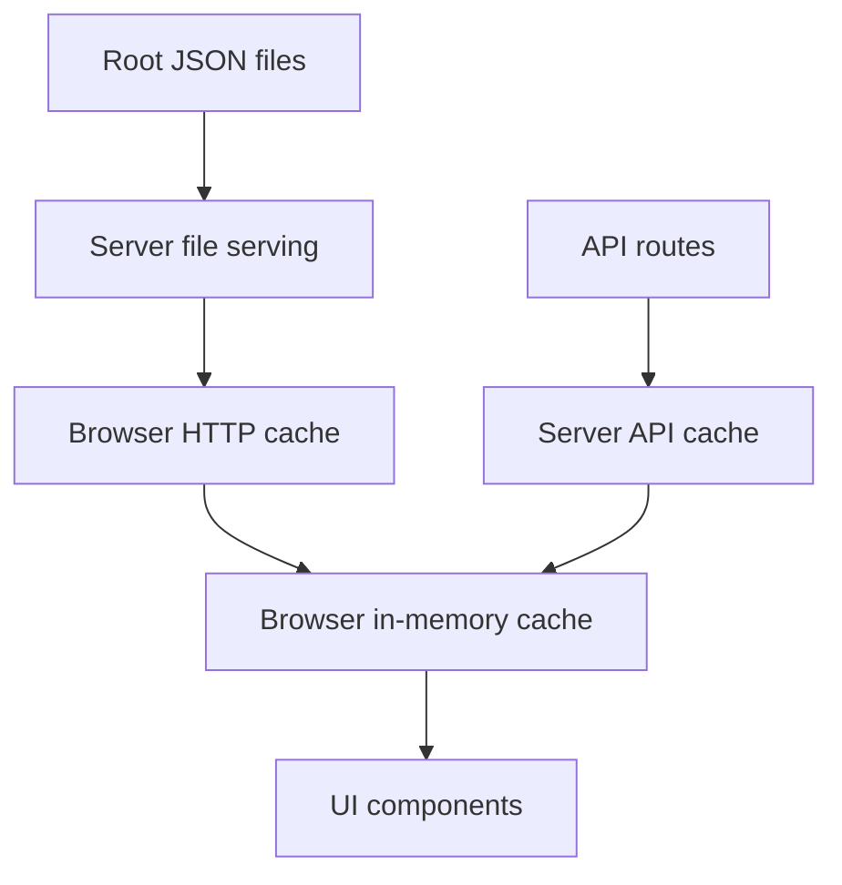

# Cache Architecture

This document describes the current caching model in this app after the cache refactor.

The goal is to keep caching:
- consistent
- easy to reason about
- short-lived for changing JSON data
- shared between development and production

## Principles

### 1. One source of truth per data type
- Raw generated datasets stay as root JSON files such as `data_*.json`, `bonds_v2.json`, and `buy_dips.json`.
- Computed app snapshots stay behind API routes such as `/api/prana-stats`, `/api/staking-stats`, and `/api/bond-metrics`.
- Refresh/update side effects stay behind explicit API routes such as `/api/bonds-v2/refresh-bonds`.
- Top holding addresses are now loaded directly via `/api/top-holding-addresses` with server memory cache (no JSON file handoff).

### 2. Short-lived data should have short-lived caches
- Root JSON files can be reused briefly by the browser before revalidation.
- API responses use `Cache-Control: private` with a route-specific `max-age`: the browser may reuse a response without a network round-trip until that window expires, then it requests again (the server may still answer from its own TTL cache).
- In-browser memory caches are short-lived and shared where they exist (see [Browser in-memory cache](#browser-in-memory-cache)).

### 3. Dev and prod should behave the same
- The Vite dev server proxies API requests and root JSON requests to the Node server.
- The Node server is the single place that applies root JSON cache headers.

## Cache Layers

There are four main cache layers in the app.



The diagram is simplified: only code paths that call `createBrowserJsonCache` (today, `/api/prana-stats` via `utils/pranaStatsApi.ts`) layer a TTL in-memory snapshot on top of HTTP caching. Other JSON APIs are loaded with `fetchJson` only, so they rely on the browser HTTP `max-age` for that URL plus concurrent GET dedupe, without that extra in-memory TTL wrapper.

### Browser HTTP cache
- Controlled by `Cache-Control` headers from the Node server.
- Applies to root JSON files and built assets.

### Browser in-memory cache
- Used by small client helpers created with `createBrowserJsonCache(...)`:
  - API snapshot helpers (e.g. `utils/pranaStatsApi.ts` → `/api/prana-stats`)
- Prevents duplicate fetches and avoids repeated requests during a short window.
- Supports forced refresh when needed.

Root JSON files (`bonds_v2.json`, `buy_dips.json`) are fetched with `fetchJson` / `fetchJsonSafe` only: concurrent GET dedupe still applies, but there is no TTL in-memory layer on top of the browser HTTP cache.

### Server API cache
- Used for computed API endpoints.
- Keeps expensive loader work from running on every request.

### Server file serving
- Serves root JSON files and static files.
- Adds HTTP cache headers, `ETag`, and `Last-Modified`.

## Central TTL Registry

All shared TTL values live in `constants/cachePolicy.ts`.

### Millisecond TTLs
- `apiResponse`: `30_000`
- `bondMetricsApiResponse`: `86_400_000` (24 hours)
- `stakingStatsApiResponse`: `86_400_000` (24 hours)
- `lpTokenId`: `86_400_000` (24 hours) — see [LP position NFT id cache](#lp-position-nft-id-cache)
- `topHoldingsRefresh`: `30_000`

`bonds_v2.json` and `buy_dips.json` rely on HTTP cache and `fetchJson` dedupe only; they do not use a millisecond TTL in `createBrowserJsonCache(...)`.

### HTTP cache TTLs in seconds
- `apiResponseBrowserHttp`: `30`
- `bondMetricsApiResponseBrowserHttp`: `60 * 60 * 24` (24 hours)
- `stakingStatsApiResponseBrowserHttp`: `60 * 60 * 24` (24 hours)
- `rootDataJsonHttp`: `30`
- `rootBondsJsonHttp`: `30`
- `rootBuyDipsJsonHttp`: `30`
- `staticAssetsHttp`: `31536000`

Rule of thumb:
- changing protocol/app data: 30 seconds by default
- longer-lived computed API snapshots can use 24 hours when intentional, such as `/api/bond-metrics` and `/api/staking-stats`
- long-lived hashed assets: 1 year immutable

## Browser Cache Helper

The shared browser helper is `utils/browserJsonCache.ts`.

It provides:
- a short-lived in-memory cache
- in-flight request sharing
- forced refresh support

Main API:
- `getCachedValue()`
- `fetchCached({ force?: boolean })`

Behavior:
- If cached data is still within TTL, return it immediately.
- If a non-forced request is already in flight, reuse that Promise.
- If `force: true` is passed, bypass the local cache and fetch again. (Right now, the derived 'force' from refresh-bonds is only used for fetchBondsV2TotalsSafe from prefetchInitialJson)
- Forced refresh also disables the lower-level `fetchJson()` dedupe for that request by setting `dedupeKey: null`.

## Low-Level Fetch Dedupe

`utils/fetchJson.ts` still handles request deduplication for concurrent GET requests.

This is different from the browser cache helper:
- `fetchJson.ts` dedupes only simultaneous requests
- `browserJsonCache.ts` caches successful results for a TTL window

Both are useful:
- dedupe avoids duplicate network traffic during one render burst
- TTL cache avoids repeated fetching across a short period

## Current Browser Data Paths

### Computed API snapshot: PRANA stats
- `hooks/usePranaStats.ts`
- `hooks/usePranaPrices.ts`
- `utils/pranaStatsApi.ts`

These share the same current snapshot source:
- `/api/prana-stats`

This endpoint returns **pricing and market cap only** (no performance percentages):
- `btcPriceUsd`, `btcPriceVnd`, `usdToVndRate`, `latestSatPrice`, `marketCapVnd`

The market-cap card and converter read the same pricing inputs from this API.

**Fiat and BTC performance** (`priceChange`, `priceChangeBtc`) are **not** in the API response. They are computed in the browser in `components/PranaStats.tsx` from:
- `hooks/usePrana365Data.ts` + `utils/prana365Data.ts` → `/data_365_days.json` (fiat vs USD, with current `btcPriceUsd` / `latestSatPrice`)
- `hooks/usePranaSatsData.ts` + `utils/pranaSatsData.ts` → `/data_sats.json` (performance vs Bitcoin / SAT)

Those two hooks use `fetchJson(...)` like the other root chart files: **browser HTTP cache** (short `max-age` on root JSON) plus **concurrent GET dedupe**. Concurrent mounts (e.g. `PranaStats` and `PriceChartsSection`) still share one in-flight request via `fetchJson`.

The API no longer carries staking or bond card payloads.

### Computed API snapshot: staking stats
- `hooks/useStakingStats.ts`
- `utils/stakingStatsApi.ts`

These use:
- `/api/staking-stats`

Browser behavior:
- fetches `/api/staking-stats` directly with `fetchJson(...)`
- relies on browser HTTP cache and concurrent GET dedupe
- does not keep a TTL in-memory browser snapshot

This endpoint owns the staking card payload:
- `stakedPrana`
- `stakedVnd`
- `interestContractBalancePrana`
- `interestContractBalanceVnd`
- `interestPrana`
- `interestVnd`

### Computed API snapshot: bond metrics
- `hooks/useBondStats.ts`
- `utils/bondMetricsApi.ts`

These use:
- `/api/bond-metrics`

Browser behavior:
- fetches `/api/bond-metrics` directly with `fetchJson(...)`
- relies on browser HTTP cache and concurrent GET dedupe
- does not keep a TTL in-memory browser snapshot

This endpoint is now the single bond API. It includes:
- raw `buy` and `sell` metric blocks
- a computed `summary` payload used by the bond cards and supply UI

This avoids duplicating bond summary fields in `/api/prana-stats`.

### Raw JSON helpers

**`fetchJson` / `fetchJsonSafe` only (HTTP cache + in-flight GET dedupe, no TTL memory cache):**
- `utils/bondsV2Json.ts` → `/bonds_v2.json`
- `utils/buyDipsJson.ts` → `/buy_dips.json`
- `utils/prana365Data.ts` → `/data_365_days.json`
- `utils/pranaSatsData.ts` → `/data_sats.json`
- `utils/stakingStatsApi.ts` → `/api/staking-stats`

### Top holding addresses API path

- `hooks/useTopHoldingAddresses.ts` fetches `/api/top-holding-addresses` directly.
- The server caches the single top-holding payload in memory for `SERVER_CACHE_TTL_MS.topHoldingsRefresh` (30 seconds) using `createServerCache(...)`.
- There is no `top_holding_addresses.json` read/write in the runtime request flow.

**`createBrowserJsonCache(...)` (TTL in-memory + force):**
- `utils/pranaStatsApi.ts` → `/api/prana-stats`

### Chart JSON and performance

`components/PriceChartsSection.tsx` is the container for chart data:
- It calls `usePranaSatsData()` and `usePrana365Data()` so SAT and 1Y VND ranges use the same series loaders as the performance cards in `PranaStats` (each hook fetches via `fetchJson`; concurrent GET dedupe still applies).
- It passes **pre-built `chartData`** into display-only chart components:
  - `components/SatsPriceChart.tsx`
  - `components/PranaVndPriceChart.tsx`

**Root chart / performance series — `fetchJson(...)`** (HTTP cache + GET dedupe; no TTL in-memory wrapper):
- `/data_sats.json` — `usePranaSatsData` / `pranaSatsData.ts`
- `/data_365_days.json` — `usePrana365Data` / `prana365Data.ts`
- `/data_30_days.json`
- `/data_90_days.json`
- `/data_180_days.json`
- `/data_max.json`

All of these rely on the Node server’s short HTTP cache policy for root JSON (see [Root JSON headers](#root-json-headers)).

**Server note:** `server/loaders/pranaPrices.ts` still reads `data_sats.json` on the server to derive `latestSatPrice` for the price bundle. It does **not** send the full sats series in `/api/prana-stats`; the browser loads `data_sats.json` separately for charts and BTC performance.

## Server Cache Behavior

### Server cache factory

`server/cacheHelpers.ts` exports shared cache factories (`createServerCache(ttlMs)` and `createKeyedServerCache(ttlMs)`) used by API response caching and keyed short-lived caches.

Each instance holds its own TTL-checked value and in-flight promise. Callers pass a loader function; the cache returns the cached value when fresh, shares an in-flight promise when one is already running, or invokes the loader otherwise.

API response caches:
- `/api/prana-stats`
- `/api/capital`
- `/api/lp-capital`
- `/api/bond-metrics` (TTL = `SERVER_CACHE_TTL_MS.bondMetricsApiResponse`, 24h)

Staking stats response cache:
- `/api/staking-stats` (TTL = `SERVER_CACHE_TTL_MS.stakingStatsApiResponse`, 24h)

Refresh request dedupe:
- `ensureBondsRefreshed()` — shares the in-flight `updateBondsV2` run and does not keep a TTL cache after it completes

Top holdings in-memory cache (TTL = `SERVER_CACHE_TTL_MS.topHoldingsRefresh`):
- `/api/top-holding-addresses` — caches the top-holding payload (first 10 addresses) in Node memory

### LP position NFT id cache

`server/loaders/lpCapital.ts` keeps an in-memory **Uniswap V3 position NFT token id** for `TARGET_OWNER`, separate from the `/api/lp-capital` response cache (`SERVER_CACHE_TTL_MS.apiResponse`).

- TTL is `LP_TOKEN_ID_CACHE_TTL_MS` from `constants/arbitrumWbtcUsdtLp.ts`, which is set to `SERVER_CACHE_TTL_MS.lpTokenId` (24 hours) in the central registry.
- Each `loadLpCapital()` call still reads on-chain `positions(tokenId)` and checks the position is still active in the configured pool; if not, the id cache is cleared and the loader rescans wallet NFTs.
- Server restart clears this cache.

Purpose: avoid repeating `balanceOf` / `tokenOfOwnerByIndex` scans on every request while keeping USD value and pool state fresh for each response.

### Price loader cache

`server/loaders/pranaPrices.ts` uses the same short API TTL model (`SERVER_CACHE_TTL_MS.apiResponse`). The bundle includes BTC prices and `latestSatPrice` from the last point of `data_sats.json` (read from disk). It does **not** load `data_365_days.json`; that file is consumed in the browser for fiat performance and the VND chart’s 1Y range.

That keeps the server-side price snapshot aligned with the rest of the API freshness model while avoiding redundant server reads for series only needed on the client.

## HTTP Cache Headers

### Root JSON headers

Defined in `server/cacheControl.ts`.

These files use short-lived browser caching:
- `data_*.json`
- `bonds_v2.json`
- `buy_dips.json`

Header shape:
- `public, max-age=30`

This means:
- the browser may reuse the response locally for up to 30 seconds without a roundtrip
- after that, normal revalidation can happen with the server
- because filenames are not content-hashed, these are not `immutable`

### API headers

Defined via `sendJson(...)` in `server/requestHelpers.ts`.

Most JSON API routes send:
- `Cache-Control: private, max-age=30`

Longer browser cache (`private`, 24 hours) for intentional snapshot endpoints:
- `/api/staking-stats`
- `/api/bond-metrics`

Routes (each uses one of the header shapes above, as wired in `server/index.ts`):
- `/api/prana-stats` — `max-age=30`
- `/api/staking-stats` — `max-age=24h`
- `/api/capital` — `max-age=30`
- `/api/lp-capital` — `max-age=30`
- `/api/bond-metrics` — `max-age=24h`
- `/api/refresh-bonds` — `max-age=30`
- `/api/top-holding-addresses` — `max-age=30`
- `/api/bonds-v2/refresh-bonds` — `max-age=30`

This means:
- browsers can reuse a response locally until that route’s `max-age` expires (30 seconds for most APIs above, 24 hours for `/api/staking-stats` and `/api/bond-metrics`)
- shared caches should not store it because the response is marked `private`
- after the browser’s `max-age` window, the next request hits the network; the server may still return a cached payload from its own TTL (including 24h server caches for staking and bond metrics)

Error responses still send:
- `Cache-Control: no-cache`

### Built assets

Hashed built assets use:
- `public, max-age=31536000, immutable`

This is safe because their filenames change when content changes.

## Dev vs Prod Behavior

`vite.config.js` proxies both API routes and root JSON files to the Node server:
- `/api`
- `/data_*.json`
- `/bonds_v2.json`
- `/buy_dips.json`

Why this matters:
- dev and prod now use the same Node server cache headers
- root JSON handling is no longer duplicated between Vite middleware and the Node server
- freshness bugs are easier to reproduce consistently

Important development note:
- when running the frontend in dev, the Node server must also be running for these proxied routes (default API target: port `4173`)
- if the Node server is stale, new API routes such as `/api/staking-stats` may fall through to `index.html` and surface as JSON parse errors in the browser
- if `npm run serve` fails with `EADDRINUSE` on `4173`, an **older** `node server/index.ts` may still be listening; that process will keep serving **old** API shapes until you stop it and restart. Vite on `5173` proxies `/api` to whatever is on `4173`, so code changes to loaders are invisible until the Node server restarts.

## Force Refresh Rules

Use `force: true` only when you specifically need to bypass the short-lived browser cache.

Current examples:
- `prefetchInitialJson` (in `utils/prefetchInitialJson.ts`) calls `/api/bonds-v2/refresh-bonds`, then `fetchBondsV2TotalsSafe({ force: Boolean(refreshResult?.updated) })`: the cache-busting query string on `bonds_v2.json` is used only when the refresh response indicates `updated` is truthy, so a forced refetch avoids a stale HTTP cache entry for the plain URL only when the file actually changed

Top holding addresses no longer use forced file refetch. They are served directly from `/api/top-holding-addresses` with server-side memory TTL.

Do not use forced refresh for normal page load unless there is a clear reason.

## Current API Shapes

These are shortened example payloads that reflect the current responsibility split.

### `/api/prana-stats`

Pricing and market cap only. Fiat and BTC performance percentages are computed in the client from `/data_365_days.json` and `/data_sats.json` (see [Chart JSON and performance](#chart-json-and-performance)).

```json
{
  "btcPriceUsd": 70666,
  "btcPriceVnd": 1859387378,
  "usdToVndRate": 26312.33,
  "latestSatPrice": 73.58,
  "marketCapVnd": 13681372327
}
```

### `/api/staking-stats`

```json
{
  "stakedPrana": 915954.74,
  "stakedVnd": 1253151790.19,
  "interestContractBalancePrana": 139945.45,
  "interestContractBalanceVnd": 191464583.51,
  "interestPrana": 74806.22,
  "interestVnd": 102345186.55
}
```

### `/api/bond-metrics`

```json
{
  "buy": {
    "v1CommittedRaw": "21078512925681",
    "v2CommittedRaw": "29792747402335",
    "v2BalanceRaw": "145025716082335",
    "totalBalanceRaw": "166104229008016",
    "totalCommittedRaw": "50871260328016",
    "totalVolumeRaw": "185073000000000"
  },
  "sell": {
    "v1CommittedRaw": "95322",
    "v2CommittedRaw": "0",
    "v2BalanceRaw": "761928",
    "totalBalanceRaw": "857250",
    "totalCommittedRaw": "95322",
    "totalVolumeRaw": "349040000000000"
  },
  "summary": {
    "buyBondPrana": 185073,
    "buyBondVnd": 252690120.95,
    "sellBondPrana": 349040,
    "sellBondVnd": 476563084.93,
    "buyBondProgressBaseDisplay": "166,104",
    "buyBondCommittedDisplay": "50,871",
    "buyBondCapacityDisplay": "115,233",
    "buyBondCommittedPercent": 30.62,
    "buyBondCapacityPercent": 69.38,
    "sellBondProgressBaseDisplay": "857,250",
    "sellBondCommittedDisplay": "95,322",
    "sellBondCapacityDisplay": "761,928",
    "sellBondCommittedPercent": 11.11,
    "sellBondCapacityPercent": 88.89
  }
}
```

## Guidelines For Future Changes

When adding a new cached data source:

1. Decide whether it is:
- raw JSON
- computed API
- refresh side effect

2. Put its TTL in `constants/cachePolicy.ts`.

3. If it is browser-consumed JSON, default to `fetchJson` plus HTTP headers in `cacheControl.ts` (concurrent GET dedupe covers multiple mounts). Use `createBrowserJsonCache(...)` only when you need a TTL in-memory snapshot or forced refresh beyond HTTP cache.

4. If it is a computed API endpoint, use the server cache helpers instead of inventing a one-off cache.

5. If it is served as a root JSON file, add HTTP cache policy in `server/cacheControl.ts`.

6. If the frontend needs it in dev, make sure `vite.config.js` proxies it to the Node server.

## Anti-Patterns To Avoid

- adding another module-level `cached` value that never expires
- adding a separate custom cache helper for one file when `createBrowserJsonCache(...)` already fits
- using different current-price sources for UI that users compare side by side
- using `cache: 'no-store'` by default when short browser-fresh HTTP headers are enough
- making dev JSON routing different from prod routing

## Quick Reference

If you are not sure where to put a new cache:

- Raw generated JSON file:
  - serve from Node root route
  - give it short browser-fresh HTTP headers
  - use `fetchJson` / `fetchJsonSafe` by default; add `createBrowserJsonCache(...)` only if you need extra client TTL or force refresh on top of HTTP cache

- Computed API response:
  - cache on the server with `createServerCache(...)`
  - expose browser access through a small helper like `pranaStatsApi.ts`

- Manual or side-effect refresh:
  - keep it as an explicit API route
  - use `force: true` on dependent fetches only when the refresh response indicates new data (see `prefetchInitialJson` and `force: Boolean(refreshResult?.updated)`)
